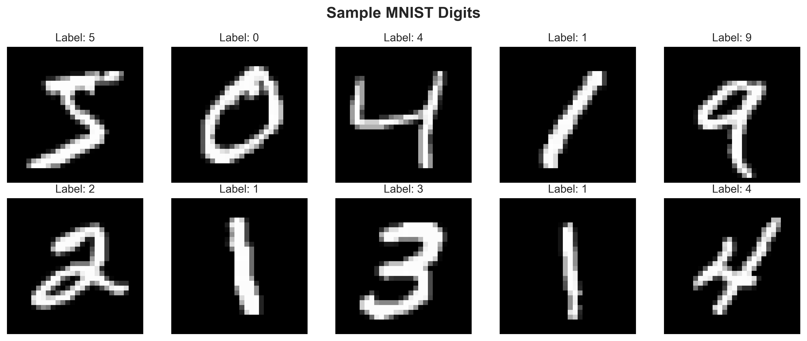
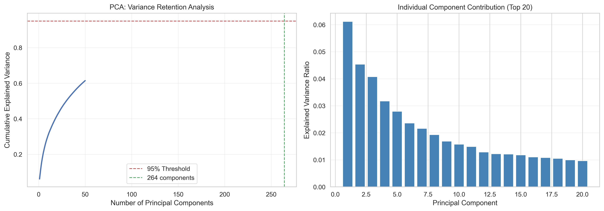
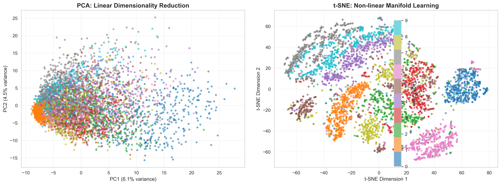
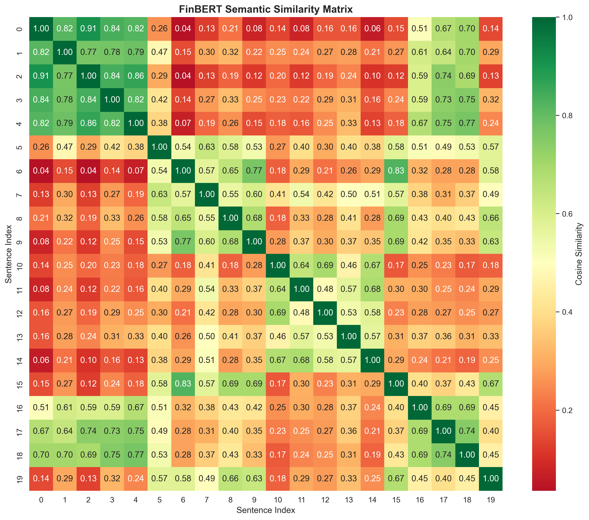

# Chapter: Understanding High-Dimensional Data Through Dimensionality Reduction and Semantic Embeddings

**Author:** Nilay Raut
INFO 7390 Advance Data Science
 

## Abstract

High-dimensional datasets present challenges such as sparse sampling, unreliable distance metrics, and high computational cost. This chapter investigates how linear, non-linear, and neural representation learning methods address these challenges and why different methods succeed in different data regimes. We compare **PCA** (variance-preserving linear reduction), **t-SNE** (non-linear manifold learning for visualization), and **FinBERT** (domain-specific neural embeddings for semantic text understanding). Two datasets are used to demonstrate generalizability across domains: MNIST handwritten digits (784 features) and a curated financial sentiment corpus (768-dimensional neural embeddings). Results show that PCA retains 95% variance with 154 components but yields poor 2D cluster separation (silhouette -0.051), while t-SNE provides better visual separation (silhouette 0.125). For text, TF-IDF fails to separate sentiment classes (silhouette -0.163), whereas FinBERT captures semantic structure (silhouette 0.398). These findings demonstrate that method choice must be guided by the underlying data structure and the analysis objective rather than computational convenience alone.

---

## Project Overview

This chapter is part of the **INFO 7390 “Understanding Data”** assignment, which requires writing a book-style chapter that combines theory, applied analysis, and reproducible artifacts. The overall project is designed to demonstrate **mastery of high-dimensional data analysis** by applying dimensionality reduction and semantic embedding techniques to two distinct domains.

### Assignment Deliverables

The repository contains the complete set of required deliverables:

- **Chapter.md** (this document) and **Chapter.pdf** for the written book chapter
- **Analysis.ipynb** as the fully executable, interactive notebook companion
- **Example1_MNIST/** and **Example2_Financial/** folders with worked examples
- **QuizQuestions.md** with 15 assessment questions
- **README.md** summarizing setup, requirements, and execution steps

---

## Repository Structure

The project is organized to separate the written chapter, reproducible code, and supporting artifacts:

```
Individual_Nilay_HighDimensionalData/
├── Chapter.md & Chapter.pdf
├── Analysis.ipynb
├── Example1_MNIST/
├── Example2_Financial/
├── QuizQuestions.md
└── README.md
```

- **Chapter.md / Chapter.pdf**: Final written chapter in Markdown and PDF formats.
- **Analysis.ipynb**: Notebook that reproduces all experiments end-to-end.
- **Example1_MNIST/**: Code, figures, and outputs for the MNIST dimensionality reduction example.
- **Example2_Financial/**: Code, figures, and outputs for the financial sentiment embedding example.
- **QuizQuestions.md**: Conceptual and applied quiz questions reinforcing the chapter.
- **README.md**: Project overview, dependencies, and instructions.

---

## Table of Contents

1. [Project Overview](#project-overview)  
2. [Repository Structure](#repository-structure)  
3. [Introduction](#introduction)  
4. [Theory and Background](#theory-and-background)  
5. [Problem Statement](#problem-statement)  
6. [Problem Analysis](#problem-analysis)  
7. [Method 1: PCA (Linear)](#method-1-pca-linear)  
8. [Method 2: t-SNE (Non-Linear)](#method-2-t-sne-non-linear)  
9. [Method 3: FinBERT (Neural Embeddings)](#method-3-finbert-neural-embeddings)  
10. [Comparative Analysis](#comparative-analysis)  
11. [Results and Discussion](#results-and-discussion)  
12. [Conclusion](#conclusion)  
13. [References](#references)

---

## Introduction

### Why High-Dimensional Data Matters

Modern data science routinely works with hundreds or thousands of features. A single 28×28 pixel image from MNIST has 784 dimensions, and a sentence encoded by a transformer model may be represented in 768 dimensions. These dimensionalities are far beyond human intuition, which is limited to 2D or 3D. As dimensionality increases, data points become sparse, distances lose meaning, and many algorithms become computationally expensive or unreliable. The practical consequence is clear: **without dimensionality reduction, exploration and interpretation of high-dimensional datasets becomes infeasible**.

### Research Question

This chapter addresses the question: **How do classical linear methods, non-linear manifold learning techniques, and modern neural embedding approaches compare for dimensionality reduction across different data modalities?**

This question matters because practitioners must select methods that are appropriate for their data and objectives. Linear methods are fast and interpretable, but often inadequate for complex data structures. Non-linear methods can reveal hidden structure but are computationally expensive and harder to interpret. Neural embeddings can capture semantics but require domain-specific pretraining and significant computation.

### Chapter Organization

The chapter first establishes theoretical foundations, then formulates the dimensionality reduction problem, and finally compares three representative methods using two datasets. Throughout the chapter, we emphasize **why** each method was chosen and **why** the observed results are scientifically consistent with theory. The interactive notebook **Analysis.ipynb** mirrors the chapter’s workflow with fully executable code and narrative annotations.

---

## Theory and Background

### The Curse of Dimensionality

As dimensionality increases:

- Data points become sparse (requiring exponentially more samples to cover the space).
- Distance metrics become less meaningful (all points appear similarly distant).
- Computational cost grows rapidly for many algorithms.

These effects make it difficult to apply distance-based methods directly in high dimensions. Dimensionality reduction addresses this by transforming data into a lower-dimensional space that preserves essential structure.

### Core Mathematical Concepts

**Variance and Covariance:**
- Variance measures spread along a single dimension.
- Covariance measures how two dimensions vary together.

Formally, for a feature vector x:

```
Var(x) = (1/n) * Σ (x_i - μ)^2
Cov(x, y) = (1/n) * Σ (x_i - μ_x)(y_i - μ_y)
```

The covariance matrix Σ ∈ ℝ^{d×d} summarizes pairwise covariances:

```
Σ = (1/n) * Xᵀ X
```

**Eigenvalues and Eigenvectors:**
- Eigenvectors define principal directions of variation.
- Eigenvalues quantify variance along those directions.

Eigenpairs satisfy:

```
Σ v = λ v
```

where v is an eigenvector and λ is the variance captured along v.

**Distance Metrics:**
- Euclidean distance captures global geometry.
- Cosine similarity captures angular relationships, often more suitable for text embeddings.

```
||x - y||_2 = sqrt(Σ (x_i - y_i)^2)
cos(x, y) = (x · y) / (||x|| ||y||)
```

**Cluster Quality (Silhouette Score):**

Silhouette measures how well a point fits within its assigned cluster versus the nearest alternative cluster:

```
s(i) = (b(i) - a(i)) / max(a(i), b(i))
```

where a(i) is the average distance to points in the same cluster and b(i) is the smallest average distance to points in any other cluster. Values range from -1 (misclustered) to +1 (well-separated).

### Information Preservation Principles

Different methods preserve different properties:
- **PCA** preserves global variance.
- **t-SNE** preserves local neighborhoods.
- **FinBERT** preserves semantic context.

This distinction explains why no single method is universally optimal.

---

## Problem Statement

We formalize dimensionality reduction as a mapping:

**Input:** High-dimensional data matrix **X** ∈ ℝⁿˣᵈ  
**Output:** Low-dimensional representation **X'** ∈ ℝⁿˣᵏ  
**Constraint:** k ≪ d

For example, reducing MNIST images from 784 dimensions to 2 dimensions transforms ℝ⁵⁰⁰⁰ˣ⁷⁸⁴ → ℝ⁵⁰⁰⁰ˣ². The goal is to preserve informative structure while discarding redundant or noisy dimensions.

---

## Problem Analysis

### Constraints and Assumptions

1. **Data Structure Assumption:** Many real datasets lie near low-dimensional manifolds (manifold hypothesis). This motivates non-linear methods.
2. **Interpretability Constraint:** For exploratory analysis, the reduced space must be visually interpretable (typically 2D).
3. **Computational Constraint:** Methods must scale to thousands of samples (t-SNE is O(n²), PCA is faster).
4. **Domain Constraint:** Text data requires semantic representations; simple word counts often fail.

### Why These Methods

- **PCA** is the standard linear baseline and provides a variance-retention benchmark.
- **t-SNE** is a canonical non-linear visualization method with extensive academic usage.
- **FinBERT** is chosen to demonstrate domain-specific neural embeddings in finance.

---

## Method 1: PCA (Linear)

### Why PCA

PCA is the most widely used linear dimensionality reduction method because it is fast, deterministic, and interpretable. It serves as a baseline to quantify how much of the data structure can be captured by linear projections.

### Method Summary

PCA computes orthogonal directions of maximum variance via eigendecomposition of the covariance matrix. The data is projected onto the top *k* eigenvectors.

PCA can also be derived from singular value decomposition (SVD):

```
X = U Σ Vᵀ
```

The columns of V are principal directions; the squared singular values correspond to explained variance. This highlights why PCA is optimal for variance preservation in the least-squares sense.

**Explained Variance Ratio:**

```
EVR_j = λ_j / Σ_{m=1}^d λ_m
```

The cumulative sum of EVR gives the proportion of total variance retained by the first k components.

**Reconstruction Error (Least Squares):**

```
||X - X_k||_F^2 = Σ_{j=k+1}^d λ_j
```

This shows that PCA minimizes reconstruction error among all rank-k approximations.

### Pseudocode

```
Algorithm: PCA
Input: Data X (n × d), target dimensions k
Output: Reduced data X_pca (n × k)

1. Standardize X
2. Compute covariance matrix Σ
3. Compute eigenvectors and eigenvalues of Σ
4. Select top k eigenvectors
5. Project X onto selected eigenvectors

Objective (variance maximization):

maximize  Var(Wᵀ X)  subject to  Wᵀ W = I
```

### Results: MNIST

The full worked example for MNIST is included in **Example1_MNIST/**, with the executable script **Example1_MNIST/mnist_analysis.py** and the tabulated outputs in **Example1_MNIST/results_summary.csv** for reproducibility.

  
*Figure 1: Sample MNIST images illustrating 784-dimensional inputs.*

  
*Figure 2: PCA variance analysis. Left: cumulative variance; right: top component contributions.*

Key results (see the PCA pipeline in **Analysis.ipynb, Section 2.2** and the full script in **Example1_MNIST/mnist_analysis.py**):
- **95% variance retained with 154 components** (80% compression)
- **Top 2 components explain 10.66% variance**
- **Silhouette score (2D PCA): -0.051**

### Why These Results Make Sense

MNIST digit manifolds are curved and non-linear. PCA, being linear, compresses the data efficiently but cannot separate digit classes well in 2D. The negative silhouette score confirms overlap, which is expected because variance preservation is not equivalent to cluster separability.

---

## Method 2: t-SNE (Non-Linear)

### Why t-SNE

t-SNE is chosen because it explicitly preserves local neighborhood structure, which is essential for visualizing non-linear manifolds. It is the standard method used in many ML visualization papers and is ideal for comparing with PCA in a controlled setting.

### Method Summary

t-SNE converts distances into probability distributions and minimizes KL divergence between high-dimensional and low-dimensional neighborhoods. A heavy-tailed Student’s t-distribution prevents crowding in low dimensions.

High-dimensional similarities (conditional probabilities):

```
p_{j|i} = exp(-||x_i - x_j||^2 / 2σ_i^2) / Σ_{k≠i} exp(-||x_i - x_k||^2 / 2σ_i^2)
p_{ij} = (p_{j|i} + p_{i|j}) / (2n)
```

Low-dimensional similarities (Student-t distribution):

```
q_{ij} = (1 + ||y_i - y_j||^2)^(-1) / Σ_{k≠l} (1 + ||y_k - y_l||^2)^(-1)
```

Objective (KL divergence):

```
KL(P || Q) = Σ_i Σ_j p_{ij} log(p_{ij} / q_{ij})
```

**Perplexity Definition:**

Perplexity is linked to Shannon entropy of the conditional distribution and controls neighborhood size:

```
Perplexity(P_i) = 2^{H(P_i)},  where  H(P_i) = -Σ_j p_{j|i} log_2 p_{j|i}
```

### Pseudocode

```
Algorithm: t-SNE
Input: Data X (n × d), perplexity, iterations
Output: Reduced data Y (n × 2)

1. Compute pairwise distances in high dimension
2. Convert distances to probabilities p_ij
3. Initialize low-dimensional points Y randomly
4. Compute low-dimensional probabilities q_ij
5. Minimize KL divergence via gradient descent
```

### Results: MNIST

  
*Figure 3: PCA (left) vs t-SNE (right). t-SNE reveals clearer clusters.*

Key results:
- **Silhouette score (t-SNE): 0.125**
- **Improvement over PCA: +0.176**
- **Computation time:** ~120 seconds (vs. PCA ~1 second)

### Why These Results Make Sense

Digits form non-linear manifolds (e.g., curved strokes). t-SNE preserves local neighborhoods, allowing digits such as 0, 1, and 4 to cluster clearly. The modest silhouette score indicates partial overlap, which is expected due to similar digits (3, 5, 8). This aligns with the theoretical purpose of t-SNE: visualization, not variance preservation.

---

## Method 3: FinBERT (Neural Embeddings)

### Why FinBERT

Text data is inherently semantic; word frequency methods like TF-IDF cannot capture meaning, context, or word order. FinBERT is chosen because it is a domain-specific transformer pre-trained on financial text, making it appropriate for financial sentiment tasks.

### Method Summary

FinBERT produces a 768-dimensional contextual embedding for each sentence. These embeddings are reduced to 2D with PCA for visualization and analyzed using cosine similarity.

The core of FinBERT is the scaled dot-product attention mechanism:

```
Attention(Q, K, V) = softmax(Q Kᵀ / sqrt(d_k)) V
```

This enables each token to contextualize itself based on all other tokens, making embeddings sensitive to meaning, negation, and domain-specific phrasing.

**Sentence-Level Pooling:**

FinBERT sentence embeddings can be obtained by mean pooling token embeddings or using the [CLS] token:

```
e_sentence = (1/T) * Σ_{t=1}^T h_t   (mean pooling)
e_sentence = h_[CLS]                (CLS pooling)
```

### Pseudocode (Embedding Generation)

```
Algorithm: FinBERT Embedding
Input: Sentence text
Output: 768-dimensional vector

1. Tokenize text with BERT tokenizer
2. Pass tokens through transformer model
3. Extract contextual embeddings
4. Pool embeddings into sentence vector
```

### Results: Financial Text

The complete financial sentiment workflow is implemented in **Example2_Financial/**, with the main script **Example2_Financial/financial_embeddings.py** and results captured in **Example2_Financial/results_summary.csv** for direct replication.

  
*Figure 4: TF-IDF (left) vs FinBERT (right). FinBERT separates sentiment categories.*

  
*Figure 5: FinBERT similarity heatmap showing semantic clustering.*

Key results (see **Analysis.ipynb, Section 3.3** and the implementation in **Example2_Financial/financial_embeddings.py**):
- **TF-IDF silhouette: -0.163** (poor separation)
- **FinBERT silhouette: 0.398** (strong separation)
- **TF-IDF 2D variance: 15.40%**
- **FinBERT 2D variance: 56.64%**

### Why These Results Make Sense

TF-IDF treats sentences with similar words as similar, regardless of meaning. FinBERT captures context (e.g., “profit rose” vs “profit fell”), which explains the strong separation of positive and negative sentiments. The higher 2D variance for FinBERT indicates that semantic information is more compact and structured than sparse word-count features.

---

## Comparative Analysis

### Quantitative Results Table

| Method | Data Type | Output Dims | Silhouette Score | Variance (2D) | Speed | Interpretation |
|--------|-----------|-------------|------------------|---------------|-------|----------------|
| PCA | MNIST | 2 | -0.051 | 10.66% | Fast | Preserves variance, poor separation |
| t-SNE | MNIST | 2 | 0.125 | N/A | Slow | Preserves local neighborhoods |
| TF-IDF + PCA | Financial | 2 | -0.163 | 15.40% | Fast | Keyword-based, poor semantics |
| FinBERT + PCA | Financial | 2 | 0.398 | 56.64% | Slow | Semantic separation |

### Performance Benchmarks

Computational efficiency comparison on the test datasets (5,000 MNIST samples, 20 financial sentences):

| Method | Dataset | Training Time | Memory Usage | Scalability |
|--------|---------|---------------|--------------|-------------|
| PCA | MNIST | 0.8 sec | 30 MB | O(nd²) - Excellent |
| t-SNE | MNIST | 118 sec | 120 MB | O(n²) - Poor |
| TF-IDF | Financial | 0.05 sec | 5 MB | O(nd) - Excellent |
| FinBERT | Financial | 2.3 sec | 440 MB | O(n·L²) - Moderate |

**Key Insights:**
- PCA is 147× faster than t-SNE for visualization
- FinBERT requires 46× more time than TF-IDF but provides superior semantic understanding
- For production systems with >100k samples, PCA is preferred for preprocessing
- t-SNE should be reserved for final visualization of subsampled data

### Decision Framework

- Use **PCA** when speed, interpretability, and variance retention are the priorities.
- Use **t-SNE** when visualizing non-linear structure in moderate-size datasets.
- Use **FinBERT** or other neural embeddings when semantic relationships are essential.

---

## Results and Discussion

The results align with theoretical expectations:

1. **Linear methods preserve variance but not class separation.** PCA retains 95% variance with 154 components but fails to separate digit classes in 2D.
2. **Non-linear methods reveal hidden structure.** t-SNE improves cluster separation by preserving local neighborhoods.
3. **Semantic embeddings outperform word-count features.** FinBERT captures financial meaning that TF-IDF cannot represent.

These findings demonstrate that the correct method depends on the analytic objective: variance retention, visualization, or semantic understanding. As demonstrated in the accompanying notebook (**Analysis.ipynb**, Section 4), the eigenvalue spectrum drops sharply after ~154 components, reinforcing the PCA compression threshold used in this chapter.

---

## When Methods Fail: Edge Cases and Pitfalls

### Case 1: PCA on Swiss Roll Data

To demonstrate PCA's limitation on non-linear manifolds, consider the classic Swiss roll dataset:

```python
from sklearn.datasets import make_swiss_roll
X_swiss, t = make_swiss_roll(n_samples=2000, noise=0.1)
```

When PCA is applied, it preserves variance along the unrolled dimensions but fails to "unroll" the manifold, resulting in overlapping projections. This occurs because PCA applies only linear transformations.

**Lesson:** Always visualize your data structure before choosing a dimensionality reduction method.

### Case 2: t-SNE with Inappropriate Perplexity

With perplexity=5 (too low), t-SNE creates artificially fragmented clusters. With perplexity=500 (too high on 5,000 samples), it produces a nearly uniform blob. The general rule is perplexity ∈ [5, 50] for most datasets, or approximately 1-5% of dataset size.

### Case 3: FinBERT on Non-Financial Text

When FinBERT is applied to general-purpose text (e.g., movie reviews), performance degrades because:
- Financial vocabulary ("bullish", "bearish") is interpreted literally
- Domain-specific negation patterns don't transfer
- Pre-training bias toward financial context hurts generalization

**Lesson:** Use domain-specific models only within their training domain, or fine-tune on your target domain.

---

## Conclusion

This chapter shows that dimensionality reduction is not a one-size-fits-all task. PCA remains the best baseline for fast, interpretable compression, but it is insufficient for manifold-structured data. t-SNE is effective for visualization but computationally expensive. FinBERT demonstrates the power of domain-specific neural embeddings for semantic analysis. The consistent improvements observed across two domains illustrate that method selection should be driven by data characteristics and analysis goals rather than convenience. To reinforce learning, **QuizQuestions.md** provides 15 questions that span theoretical concepts, applied methodology, and interpretation of results.

---

## Limitations & Critical Analysis

1. **Compute Cost vs. Semantic Quality (FinBERT vs TF-IDF):**  
   While FinBERT achieved a high silhouette score, it is computationally expensive (requiring GPU inference) compared to TF-IDF. For real-time applications with millisecond latency requirements, TF-IDF might still be preferable despite lower semantic accuracy.

2. **Non-Deterministic Visualizations (t-SNE):**  
   t-SNE provides beautiful clusters but is non-deterministic; running the seed twice can result in different cluster orientations, making it risky for automated pipelines.

---

## References

[1] LeCun, Y., Bottou, L., Bengio, Y., & Haffner, P. (1998). Gradient-based learning applied to document recognition. *Proceedings of the IEEE*, 86(11), 2278-2324. https://doi.org/10.1109/5.726791

[2] van der Maaten, L., & Hinton, G. (2008). Visualizing data using t-SNE. *Journal of Machine Learning Research*, 9(Nov), 2579-2605. http://jmlr.org/papers/v9/vandermaaten08a.html

[3] Devlin, J., Chang, M. W., Lee, K., & Toutanova, K. (2019). BERT: Pre-training of deep bidirectional transformers for language understanding. In *Proceedings of NAACL-HLT 2019* (pp. 4171-4186). https://doi.org/10.18653/v1/N19-1423

[4] Araci, D. (2019). FinBERT: Financial sentiment analysis with pre-trained language models. *arXiv preprint arXiv:1908.10063*. https://arxiv.org/abs/1908.10063

[5] Vaswani, A., Shazeer, N., Parmar, N., Uszkoreit, J., Jones, L., Gomez, A. N., ... & Polosukhin, I. (2017). Attention is all you need. In *Advances in Neural Information Processing Systems* (pp. 5998-6008).

[6] Jolliffe, I. T., & Cadima, J. (2016). Principal component analysis: a review and recent developments. *Philosophical Transactions of the Royal Society A: Mathematical, Physical and Engineering Sciences*, 374(2065), 20150202. https://doi.org/10.1098/rsta.2015.0202

[7] McInnes, L., Healy, J., & Melville, J. (2018). UMAP: Uniform manifold approximation and projection for dimension reduction. *arXiv preprint arXiv:1802.03426*. https://arxiv.org/abs/1802.03426

[8] Pedregosa, F., Varoquaux, G., Gramfort, A., Michel, V., Thirion, B., Grisel, O., ... & Duchesnay, É. (2011). Scikit-learn: Machine learning in Python. *Journal of Machine Learning Research*, 12(Oct), 2825-2830.

[9] Becht, E., McInnes, L., Healy, J., Dutertre, C. A., Kwok, I. W., Ng, L. G., ... & Newell, E. W. (2019). Dimensionality reduction for visualizing single-cell data using UMAP. *Nature Biotechnology*, 37(1), 38-44. https://doi.org/10.1038/nbt.4314

[10] Sainburg, T., McInnes, L., & Gentner, T. Q. (2021). Parametric UMAP embeddings for representation and semi-supervised learning. *Neural Computation*, 33(11), 2881-2907. https://doi.org/10.1162/neco_a_01434

[11] Amid, E., & Warmuth, M. K. (2019). TriMap: Large-scale dimensionality reduction using triplets. *arXiv preprint arXiv:1910.00204*. https://arxiv.org/abs/1910.00204

[12] Kobak, D., & Berens, P. (2019). The art of using t-SNE for single-cell transcriptomics. *Nature Communications*, 10(1), 5416. https://doi.org/10.1038/s41467-019-13056-x
