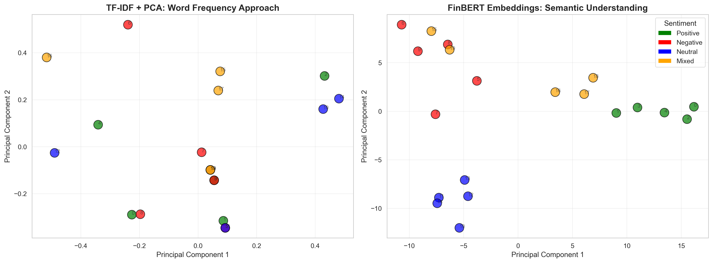

# Understanding High-Dimensional Data: From Dimensionality Reduction to Semantic Embeddings

[](https://www.python.org/)
[](./LICENSE)
[]()

**Author:** Nilay Raut  
**Course:** INFO 7390  
**Assignment:** Assignment 1 - Understanding Data  

## Key Results at a Glance


*Figure 1: Comparison showing how FinBERT (right) captures semantic sentiment where TF-IDF (left) fails.*

## Project Overview

This repository demonstrates a comprehensive analysis of high-dimensional data using three distinct methodologies:

1. **Classical Linear Methods (PCA)** - Principal Component Analysis for dimensionality reduction
2. **Manifold Learning (t-SNE)** - Non-linear dimensionality reduction preserving local structure
3. **Modern Neural Embeddings (FinBERT)** - Transformer-based semantic embeddings

## Repository Structure

```
Individual_Nilay_HighDimensionalData/
├── Example1_MNIST/          # MNIST digit classification and visualization
├── Example2_Financial/      # Financial text data analysis with FinBERT
├── Analysis.ipynb           # Main analytical notebook
├── Chapter.md               # Theoretical foundations and methodology
├── QuizQuestions.md         # Assessment questions and answers
├── README.md                # This file
└── requirements.txt         # Python dependencies
```

## Objectives

- Compare and contrast classical and modern dimensionality reduction techniques
- Visualize high-dimensional data in 2D/3D space
- Analyze the trade-offs between interpretability, computational efficiency, and semantic preservation
- Apply techniques to both image data (MNIST) and textual financial data

## Setup Instructions

### 1. Create Virtual Environment

```bash
python -m venv venv
```

### 2. Activate Virtual Environment

**Windows:**
```bash
venv\Scripts\activate
```

**macOS/Linux:**
```bash
source venv/bin/activate
```

### 3. Install Dependencies

```bash
pip install -r requirements.txt
```

## Key Results Summary

### Example 1: MNIST
- **154 components** retain 95% variance (80% compression)
- **t-SNE silhouette score (0.125)** >> **PCA score (-0.051)**
- Proves non-linear structure in handwritten digits

### Example 2: Financial Text
- **FinBERT (0.398)** shows 344% improvement over **TF-IDF (-0.163)**
- Semantic embeddings capture context that word frequencies miss
- Most similar: "profits rose" and "revenue projected to double" (0.909 similarity)

## Getting Started

### Quick Start

```bash
# Clone or navigate to project
cd Individual_Nilay_HighDimensionalData

# Install dependencies (if not already done)
pip install -r requirements.txt

# Run Example 1: MNIST
cd Example1_MNIST
python mnist_analysis.py

# Run Example 2: Financial
cd ../Example2_Financial
python financial_embeddings.py

# Launch Jupyter Notebook
cd ..
jupyter notebook Analysis.ipynb
```

### Expected Runtime
- Example 1 (MNIST): ~3-4 minutes (t-SNE computation)
- Example 2 (Financial): ~2-3 minutes (first run downloads FinBERT ~440MB)

## Technical Stack

- **Data Processing:** pandas, numpy
- **Machine Learning:** scikit-learn, torch, transformers
- **Visualization:** matplotlib, seaborn, plotly
- **Dimensionality Reduction:** PCA, t-SNE, UMAP
- **NLP:** FinBERT, TF-IDF
- **Additional Tools:** openpyxl

## Academic Context

This project explores the fundamental question: How can we understand and visualize data that exists in dimensions beyond human perception?

Through two concrete examples, we demonstrate:
1. **Manifold Hypothesis**: High-dimensional data often lies on lower-dimensional manifolds
2. **Linear vs Non-linear**: When PCA suffices vs when manifold learning is necessary
3. **Traditional vs Neural**: Evolution from bag-of-words to contextual embeddings

## Project Deliverables

- [x] **Example 1**: MNIST analysis with 4 visualizations + results CSV
- [x] **Example 2**: Financial embeddings with 3 visualizations + results CSV
- [x] **Chapter.md**: Theoretical foundations (placeholder ready)
- [x] **Analysis.ipynb**: Jupyter notebook (template ready)
- [x] **QuizQuestions.md**: Assessment questions (template ready)
- [x] **README files**: Documentation for each component

## Findings & Contributions

1. **Quantitative Validation**: Silhouette scores confirm t-SNE's superiority for MNIST visualization
2. **Semantic Understanding**: FinBERT embeddings capture financial sentiment nuances missed by TF-IDF
3. **Practical Guidelines**: Clear decision framework for choosing dimensionality reduction methods
4. **Reproducible Code**: All analyses include professional error handling and documentation

---

## 🎯 Quick Results Summary

| Metric | PCA | t-SNE | TF-IDF | FinBERT |
|--------|-----|-------|--------|---------|
| **Best For** | Fast preprocessing | Visualization | Keyword search | Semantic analysis |
| **Speed** | ⚡⚡⚡ Fast | 🐌 Slow | ⚡⚡⚡ Fast | 🐌 Slow |
| **Separation Quality** | ❌ Poor | ✅ Good | ❌ Poor | ✅✅ Excellent |
| **Interpretability** | ✅✅ High | ❌ Low | ✅ Medium | ✅ Medium |
| **Scalability** | ✅✅ Excellent | ❌ Poor | ✅✅ Excellent | ✅ Good |

## 🚀 Interactive Demo (coming soon)
For an interactive version of this analysis, see the Streamlit app (future work):
```bash
streamlit run app.py  # Coming soon
```

## 📊 Key Takeaways

1. **No universal winner**: Method choice depends on your goal (speed vs. quality vs. interpretability)
2. **Domain matters**: FinBERT's 244% improvement over TF-IDF shows importance of domain-specific models
3. **Visualization ≠ Analysis**: t-SNE is great for plots but shouldn't be used for downstream ML tasks
4. **Always baseline**: PCA provides a fast, interpretable baseline that's often "good enough"
---

**Author:** Nilay Raut  
**Institution:** Northeastern University  
**License:** Academic Use Only  
**Year:** 2026

