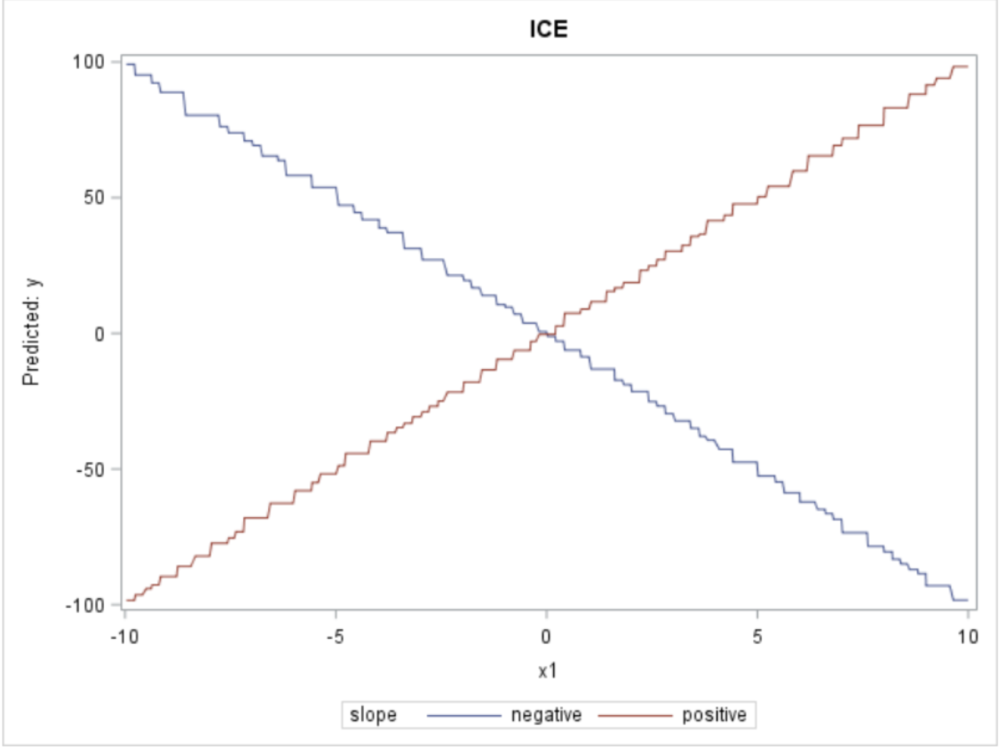

# Data Visualization


 
## Data Visualization Recipe 

### Any code and notebooks related to the lessons will be found in this directory.  

### Dataset and how to use it:

The most effective way to use a dataset in order to understand its insights will depend on the specific dataset and the questions you are trying to answer. However, some general best practices for working with datasets include:

Understand the context: 

Before you start working with a dataset, make sure you understand the context in which it was collected, including the variables that were measured, the sample size, and any limitations of the data.
Clean and organize the data: Once you have a basic understanding of the dataset, you should clean and organize the data so that it is in a format that is easy to work with. This may involve removing missing or duplicate values, and making sure that variables are in the correct format.

* Explore the data: 

Before diving into specific analyses, it's important to explore the data and get a general sense of the patterns and trends that are present. This can be done through visualizations such as histograms, scatter plots, and box plots.

* Identify patterns and trends: 

Use the data to identify patterns and trends that are relevant to the questions you are trying to answer. This may involve using statistical techniques such as hypothesis testing, regression analysis, or clustering.

* Communicate your insights: 

It's important to communicate your findings in a clear and concise manner, whether it's to a team of colleagues, stakeholders, or to a broader audience. This can be done through reports, dashboards, or data visualization tools.

* Keep questioning: 

As you work with the data, keep questioning your findings and the assumptions you are making about the data. Try to find additional evidence to support or refute your findings.

It is also worth mentioning that if the dataset is very large, it is a good practice to work with a sample of the data, and make sure that the sample is representative of the whole dataset, to avoid performance issues or too long processing times.

### Data collection mechanisms:

Data collection mechanisms are essential to ensure that the data you use for visualization is well-prepared, relevant, and conducive to effective visual representation. Here are key aspects of data collection mechanisms in relation to data visualization.

* Data Sources:

Identify Data Sources: 

Determine where your data is coming from. Sources can include databases, spreadsheets, external APIs, web scraping, surveys, or even real-time data feeds.

* Data Access: 

Establish how you will access the data from these sources. This may involve setting up connections to databases, downloading files, or using APIs for data retrieval.

* Data Selection:

Select Relevant Data: Choose the specific dataset or subset of data that is most relevant to your visualization goals. Avoid including unnecessary or unrelated data.

* Filter and Preprocess:

Apply data filters and preprocessing steps to prepare the data for visualization. This may include cleaning, aggregating, or transforming the data as needed.

* Data Quality:

Quality Assurance: Ensure that the collected data is of high quality. Implement checks to address issues such as missing values, outliers, and data inaccuracies that may impact the accuracy of visualizations.

* Data Integration:

Merge Data Sources: If your visualization requires data from multiple sources, integrate them properly to create a unified dataset. Data integration may involve data cleaning and merging based on common keys.

### Importance of Data Visualization:

Data visualization is crucial in data analysis as it serves as the primary way to reveal complex data structures that may be hard to understand otherwise. Data by itself, consisting of bits and bytes stored in a file on a computer hard drive, is invisible. In order to be able to see and make any sense of data, we need to visualize it. Every new visualization is likely to give us some insights into our data. Some of those insights might be already known (but perhaps not yet proven) while other insights might be completely new or even surprising to us. Some new insights might mean the beginning of a story, while others could just be the result of errors in the data, which are most likely to be found by visualizing the data.

* Revealing Unseen Insights: Visualization helps in discovering unexpected patterns and effects in data that might not be apparent through other means.

* Data is Initially Invisible: Data, in its raw form, is invisible and cannot be easily comprehended. Visualization transforms it into a visible and understandable format.

* Broad Understanding of Visualization: The concept of visualization extends beyond charts and graphs to include even textual representations of data, such as loading a dataset into spreadsheet software.

* The Need for Visualization: Rather than questioning whether to visualize data, the focus should be on determining which type of visualization is most suitable for a given situation.

* Moving Beyond Tables: Tables alone are often insufficient for gaining an overview of a dataset or identifying patterns. Visualizations, such as maps for geographical data, are essential for revealing certain types of patterns.

* Diverse Patterns: Visualizations can help identify a wide range of patterns within data, including geographical patterns and other complex structures.

## Additional Insights

* Interactive Visualizations: Mention the importance of interactive data visualizations, especially in explanatory and exploratory visualization. Interactive charts and graphs allow users to explore data on their own, providing a more engaging and insightful experience. Tools like D3.js, Plotly, or Tableau are popular for creating interactive visualizations.

* Choosing the Right Visualization Type: Emphasize the significance of selecting the appropriate visualization type based on the nature of the data. For instance, line charts are ideal for time-series data, while scatter plots are great for exploring relationships between variables. Using the wrong visualization can lead to misinterpretations.

* Color Palette and Accessibility: Discuss the importance of color choices in data visualization. Ensure that color palettes are chosen carefully to cater to colorblind users and maintain accessibility standards. Tools like ColorBrewer can assist in selecting suitable color schemes.

* Data Storytelling: Data visualization is not just about displaying numbers; it's about telling a compelling story. Encourage readers to consider the narrative they want to convey through their visualizations. Annotations, labels, and captions can help guide the audience through the story being told by the data.

* Data Cleaning and Preparation: Reiterate the critical role of data cleaning and preparation. Before visualization, ensure that data is cleaned of outliers, duplicates, and errors. Data transformation may also be necessary to make it suitable for visualization.

* Data Aggregation: In exploratory visualizations, aggregating data can reveal hidden patterns. Discuss techniques like grouping, binning, or summarization to simplify complex data and make it more understandable.

* Data Imputation Considerations: Expand on the challenges and considerations related to data imputation. Highlight the importance of understanding the missing data mechanism and choosing appropriate imputation techniques based on the nature of the data.

* Handling Time-Series Data: Delve deeper into techniques specific to time-series data, such as smoothing methods, moving averages, and seasonality analysis. Time-series visualizations like line charts or heatmaps can be powerful tools for extracting insights.

* Dimensionality Reduction: For datasets with high dimensionality, mention the benefits of dimensionality reduction techniques like PCA (Principal Component Analysis) or t-SNE (t-distributed Stochastic Neighbor Embedding) to visualize data in lower dimensions while preserving important information.

* Custom Visualization Tools: Depending on the complexity of the data, readers may need to explore custom visualization tools and libraries. Python libraries like Matplotlib and Seaborn are versatile for creating a wide range of visualizations, while R offers powerful capabilities through packages like ggplot2.

* Ethical Considerations: Remind readers of the ethical responsibilities in data visualization, such as avoiding data manipulation to convey misleading information and respecting user privacy when working with sensitive data.

* User Feedback: Stress the importance of obtaining feedback from end-users or stakeholders. Data visualizations should be user-centric, and incorporating feedback can lead to more effective communication and decision-making.

* Continual Learning: Encourage readers to stay updated with the latest trends and advancements in data visualization. The field is constantly evolving, and learning new techniques can lead to more impactful visualizations.


Types of Visualization (The Why?)
* Explanatory (Communicate something to a larger audience)

  Primarily used to communicate intricate patterns or findings to a larger audience. This type of visualization streamlines complex data, transforming it into easily digestible visuals that resonate with the audience's understanding.
* Exploratory (Find out interesting aspects/patterns in the data)

  Aimed at uncovering hidden patterns, relationships, and trends within the data. This is instrumental for data scientists and analysts during the initial phases of data analysis when they are trying to gain insights and generate hypotheses.
* Confirmatory (Visual evidence for an assertion/hypothesis)

  Offers a visual means to provide evidence in support of a specific assertion or hypothesis. It ensures that the conclusions drawn are based on factual evidence represented in the visualization.

Check the data! GIGO (Garbage-in, garbage-out):  It's crucial to ensure data quality before diving into visualization. Feeding flawed or irrelevant data will result in misleading visuals, hence the term "garbage in, garbage out."
* Missing values?: Ensure that there aren't significant gaps in your dataset that might skew results. Tools and techniques for data imputation can help address this.
* Data Imputation : Data Imputation refers to the procedure of using alternate values in place of missing data. It is also referred to as unit imputation.
    * Missing information can produce a significant degree of bias that makes analyzing and processing data more difficult and reduces the efficiency.
 * Importance of data imputation : Distorts datasets : Large number of missing data can lead to anomalies in the variable distribution,which can change the relative importance of different categories in the dataset.
     * Impacts the final model : Missing data leads to the bias in the dataset, which could affect the final model analysis.
     * Difficult to work with majority machine learning libraries : When utilizing machine learning libraries, mistakes may occur because there is no automatic handling of the missing data.
* Data Imputation Techniques : There are different data imputation technique some of the technique are :
    * K Nearest Neighbour : The objective is to find K nearest examples in the data where the value in the relevant feature is not absent and then substitute the value of the feature that occurs most frequently in the group.
    * Missing Value Prediction : Using a machine learning module to determine the final imputation value for charactersitic based on other features. The model is trained using the values in the remaining columns, and the rows in feature without missing values.
    * Most Frequent Value : In this method the most frequent column is used to replace the missing values.
    
Challenges in Data Imputation Techniques :Missing Data Mechanism: Understanding the missing data mechanism is crucial. Is the data missing completely at random (MCAR), missing at random (MAR), or not missing at random (NMAR)? The mechanism can affect the choice of imputation method.
* Bias: Imputing missing values can introduce bias if not done carefully. The imputed values should resemble the true underlying distribution as closely as possible to avoid distorting the data.
* Imputation Quality Assessment: It's important to assess the quality of imputed values. Some metrics, like root mean squared error (RMSE) or mean absolute error (MAE), can be used to evaluate imputation performance.
* Handling Categorical Data: Imputing categorical data can be tricky. Techniques like using the mode or more advanced approaches like random forest imputation can be employed.
* Time-Series Data: For time-series data, imputation methods need to account for temporal dependencies. Techniques like forward fill, backward fill, or interpolation with consideration of time can be useful.
* Data Scale: Scaling issues can arise in imputation. For example, imputing missing values for variables with different scales (e.g., age and salary) may require normalization or standardization. 
* Data types : Understanding the nature of your data is pivotal.
  - There are several reasons why understanding the nature of data is important as its the first step in any data analysis-
    1. Data Cleaning: Data in the real world is often messy and inconsistent. Understanding your data can help you identify errors or anomalies that need to be addressed before analysis. ex- if certain columns need to contain a specifc data type such as Int but you see some string values, this would indicate a problem.
    2. Predictive Modeling: If you’re building a predictive model, understanding your data can inform feature engineering and the choice of model. ex- categorical variables might need to be one-hot encoded before being used by any ML model as its efficient to predict using binary digits rather than a string of characters.
    3. Effective Communication: Different types of data require different types of visualizations. ex- categorical data might be best represented by a bar chart, while continuous data might be better suited for a histogram or scatter plot.
   
  - Few common data types and its uses:
  
    * Categorical, Nominal, Ordinal: Classifications without a particular order or with a hierarchy.
      1. Categorical - This type of data is used to label data in a dataset into a finite number of discrete groups. Categorical data might not have a logical order. ex- gender (Male, Female, Other) is a categorical variable.
      2. Nominal - Nominal data is a type of categorical data where the categories do not have a standard hierarchy such as colors (red, blue, green) or city names (Boston, San Francisco).
      3. Ordinal - Ordinal data is also categorical but with a clear ordering or hierarchy such as customer satisfaction ratings (Unsatisfied, Neutral, Satisfied) are ordinal.
    * Numeric: Quantifiable data that can be measured. Types of Numeric data:
      1. Discrete: These are whole numbers and represent countable data. ex- the number of employees in a company.
      2. Continuous: These can take any value within a range and represent measurable quantities. ex- temperature or weight.
    * Strings & Dates: Textual data and specific time points or durations.
      1. String: represent textual data and can include names, addresses, and descriptions.
      2. Dates: represent specific points in time and can be used to analyze trends over time.
    * Boolean: This type of data represents truth values and is commonly used in logic operations. It can only take two values: True or False.
    * Interval: Interval data is numeric but with a consistent scale and not necessarily start with zero (like temperature in Celsius or Fahrenheit).
    * Ratio: Ratio data is numeric with a consistent scale and does indeed start with zero (like height, weight, age).
   * Text Data:
     1. Unstructured Text: Free-form text data that doesn't follow a specific structure or format. Example: Customer reviews, Twitter posts.
     2. Structured Text: Text data that follows a predefined structure or format. Example: Emails, XML or JSON data
    * Time Series Data:
    1. Temporal Data: Data collected over a period of time. Example: Stock prices over days, Sensor data with timestamps.
    2. Sequential Data: Data with an inherent sequence or order. Example: Web clickstreams, GPS tracking data.

   * Geospatial Data:
    1. Point Data: Data representing specific geographic points. Example: Locations of landmarks, GPS coordinates.
    2. Polygon Data: Data representing geographic areas as polygons. Example: Country borders, city boundaries.

   * Percentage Data:

Percentage: Data represented as a percentage of a whole. Example: Percentage of votes in an election, Percentage of budget allocated to different departments.

   * Currency Data:

Currency: Data representing monetary values. Example: Dollar amounts, Euro amounts, currency exchange rates.

   * Image Data:

Digital Images: Pixel-based data representing images. Example: Photographs, MRI scans.

Vector Images: Graphics represented using mathematical equations. Example: Logos, icons.

   * Audio Data:

Audio: Sound data represented as waveforms. Example: Music recordings, Speech samples.
      
* Descriptive statistics: A preliminary overview of data.
    * Numeric: Using methods like .describe() to get count, mean, standard deviation, etc.
    * Categorical: Evaluate using Shannon entropy to measure unpredictability, count unique values, and ascertain the frequency of each value.
* Data type attributes (GPS, Sequence/Time-series, Nodes/Edges) - User feedback

  It's essential to understand the context.
    * GPS: Geographical points
    * Sequence/Time-series: Data points arranged in time order
    * Nodes/Edges: Data points representing network connections, needing feedback from users to interpret significance.

* Data structure (Tabular, Graph, Time-series, Hierarchical, Geographic, Map, Network, etc.) - User feedback

  Knowing the structure helps in selecting the right visualization.
    * Tabular, Graph, Time-series, Hierarchical, Geographic, Map, Network, etc. Each offers different insights and requires unique visualization techniques.
* Data type semantics (Spatial, Temporal) - User feedback

  Semantic meaning can influence interpretation.
    * Spatial: Relating to space
    * Temporal: Relating to time

### Data Type Semantics (Spatial, Temporal):

  * Emphasize that understanding data type semantics is crucial for effective data visualization. Spatial data, for example, can be visualized using maps, heatmaps, or geographical plots to convey geographic patterns. Temporal data, on the other hand, can be visualized using time series plots, calendars, or Gantt charts to reveal trends over time.
  * Discuss how combining spatial and temporal data can lead to powerful visualizations, such as spatiotemporal heatmaps or animations, which can reveal insights about how phenomena change over both space and time.

##Visual Encoding channels

Visual encoding channels in the context of machine learning refer to the various ways in which data attributes or features can be visually represented or encoded in data visualizations. These channels play a crucial role in conveying information effectively through visualizations. Understanding and effectively using these channels is important for creating informative and interpretable data visualizations. Common visual encoding channels include:

1. **Position**: The position of objects (such as points or bars) along a common scale can encode quantitative or categorical values. For example, the height of bars in a bar chart or the x and y coordinates in a scatter plot encode numerical data.

2. **Length**: The length of graphical elements, like bars in a bar chart, can represent quantitative values. Longer lengths typically correspond to larger values.

3. **Color**: Color can be used to represent different categories or values within a dataset. For example, different colors might be used to distinguish different classes or data clusters. However, it's important to choose colors carefully to ensure accessibility and avoid colorblindness issues.

4. **Shape**: Shapes, such as different markers or symbols, can be used to differentiate categories or data points within a visualization. For instance, circles and squares might represent different groups in a scatter plot.

5. **Size**: The size of graphical elements, such as the diameter of circles or the thickness of lines, can be used to represent quantitative values. Larger sizes often correspond to larger values.

6. **Texture and Pattern**: Texture and patterns, like stripes or dots, can be used to encode categories or data points. However, they should be used sparingly, as excessive texture can clutter visualizations.

7. **Orientation**: The orientation of graphical elements, such as the angle of lines or bars, can be used to convey information. For example, the slope of a line might represent a trend or relationship.

8. **Opacity/Transparency**: The transparency or opacity of elements can be adjusted to highlight or de-emphasize certain parts of a visualization. This is useful for showing overlapping data points.

9. **Angle**: The angle of lines or wedges in a pie chart can encode values, but this channel is less accurate and less effective than position and length for quantitative data.

10. **Direction/Connection**: Arrows or connections between points can represent directional relationships or flows in the data.

11. **Volume (3D)**: In three-dimensional visualizations, the volume of objects can represent values, but 3D visualizations should be used with caution as they can introduce distortions and make it harder to perceive relationships accurately.

12. **Time**: For time-series data, the temporal aspect can be encoded by the position along a timeline or the progression of elements over time.

Choosing the appropriate visual encoding channel or combination of channels depends on the nature of the data and the goals of the visualization. Effective use of these channels can make your data visualizations more informative, interpretable, and engaging, which is crucial in the context of machine learning for exploring data, assessing model performance, and communicating results.

  
* Outliers? (Numeric Box-whisker x times (deflaut 1.5) interquartile range, categorical would be rare values/low % default < 1%)

  
    Outliers are data points in a dataset that differ significantly from the typical data points. They may show variations in a measurement, faults in the 
    experiment, or a novelty and can be significantly larger or significantly smaller than the other data points. The effects of outliers on statistical analysis 
    can be significant, and they can skew the outcomes of any hypothesis testing. For accurate findings, it is crucial to thoroughly identify any potential 
    outliers in your dataset and deal with them appropriately.

### Handling Outliers:

Highlight that outliers can significantly impact the results of data analysis and visualizations. It's important to not only identify outliers but also consider whether they should be removed, transformed, or retained based on the context of the analysis.

Mention the use of box plots and whisker plots to visualize the distribution of data and easily spot outliers. These plots provide a visual representation of the data's spread and can help in identifying extreme values.

Discuss the importance of domain knowledge when deciding how to handle outliers. In some cases, outliers may represent critical data points that should not be removed without a thorough understanding of their significance.

  Types of outliers
  There are two kinds of outliers:
  
  Univariate Outlier
  An excessive value related to only one variable is referred to as a univariate outlier.
  Imagine you have a dataset of 10 employees’ having salary on a scale of $10k to $50k. The 
  salaries are as follows: $35k, $40k, $42k, $48k, $49k, $47k, $46k, $41k, $40k, and $20k.In 
  this case, the score of $20k is significantly lower than the rest of them and can be 
  considered a univariate outlier.

  Multivariate outlier
  A collection of odd or extreme values for at least two different variables is known as a 
  multivariate outlier.
  Imagine you are a teacher, and you have collected data on how well a group of students 
  performed in two subjects: mathematics and science. Your aim is to pinpoint students who 
  either excel or struggle significantly in both subjects simultaneously.
  Here are the scores of five students:
  Student A: Achieved a high score in math (95) and a good score in science (90).
  Student B: Scored well in both math (85) and science (88).
  Student C: Received lower scores in both math (60) and science (55).
  Student D: Obtained a remarkable math score (92) but struggled in science (40).
  Student E: Excelled in science (92) but had a relatively lower math score (75).

  In this scenario, students D and E are identified as multivariate outliers because they 
  stand out by performing exceptionally well in one subject while significantly 
  underperforming in the other subject when compared to the general distribution of scores. 
  Student D excels in math but faces challenges in science, whereas student E shines in 
  science but has a comparatively lower math score.

  You'll see outliers classified as any of the following, in addition to the distinction 
  between univariate and multivariate outliers:

  Global outliers
  Single data points that deviate significantly from the majority of the data distribution 
  are referred to as global outliers (also known as point outliers). 

  Contextual outliers
  The same value may not be regarded as an outlier if it occurred in a different context. 
  Contextual outliers, often referred to as conditional outliers, are values that 
  considerably depart from the rest of the data points in the same context. These kinds of 
  outliers are frequently observed in time series data. 

  Collective outliers
  A subset of data points that is completely distinct from the overall dataset is referred 
  to as a collective outlier.


   How do you identify outliers?

   Use of statistical tests like z-scores or interquartile range (IQR) is one of the most used techniques.  We determine the z-score for each data point in the 
   dataset using the z-score method. A data point is regarded as an outlier if the z-score exceeds a predetermined threshold. Any data point with a z-score 
   larger than 3 or less than -3 is regarded as an outlier since the threshold value is often set to 3 or -3.

   In the IQR approach, we first determine the dataset's IQR, which is the difference between the first and third quartiles (Q1 and Q3). Then, based on the IQR, 
   a range of values that are deemed "normal" are established. An outlier is any data point that lies outside of this range.
   
   Through data visualisation, outliers can also be found. We may visually locate any data points that are considerably different from other points in the 
   dataset by showing the data points on a graph.

When should you remove outliers?

The desire to eliminate outliers as part of the data cleansing process would seem obvious. However, in practise, it's occasionally preferable—even imperative—to preserve outliers in your dataset. 

Removing outliers purely because they were in the dataset's extremes can lead to inconsistent results, which would be harmful to your objectives as a data analyst. The statistical significance of the analysis could be lowered as a result of these inconsistencies.

What causes outliers to appear in datasets?

It's important to consider how outliers get into datasets in the first place now that we understand what they are and how to spot them. 

Some of the more frequent reasons for outliers in datasets are listed below:

Human error, such as a misspelling, when manually entering data
intentional mistakes, like adding mock outliers to a sample to test detection algorithms.

Sampling errors that result from removing or combining data from unreliable or inconsistent sources, Data processing mistakes brought on by unintentional dataset changes or data tampering

Instrumental error-related measurement errors

Experimental blunders that occur during the design, execution, or data extraction stage
 These are unusual data points that can heavily influence the overall visualization.
    * Numeric: Use Box-whisker plots to identify values that fall outside the interquartile range.
    * Categorical: Identify rare values or those that occur less frequently.

To do:
* Enough data (Power)?

  * Sample Size: Ensure your dataset is large enough to draw valid conclusions and to represent the population or phenomenon you're studying accurately.
  * Quality of Data: The quality of your data is more important than the quantity. Your data should be accurate, consistent, and up-to-date.
  * Variance and Standard Error: Analyze the variance and standard error to know the reliability of your data. Smaller standard errors indicate more reliable data.
  * Power Analysis: Conduct a power analysis to determine the minimum sample size needed for your analysis to be reliable.
  
* Is the data stationary? <a href='https://www.youtube.com/watch?v=R69TZFNEao4'>See Video</a>   
  * Stationary data is data that exhibits a consistent statistical behavior over time. This kind of data has statistical properties such as mean, variance, and autocorrelation that do not change significantly across different time intervals.
  * This is important to evaluate when analyzing because many statistical methods and models assume stationarity. If the data is not actually stationary, it can be more challenging to analyze and model accurately.
  * Techniques to convert data to stationary data:
     * Differencing:
       * First-Order Differencing: Most commonly used. This involves calculating the difference between consecutive data points.
       * Seasonal Differencing: Used when there is a seasonal component (e.g., data with recurring patterns over a fixed time period). Seasonal differencing involves subtracting the value of the series at the same point in the previous season.
       * Higher-Order Differencing: Used if first-order differencing doesn't make the data stationary. Perform second-order (or higher-order) differencing by applying the differencing operation multiple times.
     * Transformation:
       * Log Transformation: Taking the natural logarithm (or other appropriate transformations like square root or cube root) of the data can stabilize variance and make it more consistent across time, especially if the data exhibits exponential growth.
       * Box-Cox Transformation: The Box-Cox transformation is a family of power transformations that includes the logarithm as a special case. It can be used to find the transformation that best stabilizes the variance and makes the data approximately normal.
       * Other Transformations: Depending on the characteristics of the data, other transformations like taking the inverse or applying a polynomial transformation may be used.
* Is the data biased? <a href='https://www.youtube.com/watch?v=gF2nnpujO1g'>Check this out!</a>

  When evaluating or making judgments based on data, bias refers to the existence of systemic flaws or inaccuracies that may provide inaccurate or unjust outcomes. To maintain the       quality and fairness of the studies or models, it's crucial to recognize and remove data bias, which can come from a variety of sources.

  Here are some key aspects related to data bias, its impact, and how to address it:

  Understanding Data Bias:

  * **Sources of Bias:** Data bias can be caused by a number of factors, such as data gathering methods, sample procedures, historical biases, and human judgment. For instance, if a       survey questionnaire asks biased or deceptive questions, the results may reflect that bias.
  * **Selection Bias:** This happens when the analysis's data does not accurately reflect the population at large or the intended audience. For instance, if you only gather survey         information from a certain demographic group, it could not truly represent the attitudes or conduct of the whole community.
  * **Measurement Bias:** Bias can also arise from the way data is measured or recorded. Bias can be introduced by mistakes in measurement tools or subjective assessments. The             accuracy of medical diagnoses, for instance, may be impacted if specific symptoms are either overreported or underreported in the context of healthcare owing to cultural               considerations.

  The effect of Data Bias:

* **Unfair Decisions:** Biased data can result in discriminatory or unjust outcomes in a variety of contexts, including hiring, lending, and criminal justice. Bias may be maintained     by machine learning models that were trained on biased data.
* **Inaccurate Insights:** Data bias can cause data analysis to produce inaccurate insights. It may result in erroneous inferences and wrong interpretations of data trends or            patterns. 

  Addressing Bias in Data:

  * **Data collecting:** Keep a close eye on the data collecting process. Ensure that data is acquired in a biased-free manner. When feasible, use impartial survey questions, random       sample procedures, and a variety of data sources.
  * **Data Preprocessing:** Identify and address missing data, outliers, and data problems during data preprocessing. Examine the dataset's representativeness and consider                 oversampling or undersampling to balance class distributions.
  * **Feature Engineering:** When picking features for analysis or model training, use caution. In predictive modeling, avoid incorporating factors that may cause bias, such as            protected traits (e.g., gender or ethnicity).
  * **Fairness measures:** When developing machine learning models, include fairness measures to assess model performance in relation to various demographic groups. Modify model           predictions to account for varying effects.
  * **Transparency and documentation:** Document the data gathering method, data pretreatment stages, and model training techniques thoroughly. This openness aids in the                   identification and correction of bias.
  * **Diverse Teams:** Encourage different teams to collaborate on data-related tasks. Diverse views can aid in the detection and correction of prejudice.
  * **Regular Audits:** Check your data and models for bias on a regular basis. To guarantee fairness and accuracy, reevaluate the data sources and model performance.
  * **Ethical Considerations:** Implement ethical rules and principles in data collecting, analysis, and decision-making processes. Consider the societal implications of your work.

In conclusion, tackling data bias is critical for ensuring fair and accurate data-driven insights and choices. It entails careful evaluation of data sources, methods of collection, and preprocessing procedures, as well as continual monitoring and mitigation activities. You may move toward more equal and trustworthy data analysis and models by actively eliminating bias.

Is data biased?
Data can be influenced by a lot of factors like society, environment, favoritism, incomplete data, inaccurate data, etc.
  The types of bias are:
  1. Response/ Activity Bias
     This includes user-based responses in the form of reviews or feedback. These can be biased on favoritism, intentions, etc. E.g.- Restaurant reviews, movie 
     reviews, etc.
  2. Societal Bias
     This refers to a bias caused by unfair norms of society. This includes gender/ racial bias, etc. This can impact the whole society at large. The more      
     dominating group affects the data. Eg: Gender pay gap, racial differences in corporate leadership opportunities
  3. Omitted Bias
     When data has missing values, it induces bias in data due to inconsistencies in the dataset.
  4. Selection Bias
     This happens when the bias is used to influence a selected part of the population to gain something. E.g.: Digital election campaigns, and biased ads.
[1](https://www.wallstreetmojo.com/wp-content/uploads/2023/05/Data-Bias-Meaning.png)
[2](https://assets.website-files.com/5d6060eb18edbee0be7240e8/62bc1fc688127da698aa9ef1_2.png)
[3](https://helpfulprofessor.com/wp-content/uploads/2022/10/statistical-bias-examples-and-definition-1024x724.jpg)
     
Identifying Data Bias:
1. Data Collection: 
   Bias in data can be identified by data collection. Data collection can show three types of bias:
   1. Selection Bias: This is a bias based on a particular selection and does not represent the whole dataset
   2. Systematic Bias: This is a bias that gets repeated in a model.
   3. Response Bias: This is bas that is caused on users' responses and their inputs.
2. Data Preprocessing:
   This step can help in various ways to make the data unbiased. In one of the ways, we can determine the outliers in data that can impact data. Missing values 
   can be handled to determine biased data. Imputing missing values with the average might not necessarily remove the biased data.
3. Data Analysis:
   This includes two ways:
   1. Confirmation Bias: Involves preconceptions of a theory
   2. Misleading charts: Involved incorrect representation of data in various forms of visualizations
      
Correcting the biased data
1. Improve Data Collection Methods: Use rigorous and standardized data collection protocols to minimize errors and inconsistencies.
2. Address Non-Response Bias
3. Use Appropriate Sampling Methods
4. Apply Weighting
5. Use Statistical Techniques
6. Imputation for Missing Data
7. Conduct Sensitivity Analysis
8. Transparent Reporting
9. Peer Review and Collaboration     
10. Consider External Data Sources                   

  


Fix data issues and log what was done
* Impute missing values
  * Type of missing values:<br>
  * Missing completely at Random:<br>
    The missing value has absolutely no relation with other observations.<br>
  * Missing Data not at Random:<br>
      There is a relationship between missing value and other observations.<br>
  * Missing at Random:<br>
      Some values are missing at random.<br>

  **Imputation Techniques**:<br>
  **Mean, median, Mode**:<br>
    **Assumption**: Data is missing completely at random.<br>
      Operation:<br>
      Replacing the NaN with most frequently occurring variable based on mean, median or mode.<br>

  **Random Sample imputation**:<br>
    **Assumption**: Data is missing completely at random.<br>
      Operation:<br>
      Taking random observation from given dataset and replace the NaNs with these observations.<br>

  **End of Distribution**:<br>
    **Assumption**: Data not missing completely at random.<br>
    Operation:<br>
    Replace NaN in the dataset with the values at the extremes (outliers)<br>
    This technique takes outliers into consideration.<br>

  **Capturing NaN with a new feature**:<br>
    **Assumption**: Data NOT missing completely at random.<br>
      Operation:<br>
      Replace the NaN in dataset with a new feature. ex: 0 and 1<br>
      Can also be replaced with a variable (for categorical variable). ex: “Missing”.<br>

  **Arbitrary Value Imputation**:<br>
    **Operation**:<br>
    Arbitrary value should not be the most frequent values.<br>
    Replace the NAN value with arbitrary value such as the extreme values in the dataset or any other values other than mean, median or mode.<br>

  **Frequent Category Imputation**:<br>
    **Assumption**: The amount of missing value is low.<br>
    **Operation**:<br>
    Find the number of missing values.<br>
    If there are few missing values: replace the missing values with most frequent value.<br>
  
* Remove outliers : 
  
Removing outliers from a dataset is an important step in data preprocessing to ensure that your data analysis and modeling are not unduly influenced by extreme or erroneous data points. Outliers are data points that deviate significantly from the rest of the data. There are various methods to identify and remove outliers, and the choice of method depends on the nature of your data and the specific goals of your analysis. Here's a general outline of the process:

1. Visual Inspection:
Start by visualizing your data using plots like histograms, box plots, scatter plots, or Q-Q plots. These can help you identify potential outliers.
Statistical Methods:

2. Use statistical methods to detect outliers. Some common techniques include:
Z-Score: Calculate the Z-Score for each data point, which measures how many standard deviations it is away from the mean. Data points with high absolute Z-Scores (typically greater than 3 or -3) can be considered outliers.
IQR (Interquartile Range): Calculate the IQR, which is the difference between the 75th percentile (Q3) and the 25th percentile (Q1). Data points outside the range [Q1 - 1.5 * IQR, Q3 + 1.5 * IQR] are considered outliers.

3. Domain Knowledge:
Consider domain knowledge to identify outliers. Sometimes, data points that are outliers may have important information or may be valid data. In such cases, it's crucial to consult with domain experts before removing them.
Remove or Transform Outliers:

4. After identifying outliers, you can choose to:
Remove them: Delete the rows or data points that are identified as outliers. Be cautious when doing this, as it may lead to a loss of valuable information.
Transform them: Instead of removing outliers, you can transform them to be less extreme. Options include replacing them with the mean, median, or a predefined constant value, or applying data transformations like logarithms or winsorization.

5. Evaluate Impact:
Always assess how removing outliers affects your data distribution and analysis. It's essential to understand whether the removal significantly changes the results or insights drawn from the data.

6. Robust Algorithms:
When applicable, consider using robust statistical techniques or machine learning algorithms that are less sensitive to outliers, especially if you have reasons to believe that outliers are genuine data points.
Document and Justify:

7. Document the process of outlier detection and removal, including the criteria used and the rationale behind it. This documentation is essential for transparency and reproducibility of your analysis.
 
8. Iterate as Needed:
Depending on the impact of outlier removal, you may need to iterate through the process and re-evaluate your data.
Remember that the decision to remove outliers should be made thoughtfully, as it can have a significant impact on your analysis. It's important to strike a balance between data cleaning and retaining valuable information.
 
* Adjust for bias

  Adjusting for bias in data or in the context of data analysis is a critical step to ensure that your analysis and conclusions are as accurate and fair as possible. Bias can occur for various reasons, such as sampling methods, data collection processes, or algorithmic decisions. Here are some steps to help you adjust for bias in your data analysis:

1. Identify the Sources of Bias:
Before you can adjust for bias, you need to understand where bias may be present in your data or analysis. This could include bias in data collection, measurement error, sampling bias, or algorithmic bias.

2. Collect Comprehensive Data:
Ensure that your data collection process is as comprehensive as possible. Collecting data from a diverse and representative sample of the population or target group can help reduce bias due to underrepresentation.

3. Use Random Sampling:
If applicable, use random sampling techniques to select your data points. Random sampling helps ensure that each data point has an equal chance of being included, reducing selection bias.

4.Account for Missing Data:
Handle missing data appropriately. The way you handle missing data can introduce bias. Options include imputation methods or considering the missing data mechanism (missing completely at random, missing at random, or not missing at random) to make informed decisions about handling missing data.

5. Analyze Subgroups:
When analyzing data for bias, consider breaking down your analysis into subgroups based on relevant variables, such as age, gender, ethnicity, or other demographic factors. This can help identify bias affecting specific groups.

6.Evaluate Data Collection Procedures:
Examine the methods and procedures used to collect your data. Ensure that data collection tools and processes are designed to minimize bias. For example, consider using double-blind surveys to reduce response bias.

7.Use Fair and Unbiased Algorithms:
If you are using machine learning or algorithmic models, ensure that they are designed and trained to be fair and free from bias. Use techniques such as fairness-aware machine learning and algorithmic audits to detect and mitigate bias in models.

8. Sensitivity Analysis:
Perform sensitivity analysis to assess how changes in assumptions or methods affect your results. This can help you understand the impact of potential bias on your conclusions.

* Upsample
* Create synthetic data 

Feature selection<br>
Feature selection is an important aspect of building a machine learning model. Determining which features are important is essential for both performance and interpretability. Below are some methods and approaches to consider:
* Which features are important?
  * Statistical Tests: Correlation coefficients, chi-square tests, and t-tests can indicate the relationship between each feature and the target variable.
  *	Ensemble Methods: Algorithms like Random Forest and XGBoost provide feature importance metrics.
  *	Regularization Methods: Lasso and Elastic Net will shrink less important features towards zero, effectively performing feature selection.
  *	Domain Knowledge: Sometimes, the importance of features can be determined by domain experts.
  *	Wrapper Methods: Techniques like backward elimination and forward selection are model-based methods for feature selection.
    
* Partial dependencies/marginal contributions of each feature
  *	Partial Dependence Plots: These are used to visualize the effect of a single feature on the predicted outcome of a machine learning model.
    * Example:
      
    * The simplest PD plots are 1-way plots, which show how a model’s predictions depend on a single input. The plot below shows the relationship (according the model that we trained) between price (target) and number of bathrooms. Here, we see that house prices increase as we increase the number of bathroom up to 4. After that it does not change the house price.
    * PD plots look at the variable of interest across a specified range. At each value of the variable, the model is evaluated for all observations of the other model inputs, and the output is then averaged. Thus, the relationship they depict is only valid if the variable of interest does not interact strongly with other model inputs.

  *	Individual Conditional Expectation (ICE) Plots: An extension of partial dependence plots, ICE plots visualize the dependence of the prediction on a feature for each instance.
    * Example:
      
    * The ICE plots present a much different picture: the relationship is strongly positive for one observation, but strongly negative for the other observation. So contrary to what the PD plot tells us, the ICE plot shows that X1 is actually related to the target; it’s just that there are strong differences in the nature of that relationship, depending on the values of the other variables. 
    * Basically, ICE plots separate the PD function (which, after all, is an average) to reveal interactions and individual differences.
  *	Shapley Values: These provide a measure of how each feature contributes to each individual prediction, allowing you to understand both global and local feature importance.
  
* Relations between the features
  * Correlation Matrix: A heat map of Pearson or Spearman correlation coefficients can show how features are related to each other.
  *	Multicollinearity Tests: The variance inflation factor (VIF) can be used to detect multicollinearity between features.
  *	Pair Plots: Scatter plot matrices can show pairwise relationships between numerical features.
  *	Cross-tabulation: For categorical features, cross-tabulation can help understand the relationship between different categories.

  **Example for the relation between the feature**
    * We can plot lot to see the correlation between each variable and see the result:
    
    * From this graph, we can see there is a strong linearly correlation between many variables, such as radius_mean are strong linearly correlated with perimeter_mean, area_mean, radius_worst, perimeter_worst and area_worst, so we can drop the columns of perimeter_mean, area_mean, radius_worst, perimeter_worst and area_worst. 
    * In this case, we can use one strongest linearly correlation variable to represent the other variables and we do not need to analyze so many variables which is a way to reduce the workload.
      
* Dependencies between the features
  *	Conditional Independence Tests: These tests can check if one variable is independent of another, given a third variable.
  *	Feature Interaction Terms: Adding interaction terms to the model can capture dependencies between features.
  *	Graphical Models: Bayesian networks or graphical models can represent conditional dependencies between features.
  *	Cluster Analysis: This can be used to find groups of highly similar features, indicating possible dependency.
  *  Some Statistical Test Methods: Pearson Correlation Test, Spearman Correlation Test, Kendall-Tau Correlation Test, ANOVA test, Kruskal-Wallis H test, Chi-Square Test

* Considerations:
  *	Overfitting: Be cautious of overfitting when considering feature relations and dependencies. More features can make the model more complex and susceptible to overfitting.
  *	Interpreting Complexity: Complex relationships and dependencies between features can make the model less interpretable.
  *	Computation Cost: Some feature selection techniques and methods for assessing feature relations and dependencies can be computationally expensive.
It's often useful to employ a combination of these techniques to ensure a balanced approach to feature selection and understanding their interactions and dependencies.


Scale, normalize and transform
* When to scale?
    * Scaling means that we are tranforming the data so that it fits within a specific scale, like 0-1. This method is used when you're using methods based on measures of how far apart data points are.
    * It can help to balance the impact of all variables on the distance calculation and can help to imporve the performance of the algorithm.
* When to normalize?
    * The goal of normalization is to change the values of numerical columns in the dataset to use a common scale, without distorting differences in the ranges of values or losing information.
    * The data should be normalized when features have different ranges.
    * It also improves the performance and training stability of the model.
* When to transform?
    * Whenever a measurement variable does nit fit a normal distribution or has great different standard deviations in different groups it is better to perform a data tranformation.
    * Transforming variables can be done to correct outliers and assumption failures.

Graphical components ---> Graphical components and diverse aspects are used in Data Visualisation to effectively represent and convey information.
These graphical components are the foundation of data visualization, and how they are used can have a big impact on the effectiveness of the visualizations.
The graphical components used are determined by the type of data, the message that is to be conveyed, and the sort of visualization that is being generated (for example, bar charts, scatter plots, line charts, and so on).

* X-position: The horizontal positioning of data points along a scale or axis is represented by an X-position. It usually refers to the dataset's independent variable or categories. The X-position is critical for organizing data along a similar scale, which allows readers to compare and analyze numbers within categories or across time
  * Example:
    * In a bar chart, the X-positions represent different categories or groups.
    * In a line chart, the X-axis usually represents time or continuous variables.
 
* Y - position: The vertical positioning of data points along a scale or axis is represented by the Y-position. It is usually associated with the dependent variable or data values.
 The Y-position helps viewers grasp relationships and changes by displaying the size or value of data points.
    * Example :
      * In a bar chart, the Y-positions represent the heights or values of bars.
      * In a scatter plot, the Y-coordinates show the relationship between two variables.

Best practices for data visualization include:
* Reproducibility:
  * Documentation: Maintaining clear and well-documented code and scripts for creating visualizations. This includes comments, version control, and descriptions of data sources.
  * Parameters: Recording the parameters and settings used in visualization tools or libraries to ensure that others can replicate your results.
  * Data Provenance: Keeping track of the source, preprocessing steps, and any transformations applied to the data before visualization.
* Interactivity:
  * User-Centric Design: When creating interactive visualizations, consider the end-user's perspective. Ensure that the interactive elements provide meaningful insights and allow users to explore the data intuitively.
  * Clear Instructions: Include clear instructions or tooltips to guide users on how to interact with the visualization effectively.
  * Responsiveness: Ensure that interactive visualizations are responsive and work smoothly across various devices and screen sizes.
* Annotation:
  * Labels and Titles: Using informative labels for axes, data points, and legends. Titles and subtitles can provide context and help viewers understand the visualization's purpose.
  * Legends: Including a legend if your visualization uses color or symbols to represent categories or variables.
  * Annotations: Adding textual or graphical annotations to highlight specific data points or interesting observations in the visualization.
* Simplicity:
  * Minimizing Clutter: Avoiding clutter and excessive detail in visualizations and simplifying complex data when necessary to highlight key insights.
  * Data-Ink Ratio: Aiming for a high data-ink ratio by removing non-essential elements, such as excessive gridlines or background decorations.
  * Chart Selection: Choosing visualization types that best represent the data and the insights we want to convey. Sometimes, a simple bar chart or line chart is more effective than complex visualizations.   
   
* Color: Color is used to differentiate and categorize data points or groupings depending on a certain property or variable.
Color provides a visual encoding that helps distinguish and highlight data points or patterns. It can be used for categorical or qualitative data.
    * Example :
      * In a pie chart, each segment is often colored differently to represent different categories.
      * Heatmaps use color gradients to display variations in data intensity. 

* Marks - Shape (Points, Bars,Lines, Areas, Volumes): Marks or shapes are graphical representations of individual data points or data groups.
Marks are used to display data visually. Shapes can transmit distinct meanings or categories, and they are particularly helpful for encoding categorical data.
    * Example:
      * Scatter plots use points as marks to display individual data points.
      * Bar charts use bars as marks to represent discrete data categories.
      * An area chart uses filled areas to represent cumulative data over time or across categories
      * A 3D bar chart uses volumetric bars to represent data values in three dimensions.

* Channels (Position, Size, Angle/Slope, Color/Intensity/Hue, Texture): Channels refer to the different visual properties or attributes that can be used to represent and convey information about data points. These channels are ways to encode data so that viewers can interpret and understand the information more effectively. Common channels in data visualization include:

    * Position: The location of data points along a scale or axis. For example, in a bar chart, the height of the bars represents data values, and their position along the horizontal axis provides context.
    
    * Size: The physical dimensions of graphical elements, such as the size of circles in a scatter plot or the thickness of lines in a line chart. Size can be used to represent quantities, with larger elements indicating larger values.
    
    * Color: The use of different colors to distinguish data points or categories. Color can convey information or be used to highlight specific data points. However, it's essential to use color thoughtfully, considering color blindness and ensuring readability.
    
    * Shape: The choice of different shapes to represent data points. This is often used in scatter plots or symbol maps, where each shape may represent a different category or data attribute.
    
    * Texture: The use of patterns or textures within graphical elements to provide additional information. Texture can be useful for adding detail or nuance to data visualization, although it's less commonly used than other channels.
    
    * Angle/Slope: The orientation or angle of graphical elements, such as lines or wedges in pie charts. However, using angles and slopes to represent data should be done cautiously, as our perception of these attributes can be less accurate than position and size.
    
    * Opacity/Transparency: The degree to which graphical elements are transparent or opaque. This can be used to show overlapping data points or emphasize certain elements while de-emphasizing others.

* Animation: Animation in data visualization plays a role similar to storytelling in a movie. It helps make the data come to life and tells a dynamic story. Here's a simple explanation of its role:

   * Engagement: Animation makes data more interesting and engaging. It captures the viewer's attention and keeps them interested in exploring the data.

   * Sequence: It can show how things change over time or in a particular order. For example, you can use animation to reveal data points one by one to emphasize their importance.

   * Transitions: Animation can smooth transitions between different views or data sets, making it easier for viewers to follow along and understand changes.

   * Context: It provides context by showing how data elements move, grow, or interact. This helps viewers see the relationships and patterns within the data.

   * Interactivity: Animated data visualizations often allow viewers to interact with the data, like zooming in, filtering, or clicking on elements for more details.
     
* Faceting (small multiples): Faceting in data visualization is like dividing a big puzzle into smaller pieces to understand it better. Here's a simple explanation:
Imagine you have a lot of data, and you want to see how it behaves in different groups or categories. Faceting helps you do this by splitting your data into smaller, similar parts and showing each part separately. Each smaller part is like a mini-graph that focuses on a specific group or category.
For example, if you have data about sales in different regions and you use faceting, you'd create separate charts or graphs for each region. This way, you can quickly see how sales are doing in each area without getting overwhelmed by all the data at once.

**Animation**

Animation in Data is a method used to visually present complex business data which can be expressed in multiple frames, turning it into an engaging, easy-to-understand visual story. It uses real-time data from various sources to create dynamic presentations that help audiences track data changes effectively.  
Data animations are used in a variety of contexts such as financial reporting, advertising measurement, sales dashboards, and more. They improve data analysis and storytelling.

Improve engagement: Data animations increase viewer engagement by making data more engaging and understandable. Animations allow viewers to follow data changes and modifications, leading to increased engagement.

Improved communication: Data animation bridges the communication gap between management and employees by simplifying complex topics. Movement in animations highlights changes and clarifies data analysis. 

Report: Data animations are effective in storytelling, helping audiences understand the reasons behind data changes over time. They provide context and inspire action or behavior change.

View changes: Data animation helps viewers see and understand changes in data  more effectively, maintaining context during transitions between different data states.

When considering animation for the data, following four techniques will make the visualization understandable and intuitive.

  1. Value Transformation: In data animation, we prefer to show the dynamic changes in data rather than static representations. For instance, rather than displaying a fixed number, one might present a numerical counter that incrementally progresses to a final value. This technique will illustrates progress, growth, or change. It is commonly used in mobile applications, like progress bars loading during language learning tasks, to show a sense of achievement and user interaction.

 2. Easing, Offset, and Delay: To ensure that data animations appear natural and avoid sudden or fast movements that can disrupt the viewer's experience easing techniques can be helpful. Easing involves gradually accelerating or decelerating animations through different frames. Additionally, introducing offsets and delays into animations assists in conveying distinctions between elements and organizing a visual hierarchy. For instance, in a stock trading application, delaying the display of stock values in comparison to general indices can enhance the comprehensibility and structure of the data.

  3. Parenting: Parenting is a method that establishes relationships between various components within data animations. When a property within the parent element changes, it has a corresponding effect on a property in the child element. For example, in a line chart, if a point on the line represents the parent, dragging that point could result in alterations in the associated value (the child object). Parenting enhances interactivity and hierarchy within data animations, facilitating the viewer's understanding of relationships between data points.

  4. Zooming: Zooming is employed to transition from an overview of data to a more detailed examination. It is important when we are dealing with datasets requiring deeper exploration like maps and multiple classifications. For instance, zooming is a frequent feature in map visualizations, allowing users to switch between a global perspective and a closer examination of specific regions or details on the map. This technique provides users with flexibility in exploring data and discovering insights.


**Uses In Real World Markets**
 Data visualization plays a crucial role in analytics, helping marketers make data-driven decisions, gain insights into customer behavior, and optimize marketing strategies. Data-visualization is used in marketing analytics, including customer segmentation, funnel analysis, and A/B testing visualizations:
 
**1. Customer Segmentation**:
Customer segmentation is the process of dividing a customer base into distinct groups or segments based on shared characteristics or behaviors.
 
Role of Data Visualization:
     - Data visualizations, such as scatter plots, bar charts, and heatmaps, help marketers identify patterns and clusters within customer data.
     - Visualizations provide a clear understanding of customer demographics, purchase history, geographic locations, and other attributes.
     - Cluster analysis visualizations, like dendrogram trees or silhouette plots, help determine the optimal number of segments and their characteristics.
 
Benefits:
     - Marketers can tailor their messaging, products, and services to specific customer segments, resulting in more effective and personalized marketing campaigns.
     - Visualization of segmentation results facilitate easy communication and collaboration among marketing teams, ensuring everyone understands and targets the identified segments.
 
**2. Funnel Analysis**:
Funnel analysis tracks the customer journey through different stages of a conversion process, such as awareness, interest, consideration, and conversion.
 
 Role of Data Visualization:
     - Funnel visualizations, such as funnel charts or Sankey diagrams, show the drop-off rates at each stage of the conversion funnel.
     - Heatmaps can reveal user interactions on websites or apps, highlighting areas where users drop out or encounter friction.
      Benefits:
     - Data visualizations make it easy to identify bottlenecks and points of user attrition in the conversion process.
     - By visualizing the funnel, marketers can focus on optimizing specific stages to improve overall conversion rates.
 
**3. A/B Testing Visualizations**:
A/B testing (or split testing) is a controlled experiment where two or more versions of a webpage, email, or ad are tested to determine which one performs better.
Role of Data Visualization:
     - Line charts, bar charts, and confidence interval plots help visualize A/B test results, showing the performance metrics (e.g., conversion rate, click-through rate) for each variant over time.
     - Histograms and probability density plots display the distribution of key metrics to assess statistical significance.
Benefits:
     - Data visualizations enable marketers to quickly assess the impact of changes and determine if one variant significantly outperforms another.
     - Visualizations also help in understanding how changes affect user behavior throughout the testing period.
 
**4. Marketing Dashboards**:
Marketing dashboards are interactive data visualizations that provide a comprehensive view of marketing metrics and performance indicators.
Role of Data Visualization:
     - Dashboards combine various visualizations, including line charts, pie charts, and tables, to offer a holistic view of marketing campaigns, website traffic, and social media engagement.
     - Interactive elements, like filters and drill-down options, allow marketers to explore data and extract actionable insights.
Benefits:
     - Marketing dashboards facilitate real-time monitoring of marketing KPIs, helping marketers make informed decisions on the fly.
     - Interactive dashboards empower marketing teams to customize views, investigate trends, and optimize campaigns efficiently.
 
In summary, data visualization is a powerful tool in marketing analytics, allowing marketers to uncover insights, track customer behavior, and optimize their strategies. Whether it's customer segmentation, funnel analysis, A/B testing, or overall campaign monitoring, effective data visualizations make complex data more accessible and actionable for marketing professionals.


Chart types and fundamental graphs   
* Bar chart  (Categorical versus numeric)
   ----> A bar chart is a typical style of chart used in data science and data visualization to display categorical data (also known as qualitative or nominal data) in contrast to numeric data (quantitative data). Bar graphs are useful tools for showing and contrasting several categories or groups within a dataset visually.

  EXAMPLE OG BAR CHART:
.
categorical data : Data that defines the categories or groups you want to compare is known as categorical data. Examples may be company names, locations, dates, or any other labels that lack numerals.
Numerical Information: This displays the numbers or measures related to each category. Any type of numerical data, including counts, frequencies, percentages, and continuous values, may be included.

* Scatter plot (Numeric versus numeric)
  ----> A  scatter plot is a sort of data visualization that is used to show the relationship or correlation between two sets of numeric data variables. Exploring patterns, trends, clusters, or outliers in the data is where it is most helpful. The x-axis and y-axis of a scatter plot both depict numerical variables.

  EXAMPLE OF SCATTERED GRAPH:


- The link between the two numerical variables is visually evaluated using scatter plots:
- A positive linear relationship exists between the variables if the data points form an approximately upward-sloping line, indicating that an increase in one variable tends to be associated with an increase in the other.
-  A negative linear relationship exists between the variables if the data points form an approximately downward-sloping line, indicating that an increase in one variable tends to be associated with a decrease in the other.
- No Linear Relationship: There may not be a linear relationship between the variables if there is no discernible pattern or if the points are dispersed at random.
    

* Line graphs (Sequence versus numeric) :

----> line graphs—also known as line charts or time series plots—are frequently used to show the link between a series of data points (such as time intervals or sorted categories) and an associated set of numerical values. The ability to display trends and patterns over time or among ordered categories makes these graphs especially helpful. 

EXAMPLE OF LINE GRAPH:


Line graphs are used to visually assess trends, patterns, or changes in numeric values over the sequence:
-Increasing Trend: If the line generally moves upward from left to right, it indicates an increasing trend in the numeric values.
-Decreasing Trend: If the line generally moves downward from left to right, it indicates a decreasing trend.
-Steady or Flat Trend: If the line remains relatively constant, it indicates that the numeric values are not changing significantly over the sequence.
-Cyclical or Seasonal Patterns: In some cases, you may observe repeating patterns or cycles in the data.
Line graphs can also help identify outliers or sudden changes in the numeric values.

* Matrix (Rows versus columns)  :
----> Rows and columns make up a matrix, which is a structured data representation. Row and column indices serve as a means of identifying each member of a matrix. Matrices are a basic concept in linear algebra and other fields of data analysis and machine learning because they are used to organize, store, and modify data.

  EXAMPLE OF MATRIX :
  


  
* Maps (Transformation)  

See the Data Visualisation Catalogue  <a href='https://datavizcatalogue.com'>https://datavizcatalogue.com</a>   


**What is causal inference and what are different Visual Techniques in Causal Data?**

Causal Inference refers to the process of determining whether one event or variable (the cause) directly or indirectly brings about another event or variable (the effect). In other words, it involves understanding the cause-and-effect relationships between variables in a dataset or system. Causal inference is crucial in various fields, including epidemiology, economics, social sciences, and machine learning, as it helps us make informed decisions, predict outcomes, and understand the impact of interventions or policies.

Some key concepts and techniques related to causal inference are:

1. Observational vs. Experimental Data: Causal inference can be particularly challenging when working with observational data, where researchers do not have control over the assignment of treatment or exposure. Experimental data, where treatments are randomly assigned, makes causal inference more straightforward. Techniques like randomized controlled trials (RCTs) are common in experimental settings.

2. Counterfactuals: A central concept in causal inference is the counterfactual scenario, which represents what would have happened if a particular treatment or event had not occurred. Causal inference aims to estimate the difference between what actually happened and what would have happened in the counterfactual scenario.

3. Confounding Variables: Confounding variables are factors that can affect both the cause and the effect, leading to spurious correlations. Techniques like regression analysis and propensity score matching are used to control for confounding variables and isolate causal relationships.

4. Causal Graphs (Causal Diagrams): Causal graphs or causal diagrams are visual representations of causal relationships among variables. They use directed acyclic graphs (DAGs) to depict the causal structure, including cause-effect relationships and confounding variables. These graphs help researchers identify and visualize causal pathways.

5. Pearl's Causal Hierarchy: Judea Pearl's causal hierarchy classifies causal relationships into three levels: association (correlation), intervention (causation), and counterfactual (what would have happened). This framework helps formalize causal reasoning.

6. Instrumental Variables: Instrumental variables are used in cases where randomization is not possible. These are variables that are associated with the treatment or exposure but not with the outcome except through their influence on the treatment. They help identify causal effects in the presence of unobserved confounders.


Different visual techniques in causal data analysis:

1. Causal Diagrams (Directed Acyclic Graphs - DAGs): These graphical representations show the causal relationships between variables, making it easier to identify potential confounders and causal pathways. DAGs help researchers visualize the structure of their causal model.

2. Path Diagrams: Path diagrams are graphical representations that show the paths through which causal effects propagate from one variable to another. They are especially useful for visualizing multiple mediators and indirect effects.

3. Forest Plots: Forest plots are commonly used in meta-analysis to display the results of multiple studies examining the same causal relationship. They provide a visual summary of effect sizes and confidence intervals across studies.

4. Difference-in-Differences Plots: These plots show the difference in outcomes before and after an intervention or treatment for both the treated and control groups. They help assess the causal impact of an intervention over time.

5. Heatmaps: Heatmaps can be used to visualize the relationships between variables and their strengths. They are useful for identifying potential confounders and for exploring the impact of different variables on the outcome of interest.

6. Controlled Direct Acyclic Graphs (CDAGs): CDAGs extend DAGs by incorporating control variables explicitly. They help researchers visualize how control variables are used to estimate causal effects while accounting for confounding.

7. Bubble Charts: Bubble charts can represent causal relationships by placing variables on the x and y axes and using bubble size or color to indicate the strength or direction of the causal effect.

8. Interactive Visualization: Interactive visualizations, such as causal inference dashboards, allow users to explore causal relationships and perform "what-if" analyses by manipulating variables and observing the effects on outcomes.

Visual techniques in causal data analysis play a crucial role in communicating complex causal relationships, helping researchers make informed decisions, and promoting transparency in the analysis process. They assist in identifying potential biases, validating causal models, and conveying findings to a broader audience.

Advanced causal analysis techniques are methods and approaches used to investigate and understand complex causal relationships in data. These techniques go beyond basic methods like correlation analysis and regression to uncover more nuanced and intricate cause-and-effect relationships. Here are some advanced causal analysis techniques:

1. Structural Equation Modeling (SEM): SEM is a statistical technique used to analyze the relationships between observed and latent (unobserved) variables. It allows researchers to create complex models that incorporate multiple causally linked variables. SEM can handle both confirmatory (testing pre-specified hypotheses) and exploratory (discovering relationships) analyses.

2. Instrumental Variable (IV) Analysis: IV analysis is used when there is endogeneity (correlation between the independent variable and the error term) in regression models. IVs are variables that are correlated with the independent variable of interest but not directly with the outcome. By using IVs, researchers can estimate causal effects in the presence of confounding factors.

3. Propensity Score Matching (PSM): PSM is a method used in observational studies to reduce bias when estimating causal effects. It involves matching subjects who received a treatment with those who did not, based on a set of observed covariates. This balances the groups, making them more comparable and helping to estimate causal effects more accurately.

4. Regression Discontinuity Design (RDD): RDD is a quasi-experimental design used to estimate causal effects near a threshold or cutoff point. It assumes that individuals just above or below a certain threshold are similar, except for the treatment or exposure being studied. RDD can be used to estimate causal effects when randomization is not possible.

5. Difference-in-Differences (DiD): DiD is a method used to estimate causal effects by comparing changes in outcomes over time between a treatment group and a control group. It is commonly used in program evaluation and policy analysis to assess the impact of interventions or policy changes.

6. Bayesian Networks: Bayesian networks are graphical models that represent probabilistic relationships among variables. They are used to model causal relationships and perform probabilistic inference. Bayesian networks can handle uncertainty and are particularly useful when dealing with complex, interconnected variables.

7. Granger Causality: Granger causality is a statistical test used to assess whether one time series can predict another time series. It is commonly used in econometrics and time series analysis to explore causal relationships between variables measured over time.

8. Causal Inference with Machine Learning: Advanced machine learning techniques, such as causal forests, causal inference using neural networks (e.g., causal CNNs), and causal reinforcement learning, are employed to estimate causal effects and discover complex causal relationships in high-dimensional data.

9. Mediation and Moderation Analysis: These analyses help researchers understand the mechanisms through which a causal effect operates. Mediation analysis examines intermediate variables that explain the relationship between an independent and dependent variable, while moderation analysis explores how the strength or direction of a causal effect varies under different conditions.

10. Bayesian Structural Time Series (BSTS): BSTS is a Bayesian approach for modeling and forecasting time series data. It allows for the decomposition of time series into trend, seasonal, and causal components, making it useful for causal inference in time series analysis.

11. Machine Learning Causal Discovery: Advanced machine learning algorithms, such as causal Bayesian networks, structural causal models, and causal discovery algorithms like PC (Peter-Clark) and FCI (Fast Causal Inference), are used to discover causal relationships in high-dimensional data.

These advanced causal analysis techniques are essential for addressing complex questions in various fields, including economics, social sciences, epidemiology, and machine learning. They provide researchers with the tools to uncover causal relationships, make informed decisions, and develop more accurate models of complex systems.


### Legends, labels, annotations, and typeface  
**How to design and choose legends, labels, annotations and type:**
Legends, labels, annotations, and typeface are crucial elements in data science and data visualization as they help convey information clearly and effectively to the audience. Let's dive into each of these components and discuss how to design and choose them:

1. **Legends**:
   - **Definition**: Legends are used to explain the meaning of different elements in a chart or graph, particularly when multiple data series or categories are represented.
   - **Design Tips**:
     - Keep legends clear and concise. Avoid cluttering them with too much information.
     - Use a font size that is easy to read but doesn't dominate the chart.
     - Position legends in a way that they don't overlap with the data but are still close enough for easy reference.

2. **Labels**:
   - **Definition**: Labels provide context and information about specific data points, categories, or features within a visualization.
   - **Design Tips**:
     - Use labels sparingly, only providing information that is necessary for understanding the data.
     - Make sure labels are legible and appropriately placed, avoiding overlaps with other elements.

3. **Annotations**:
   - **Definition**: Annotations add additional information or context to specific data points or areas of interest in a visualization.
   - **Design Tips**:
     - Use annotations to highlight important trends, outliers, or events.
     - Keep annotations concise and avoid cluttering the visualization.

4. **Typeface (Font)**:
   - **Definition**: Typeface refers to the design of the characters used in text. Choosing the right typeface is important for readability and aesthetics.
   - **Design Tips**:
     - Use a clean and legible typeface. Sans-serif fonts are often a good choice for data visualization as they are easy to read on screens.
     - Be consistent with font choices across the visualization and use different fonts for emphasis or headings.
     - Pay attention to font size. Titles and headings should be larger for emphasis, while labels and annotations can be smaller but still easily readable.

**Choosing and Designing Legends, Labels, Annotations, and Typeface**:

1. **Consistency**: Maintain a consistent style across all visual elements. This includes using the same font family, font sizes, and color schemes.

2. **Prioritize Readability**: Ensure that all text elements are easily readable. This may involve adjusting font size, color contrast, and avoiding complex or decorative fonts.

3. **Consider the Audience**: Think about who will be viewing the visualization. Tailor your choices to suit the preferences and needs of your target audience.

4. **Highlight Key Information**: Use variations in font size, color, or style to draw attention to important information like titles, headings, or key data points.

5. **Test and Iterate**: Always test your visualization with a diverse group of users, if possible, to gather feedback on the readability and clarity of the text elements.

Effective use of legends, labels, annotations, and typeface can significantly enhance the impact and communicative power of your data visualization. Keep in mind the principles of clarity, simplicity, and consistency while making design choices.


### Visual cognitive effectiveness:
Visual cognitive effectiveness refers to the ability of data visualizations to convey information clearly and efficiently to viewers, particularly in the context of data science and data visualization. It encompasses various factors that influence how well people can understand and interpret data when presented in visual form. Let's delve into each of the components you mentioned:

1. **Quality of Data**: This aspect refers to the reliability and integrity of the data used in visualizations. High-quality data is accurate, complete, and free from errors or bias. In data science, ensuring data quality is fundamental because inaccurate or incomplete data can lead to misleading visualizations.This means using good and reliable data. If your data is messy or wrong, the picture won't make sense.

2. **Accuracy**: Accuracy in data visualization relates to how faithfully the visual representation reflects the underlying data. Visualizations should accurately represent the data points and relationships they aim to convey. Misleading visualizations can result in incorrect conclusions and decisions. The picture should show exactly what the data says. If the picture is wrong, it could give the wrong idea.

3. **Discriminability**: Discriminability refers to the ease with which viewers can distinguish between different data elements in a visualization. It's crucial that elements like data points, categories, or trends are visually distinct to avoid confusion. Color choices, shapes, and labeling can all impact discriminability. This is about making sure things in the picture look different enough from each other. If everything looks the same, it's hard to tell what's what.

4. **Salience**: Salience refers to the degree to which certain elements or patterns in a visualization stand out to viewers. Effective visualizations emphasize the most important data points or trends while de-emphasizing less relevant information. Techniques such as using contrasting colors or emphasizing key data points can enhance salience. Important stuff in the picture should stand out. Imagine you're highlighting the most important parts with a bright color so people notice them.

5. **Clutter**: Clutter occurs when there is an excessive amount of information or visual elements in a visualization. Too much clutter can overwhelm viewers and hinder their ability to extract meaningful insights. Effective data visualizations strike a balance between providing necessary information and avoiding clutter. Putting too much stuff in the picture will look messy. Keep it clean and simple.

6. **Grouping**: Grouping involves organizing related data or elements together in a visualization. Grouping can help viewers understand the structure of the data and identify patterns or relationships more easily. Techniques like clustering data points or using visual containers can aid in grouping.  If things belong together, put them together in the picture. It helps people see how things are related.

Achieving visual cognitive effectiveness is essential for effectively communicating insights and making informed decisions. Designing visualizations that prioritize these factors can lead to better understanding, more accurate analysis, and improved decision-making based on data. It's important to consider the audience and the specific objectives of the visualization when applying these principles to create informative and impactful visualizations. Visual cognitive effectiveness is about creating clear and easy-to-understand pictures or charts when you're dealing with data. It's like making sure your painting is neat, shows the right things, and isn't too messy, so everyone can understand what you're trying to say. 
 
 
## Data Visualization Design

A collection of data visualization chart choosers, reference guides, cheat sheets, websites, books, tutorials and infographics about data visualization design.


*The Data Visualisation Catalogue* 

The Data Visualisation Catalogue <a href='https://datavizcatalogue.com'>https://datavizcatalogue.com</a>  

The Data Visualisation Catalogue is a project developed by <a href='http://www.severinoribecca.one'>Severino Ribecca</a> to create a library of different information visualisation types. The website serves as a learning and inspiration resource for those working with data visualisation. 


*The Chart Chooser Dissected*  

Identify the most effective graphical elements to use in your presentation from <a href='https://www.qlik.com/blog/third-pillar-of-mapping-data-to-visualizations-usage'>The Chart Chooser</a>. Decide what charts will provide the most convincing display of your quantitative evidence. 

Download a <a href='https://extremepresentation.typepad.com/files/choosing-a-good-chart-09.pdf'>pdf</a> of the chart chooser. 

*Financial Times Visual Vocabulary* 

A <a href='https://github.com/Financial-Times/chart-doctor/tree/main/visual-vocabulary'>PDF poster</a> (available in English, Japanese, traditional Chinese and simplified Chinese) to assist designers and journalists to select the optimal symbology for data visualisations, by the <a href='https://www.ft.com/visual-and-data-journalism'>Financial Times Visual Journalism Team</a>.  


*The Data Viz Project*  

The <a href='https://datavizproject.com'>Data Viz Project</a> is a website trying to present all relevant data visualizations, so you can find the right visualization and get inspired how to make them. It started out as an internal tool box at ferdio, an infographic and data visualization agency in Copenhagen, and grew into a public website where you and others can use it as a tool and inspiration.

*From Data to Viz*  

From <a href='https://www.data-to-viz.com/'>Data to Viz</a> is on online, interactive chart chooser that leads you to the most appropriate graph for your data. It also links to the code to build it (R, Python and D3) and lists common caveats you should avoid.

Also available as the poster shown. You can download the <a href='https://www.data-to-viz.com/#poster_full'>high-resolution image</a> or <a href='https://www.data-to-viz.com/poster.html'>Buy the Printed Poster.</a>


*The Data Visualization Checklist*  

This is a collaboration from Stephanie Evergreen & Ann K. Emery. The <a href='https://stephanieevergreen.com/wp-content/uploads/2020/12/EvergreenDataVizChecklist.pdf'>Data Visualization Checklist</a> is a compilation of 24 guidelines on how graphs should be formatted to best show the story in your data. The 24 guidelines are broken down into 5 sections: Text, Arrangement, Color, Lines, and Overall.

*Graph Selection Matrix*  

The <a href='https://www.perceptualedge.com/images/Effective_Chart_Design.pdf'>Graph Selection Matrix</a> comes from Stephen Few’s book, Show Me The Numbers, and is available as a stand-alone <a href='https://www.perceptualedge.com/images/Effective_Chart_Design.pdf'>PDF</a> download.

 
*Visualizing Percentages & Parts of a Whole*
 
Working with percentages is very common, and one of the most challenging parts of designing data visualizations. 


You can download a PDF of the reference sheet here: <a href='https://static1.squarespace.com/static/59df9853cd0f68dd29301c12/t/5c54cc23652dea724570e8c4/1549061155345/Visualizing-Percentages-20-Ways-InfoNewt.pdf'>Visualizing-Percentages-20-Ways-InfoNewt.pdf</a>     


*Graphic Cheat Sheet*  

The <a href='https://www.billiondollargraphics.com/GCS.pdf'>Graphic Cheat Sheet</a> was designed by Mike Parkinson, and is a very popular handout distributed at his conference talks. He has updated it numerous times over the years, and it’s available to download as a PDF. 60 different graphic types are grouped as Simple, Complex or Quantitative and shown when they can apply to be used to communicate 13 different types of data.


*The Chart Guide 4.0* 

Michiel Dullaert created the <a href='https://chart.guide/wp-content/uploads/2019/10/ChartGuide-402-web.pdf'>Chart Guide</a> for his data visualization classes, and has made it available to everyone through the website chart.guide as a downloadable <a href='https://chart.guide/wp-content/uploads/2019/10/ChartGuide-402-web.pdf'>PDF</a> or for purchase as a <a href='https://chart.guide/poster/'>printed poster</a>.


*Play Your Charts Right*  

Play Your Charts Rights is a free, downloadable <a href='https://www.geckoboard.com/uploads/play-your-charts-right.pdf'>PDF poster</a> with 12 great data visualization tips from Geckoboard. They will also send you a print poster upon request! Hang it in the office as a constant reminder for your team!

*How To Think Visually Using Visual Analogies*  

This <a href='https://blog.adioma.com/wp-content/uploads/2017/02/how-to-think-visually-using-visual-analogies-infographic.png'>infographic</a> from Anna Vital at Adioma groups 72 different visualization methods into four main categories: Charts & Diagrams, Abstract Analogies, Analogies, and Allegories. This goes beyond the traditional numerical data visualization methods to include more conceptual visual styles and diagrams often used in business environments.


*Qualitative Chart Chooser*   

Stephanie Evergreen and Jennifer Lyons collaborated to create the Qualitative Chart Chooser as a downloadable <a href='https://stephanieevergreen.com/wp-content/uploads/2021/07/Qualitative-Chooser.pdf'>PDF</a> to help researchers working with text, concept sand relationship data where traditional charts don’t apply. Version 2.0 includes two pages with a visual display of the chart types and decision matrix to help choose the appropriate display of information. There is also an updated Version 3.0 of the decision matrix.


<a href=''></a>

 
## Data Visualization articles and links 

The full content of the poster, along with links to related material, including research and examples of best practice. _This is a work in progress._

Note: For the code of the example plots, refer to Data_Visualization/Notebooks_Data_Visualization/example plots for readme.ipynb

### General

* National Geographic: [Taking data visualisation from eye candy to efficiency](http://news.nationalgeographic.com/2015/09/150922-data-points-visualization-eye-candy-efficiency/)
* William S. Cleveland and Robert McGill: [Graphical Perception: Theory, Experimentation, and Application to the Development of Graphical Methods](http://info.slis.indiana.edu/~katy/S637-S11/cleveland84.pdf)
* Hadley Wickham: [A Layered Grammar of Graphics](http://vita.had.co.nz/papers/layered-grammar.pdf)
* Tracey L. Weissgerber et al: [Beyond Bar and Line Graphs: Time for a New Data Presentation Paradigm](http://journals.plos.org/plosbiology/article?id=10.1371/journal.pbio.1002128)
* Numeroteca: [Uses and abuses of data visualisations in mass media](http://numeroteca.org/2016/05/18/uses-and-abuses-of-data-visualizations-in-mass-media/)
* Andy Cotgreave: [The inevitability of data visualization criticism](http://www.computerworld.com/article/3048315/data-analytics/the-inevitability-of-data-visualization-criticism.html)
* Alberto Cairo: ["Our reader" won't understand something as complicated as that!](http://www.thefunctionalart.com/2016/05/our-reader-wont-understand-something-as.html)
* Alberto Cairo: [Visualization's expanding vocabulary](http://www.thefunctionalart.com/2016/05/visualizations-expanding-vocabulary.html)

### Deviation

Emphasise variations (+/-) from a fixed reference point. Typically the reference point is zero but it can also be a target or a long-term average. Can also be used to show sentiment (positive/neutral/negative). *Example FT uses:* Trade surplus/deficit, climate change

#### Diverging bar

A simple standard bar chart that can handle both negative and positive magnitude values.

* Chart Doctor: [How the FT explained Brexit](https://www.ft.com/content/3bfc0aac-4ccd-11e6-88c5-db83e98a590a)

#### Diverging stacked bar

Perfect for presenting survey results which involve sentiment (eg disagree/neutral/agree).

#### Spine chart

Splits a single value into 2 contrasting components (eg Male/Female)

#### Surplus/deficit filled line

The shaded area of these charts allows a balance to be shown – either against a baseline or between two series.

### Correlation

Show the relationship between two or more variables. Be mindful that, unless you tell them otherwise, many readers will assume the relationships you show them to be causal (i.e. one causes the other). *Example FT uses:* Inflation & unemployment, income & life expectancy

* Chart Doctor: [The German election and the trouble with correlation](https://www.ft.com/content/94e3acec-a767-11e7-ab55-27219df83c97)

#### Scatterplot

The standard way to show the relationship between two continuous variables, each of which has its own axis.


<p align="center">Example of a scatterplot.</p>

* Chart Doctor: [The storytelling genius of unveiling truths through charts](https://www.ft.com/content/e2eba288-ef83-11e6-930f-061b01e23655)
* Maarten Lambrechts: [7 reasons you should use dot graphs](http://www.maartenlambrechts.com/2015/05/03/to-the-point-7-reasons-you-should-use-dot-graphs.html)
* Tim Brock: [Too Big Data: Coping with Overplotting](https://www.infragistics.com/community/blogs/tim_brock/archive/2015/04/21/too-big-data-coping-with-overplotting.aspx)
* Sara Kehaulani Goo: [The art and science of the scatterplot](http://www.pewresearch.org/fact-tank/2015/09/16/the-art-and-science-of-the-scatterplot/)
* Chart Doctor: [The storytelling genius of unveiling truths through charts](https://www.ft.com/content/e2eba288-ef83-11e6-930f-061b01e23655)
* *Examples:* [_FT_](https://www.ft.com/content/1ce1a720-ce94-3c32-a689-8d2356388a1f)

#### Line + Column

A good way of showing the relationship between an amount (columns) and a rate (line)

* Data Revelations: [Be Careful with Dual Axis Charts](http://www.datarevelations.com/be-careful-with-dual-axis-charts.html)
* DataHero: [The Do’s and Don’ts of Dual Axis Charts](https://datahero.com/blog/2015/04/23/the-dos-and-donts-of-dual-axis-charts/)
* Harvard Business Review: [Beware Spurious Correlations](https://hbr.org/2015/06/beware-spurious-correlations)

#### Connected scatterplot

Usually used to show how the relationship between two variables has changed over time.

 

<p align="center">Example of a conencted scatterplot.</p>

* Robert Kosara: [The Connected Scatterplot for Presenting Paired Time Series](https://eagereyes.org/papers/the-connected-scatterplot-for-presenting-paired-time-series)
* Data Revelations: [Be Careful with Dual Axis Charts](http://www.datarevelations.com/be-careful-with-dual-axis-charts.html)
* *Examples:* [_Washington Post_](https://www.washingtonpost.com/apps/g/page/business/the-end-of-the-us-oil-boom-told-through-one-texas-companys-bust/1999/)

#### Bubble Plots

Like a scatterplot, but adds additional detail by sizing the circles according to a third variable 


<p align="center">Example of a bubble plot.</p>

* Chart Doctor: [The storytelling genius of unveiling truths through charts](https://www.ft.com/content/e2eba288-ef83-11e6-930f-061b01e23655)
* *Examples:* [_FT_](https://ig.ft.com/managements-missing-women-data/)

#### XY heatmap

A good way of showing the patterns between 2 categories of data, but less good at showing fine differences in amounts.


<p align="center">Example of a heatmap.</p>

* Chart Doctor: [Use fewer maps to illustrate data better](https://www.ft.com/content/de3ef722-9514-11e6-a1dc-bdf38d484582)

### Ranking

Use where an item’s position in an ordered list is more important than its absolute or relative value. Don’t be afraid to highlight the points of interest. *Example FT uses:* Wealth, deprivation, league tables, constituency election results

#### Ordered bar

Standard bar charts display the ranks of values much more easily when sorted into order


<p align="center">Example of an ordered bar chart.</p>

#### Ordered column

See above.

#### Ordered proportional symbol

Use when there are big variations between values and/or seeing fine differences between data is not so important.

#### Dot strip plot

Dots placed in order on a strip are a space-efficient method of laying out ranks across multiple categories.


<p align="center">Example of a dot strip plot.</p>

#### Slope

Perfect for showing how ranks have changed over time or vary between categories. 


<p align="center">Example of a slope chart.</p>

#### Lollipop chart

Lollipops draw more attention to the data value than standard bar/column and can also show rank and value effectively.


<p align="center">Example of a lollipop chart.</p>

### Distribution

Show values in a dataset and how often they occur. The shape (or ‘skew’) of a distribution can be a memorable way of highlighting the lack of uniformity or equality in the data. *Example FT uses:* Income distribution, population (age/sex) distribution

* Joey Cherdarchuk: [Visualising distributions](http://www.darkhorseanalytics.com/blog/visualizing-distributions-3)

#### Histogram

The standard way to show a statistical distribution - keep the gaps between columns small to highlight the ‘shape’ of the data


<p align="center">Example of a histogram.</p>

* Aran Lunzer and Amelia McNamara: [Exploring histograms](http://tinlizzie.org/histograms/)

#### Boxplot

Summarise multiple distributions by showing the median (centre) and range of the data


<p align="center">Example of a boxplot.</p>

#### Violin plot

A violin plot is a data visualization tool that combines aspects of a box plot and a kernel density plot. It is used to represent the distribution of a continuous or categorical variable across different categories or groups. Violin plots provide a more detailed view of the data distribution than traditional box plots and can be especially useful for comparing distributions between groups. Let's explain the components of a violin plot with an example:

Example: Exam Scores by Gender

Suppose you are a teacher, and you want to compare the distributions of exam scores between male and female students in your class. You have collected the following data:

Male students' exam scores: 78, 85, 62, 93, 75, 88, 91, 82, 70, 72
Female students' exam scores: 98, 89, 65, 77, 84, 79, 73, 68, 95, 87
You want to create a violin plot to visualize the distribution of exam scores for each gender.

Here's how to create a violin plot:

Data Collection: Collect the exam scores for male and female students, as shown above.

Plotting the Violin Plot: Using a data visualization library like Python's Seaborn or R's ggplot2, you can create a violin plot. Each violin plot will have two "violins," one for each gender, representing the distribution of scores.

Components of the Violin Plot:

Violin Shape: The main component of the plot is the "violin" shape, which shows the distribution of the data. The width of the violin at any point represents the density of data points at that value. Wider parts of the violin indicate higher data density.

Box Plot: Inside each violin, you can include a box plot, which provides summary statistics such as the median, quartiles, and potential outliers. The box plot is a simple rectangle inside the violin.

Whiskers: In a violin plot, the whiskers of the box plot can extend beyond the violin, indicating the range of data values that are not considered outliers.

Median Line: A line inside the box plot represents the median value of the data.

Here's a textual representation of what a simplified violin plot might look like:

lua

|                .       .     .        |
|              . .     . . . . .      . |
|            . . . . . . . . . . . . . |
|         . . . . . . . . . . . . . .  |
|       . . . . . . . . . . . . . .    |
|     . . . . . . . . . . . . . .      |
|   . . . . . . . . . . . . . .        |
| . . . . . . . . . . . . . .          |
|        |---|                        |
|        Median                      |
In this example, the violin plot visually displays the distribution of exam scores for both male and female students. You can compare the shapes of the violins to understand how the distributions differ between the two groups. Additionally, you can see summary statistics like the median and quartiles in the box plots.

Violin plots are useful for exploring and comparing data distributions, especially when dealing with multiple categories or groups. They provide a more detailed view of the data compared to traditional box plots and can reveal insights about the data's central tendency, spread, and skewness.


Similar to a box plot but more effective with complex distributions (data that cannot be summarised with simple average).


<p align="center">Example of a simple violin plot.</p>

_some comment_


<p align="center">Example of a multivariate violin plot.</p>

#### Population pyramid

A standard way for showing the age and sex breakdown of a population distribution; effectively, back to back histograms.


<p align="center">Example of a population pyramid.</p>

#### Dot strip plot

Good for showing individual values in a distribution, can be a problem when too many dots have the same value.

#### Dot plot

A simple way of showing the change or range (min/max) of data across multiple categories. 

#### Barcode plot

Like dot strip plots, good for displaying all the data in a table,they work best when highlighting individual values.

* Maarten Lambrechts: [Interactive strip plots for visualizing demographics](http://www.maartenlambrechts.com/2015/11/30/interactive-strip-plots-for-visualizing-demographics.html)

#### Cumulative curve

A good way of showing how unequal a distribution is: y axis is always cumulative frequency, x axis is always a measure.

### Change over Time

Give emphasis to changing trends. These can be short (intra-day) movements or extended series traversing decades or centuries. Choosing the correct time period is important to provide suitable context for the reader. *Example FT uses:* Share price movements, economic time series

* Flowing Data: [11 Ways to Visualize Changes Over Time – A Guide](http://flowingdata.com/2010/01/07/11-ways-to-visualize-changes-over-time-a-guide/)

#### Line 

The standard way to show a changing time series. If data are irregular, consider markers to represent data points 

* Chart Doctor: [A chart’s ability to mislead is off the scale](https://www.ft.com/content/3062d082-e3da-11e6-8405-9e5580d6e5fb)
* Office for National Statistics: [Does the axis have to start at zero? (Part 1 – line charts)](https://blog.ons.digital/2016/06/27/does-the-axis-have-to-start-at-zero-part-1-line-charts/)
* Quartz: [It's OK not to start your y-axis at zero](https://qz.com/418083/its-ok-not-to-start-your-y-axis-at-zero/)
* Vox: [Shut up about the y-axis. It should't always start at zero](https://www.youtube.com/watch?v=14VYnFhBKcY)
* Emily Schuch: [How to Make a Line Chart that Doesn't Lie](http://emschuch.github.io/Planned-Parenthood/)

#### Column 

Columns work well for showing change over time - but usually best with only one series of data at a time.

* Chart Doctor: [A chart’s ability to mislead is off the scale](https://www.ft.com/content/3062d082-e3da-11e6-8405-9e5580d6e5fb)
* Office for National Statistics: [Does the axis have to start at zero? (Part 2 – bar charts)](https://blog.ons.digital/2016/07/19/does-the-axis-have-to-start-at-zero-part-2-bar-charts/)


#### Line + column 

A good way of showing the relationship over time between an amount (columns) and a rate (line)

#### Stock price 

Usually focused on day-to-day activity, these charts show opening/closing and hi/low points of each day 

#### Slope 

Good for showing changing data as long as the data can be simplified into 2 or 3 points without missing a key part of story 

#### Area chart 

Use with care – these are good at showing changes to total, but seeing change in components can be very difficult 


<p align="center">Example of an area chart.</p>

#### Fan chart (projection) 

Use to show the uncertainty in future projections - usually this grows the further forward to projection 

#### Connected scatterplot 

A good way of showing changing data for two variables whenever there is a relatively clear pattern of progression. 

#### Calendar heatmap 

A great way of showing temporal patterns (daily, weekly, monthly) – at the expense of showing precision in quantity. 

#### Priestley timeline 

Great when date and duration are key elements of the story in the data.

* Chart Doctor: [Communicating with data: Timelines](https://www.ft.com/content/6f777c84-322b-11e6-ad39-3fee5ffe5b5b)
* *Examples:* [_FT_](https://www.ft.com/content/e7591532-9338-11e6-a1dc-bdf38d484582)

#### Circle timeline 

Good for showing discrete values of varying size across multiple categories (eg earthquakes by contintent). 

#### Seismogram 

Another alternative to the circle timeline for showing series where there are big variations in the data.

### Part-to-whole

Show how a single entity can bebroken down into its component elements. If the reader’s interest issolely in the size of the components,consider a magnitude-type chartinstead. *Example FT uses:* Fiscal budgets, company structures,national election results

* Flowing Data: [9 Ways to Visualize Proportions – A Guide](http://flowingdata.com/2009/11/25/9-ways-to-visualize-proportions-a-guide/)

#### Stacked column

A simple way of showing part-to-whole relationships but can be difficult to read with more than a few components.

* Robert Kosara: [Stacked bars are the worst](https://eagereyes.org/techniques/stacked-bars-are-the-worst)

#### Proportional stacked bar

A good way of showing the size and proportion of data at the same time – as long as the data are not too complicated. 


<p align="center">Example of a stacked bar chart.</p>

* Chart Doctor: [How to apply Marimekko to data](https://www.ft.com/content/3ee98782-9149-11e7-a9e6-11d2f0ebb7f0)

#### Pie

A common way of showing part-to-whole data – but be aware that it’s difficult to accurately compare the size of the segments.

* Robert Kosara: [Ye olde pie chart debate](https://eagereyes.org/blog/2015/ye-olde-pie-chart-debate)
* Robert Kosara: [Pie Charts – Unloved, Unstudied, and Misunderstood](https://eagereyes.org/talk/pie-charts-unloved-unstudied-and-misunderstood)
* Robert Kosara: [An Illustrated Tour of the Pie Chart Study Results](https://eagereyes.org/blog/2016/an-illustrated-tour-of-the-pie-chart-study-results)
* David Robinson: [How to replace a pie chart](http://varianceexplained.org/r/improving-pie-chart/)
* Office for National Statistics: [The humble pie chart: part 1](https://blog.ons.digital/2017/01/24/the-humble-pie-chart-part1/)
* Office for National Statistics: [The humble pie chart: part 2](https://blog.ons.digital/2017/02/23/the-humble-pie-chart-part2/)
* Ian Spence: [No humble pie: The origins and usage of a statistical chart](http://www.psych.utoronto.ca/users/spence/Spence%202005.pdf)
* Jeff Clark: [In defense of pie charts](http://www.neoformix.com/2007/InDefenseOfPieCharts.html)
* Stephen Few: [Save the Pies for Dessert](https://www.perceptualedge.com/articles/visual_business_intelligence/save_the_pies_for_dessert.pdf)


#### Pie Charts in Data Visualization: When to Slice and When to Pass

## What is a Pie Chart?

Imagine a universal language for the world and how easy it would be for everyone to communicate and share their thoughts. In the same way, data visualization acts as a universal language for communicating data. It enables individuals from completely different backgrounds to understand, relate, and discuss data without the need for extensive technical expertise.
One of the most frequently used charts are pie chart because they represent data in an attractive manner. But whether they are a good choice or not depends on the situation and data you're dealing with. In this article, we'll take a closer look at when it's suitable to use pie charts and when it's better to use something else.


The chart above depicts the distribution of stock percentage of the four categories for a warehouse, the circle is divided into radical slices. Annotation in the upper right side gives a more precise judgment of the proportions for each category. While the category D has the product in stock from the rest of the products and other constitutes 60% of the total.


In the below, pie chart we can see the distribution of the expenses for a month in proper proportions. Since the number of expense categories is less it makes it easier for us to display on the chart maintaining excellent clarity and simplicity. Using the exploding technique offsets the rent slice, drawing attention to the fact that rent is the most substantial expense.


### Misuses of Pie Chart 

In this pie chart, which represents product sales of a company, there are too many products, making it hard to understand. The use of colors that are slightly different in shade could make data more complicated for the user to understand or interpret. Plus, this chart ignores the regions where the sale has been made, it distorts how much revenue is coming from each type. A bar chart/line chart could be an appropriate chart for this case.

 


The bar chart below shows each bar as a distinct product category, and the height of each bar indicates the total sales generated by that product category. An additional element to enhance the visualization i.e., the use of color or segments to signify the region where the sales occurred (e.g., Asia, Americas, Europe, Oceania, Africa). It clearly helps show the overall sales of all the product categories.


Pie charts can be a useful tool for visualizing data when used appropriately, but they are often misused, leading to misinterpretation and ineffective communication of information. Here are some common misuses of pie charts:

Too Many Categories: Pie charts become cluttered and hard to read when there are too many categories. If you have more than 5-7 categories, consider using a different type of chart, like a bar chart or a stacked bar chart.

Non-Hierarchical Data: Pie charts are suitable for representing data that has a clear hierarchical structure, where the parts make up a whole. Using them for non-hierarchical data can lead to confusion.

Comparing Non-Adjacent Slices: It's difficult to accurately compare slices that are not adjacent in a pie chart. If you need to compare specific categories, a bar chart or a stacked bar chart is often more effective.

Inaccurate Sizing: Pie charts can mislead if the areas of the slices are not proportional to the data they represent. Always ensure that the sizes of the slices accurately reflect the data values.

Lack of Labels: Without proper labels and data labels, it can be challenging for viewers to understand what each slice represents. Always include clear labels for each category.

Overuse for Time-Series Data: Pie charts are not suitable for representing changes over time or showing trends. Line charts or area charts are better for displaying time-series data.

3D Pie Charts: Three-dimensional pie charts add unnecessary complexity and can distort the perceived size of slices. Stick to 2D pie charts for clarity.

Exploded Pie Charts: Exploding or pulling out slices from the pie can make it harder to compare sizes accurately. It's often better to keep slices together for easy comparison.

Missing Data: Pie charts can't effectively represent missing data or data with unknown categories. In such cases, it's better to use other chart types or explicitly indicate the missing data.

Overemphasis on Small Slices: Small slices, especially those with similar colors, can be easily overlooked. Consider aggregating small categories into an "Other" category or using a different visualization.

No Total Value Displayed: Pie charts don't inherently show the total value of the data, which is essential for understanding the context. Always include the total value either within or outside the chart.

Misleading Use of Colors: Colors should be used purposefully. Using colors arbitrarily or inconsistently can confuse viewers. Ensure that colors are meaningful and convey information effectively.

In summary, while pie charts have their place in data visualization, they should be used thoughtfully and appropriately. It's crucial to consider the type of data you have and the message you want to convey when choosing a chart type. In many cases, other types of charts, such as bar charts, stacked bar charts, or line charts, may provide better clarity and accuracy for your data.

### Factors to Think About When Using a Pie Chart
Some points to consider while selecting a pie chart as a data visualization for a particular data:

•	Limit the number of categories or slices 
•	Use relevant and descriptive labels
•	Avoid using too many colors 
•	Ensure values in the add up to 100%	

When selecting a pie chart as a data visualization for a particular dataset, it's essential to consider whether a pie chart is the most suitable choice given the nature of the data and the message you want to convey. Here are some specific points to consider:

Data Structure:

Ensure that your data is structured in a way that makes sense for a pie chart. Pie charts are best suited for representing parts of a whole, where data can be categorized into discrete segments.
Number of Categories:

Limit the number of categories (slices) in the pie chart. Too many slices can make the chart cluttered and difficult to interpret. Generally, aim for no more than 5-7 categories for clarity.
Data Accuracy:

Verify the accuracy of your data. Inaccurate data can distort the proportions in the pie chart and mislead viewers.
Clear Labels:

Include clear and concise labels for each category (slice) to help viewers understand what each segment represents.
Percentage Values:

Consider including percentage values on or next to each slice to show the proportion of each category relative to the whole. This helps viewers better understand the distribution.
Hierarchy or Order:

Ensure that there's a logical hierarchy or order among the categories, especially if the data is ordinal. A pie chart can visually represent order, but the order should be evident.
Avoiding Overlapping Labels:

Pay attention to label readability, especially for small slices. Labels should not overlap or become illegible. Adjust the chart as needed.
Comparative Data:

Think about whether the data in the pie chart needs to be compared to other datasets. Pie charts are not suitable for comparing multiple datasets; consider other chart types for that purpose.
Message Clarity:

Consider whether a pie chart effectively communicates the key message or insight you want to convey. Sometimes, a different chart type might be more suitable for your specific message.
Use as a Complement:

Determine if the pie chart should be the primary visualization or if it's better used as a complement to other charts or graphs to provide additional context.
Audience Understanding:

Assess your audience's familiarity with pie charts. Ensure that your audience knows how to interpret and understand the chart.
Accessibility:

Make sure the chart is accessible to all viewers, including those with visual impairments. Provide alternative text or descriptions for digital or print materials.
3D and Exploded Pie Charts:

Use caution with 3D or exploded pie charts, as they can make it harder to accurately compare slice sizes. A 2D pie chart is often clearer.
Alternatives:

Consider whether an alternative chart type, such as a bar chart, stacked bar chart, or donut chart, might better suit your data and communication goals.
Data Change Over Time:

If your data represents changes over time, a time series or line chart might be more appropriate. Pie charts are static and do not show trends effectively.
Interactive Features:

Evaluate whether interactive features (e.g., tooltips, hover effects) can enhance the understanding of the pie chart, especially for digital formats.
In summary, a pie chart can be a useful visualization tool for specific datasets, but it should be chosen thoughtfully based on the nature of the data and the intended message. Carefully consider these points to determine whether a pie chart effectively communicates your data insights or if another chart type would be more suitable.

#### Donut

Similar to a pie chart – but the centre can be a good way of making space to include more information about the data (eg. total) 

#### Treemap

Use for hierarchical part-to-whole relationships; can be difficult to read when there are many small segments.

#### Voronoi

A way of turning points into areas – any point within each area is closer to the central point than any other centroid.

#### Arc

A hemicycle, often used for visualising political results in parliaments.

#### Gridplot

Good for showing % information, they work best when used on whole numbers and work well in multiple layout form.

#### Venn

Generally only used for schematic representation

#### Waterfall

Can be useful for showing part-to-whole relationships where some of the components are negative.

### Magnitude

Show size comparisons. These can berelative (just being able to seelarger/bigger) or absolute (need tosee fine differences). Usually theseshow a ‘counted’ number (for example, barrels, dollars or people) rather thana calculated rate or per cent. *Example FT uses:* Commodity production, marketcapitalisation

#### Column

The standard way to compare the size of things. Must always start at 0 on the axis

#### Bar

See above. Good when the data are not time series and labels have long category names.

#### Paired column

As per standard column but allows for multiple series. Can become tricky to read with more than 2 series.

#### Paired bar

See above.

#### Proportional stacked bar

A good way of showing the size and proportion of data at the same time – as long as the data are not too complicated.

* Chart Doctor: [How to apply Marimekko to data](https://www.ft.com/content/3ee98782-9149-11e7-a9e6-11d2f0ebb7f0)

#### Proportional symbol

Use when there are big variations between values and/or seeing fine differences between data is not so important.

#### Isotype (pictogram)

Excellent solution in some instances – use only with whole numbers (do not slice off an arm to represent a decimal).

#### Lollipop chart

Lollipop charts draw more attention to the data value than standard bar/column – does not HAVE to start at zero (but preferable).

#### Radar chart

A space-efficient way of showing value pf multiple variables– but make sure they are organised in a way that makes sense to reader.

#### Parallel coordinates

An alternative to radar charts – again, the arrngement of the variables is important. Usually benefits from highlighting values.

### Spatial

Used only when precise locations orgeographical patterns in data aremore important to the reader thananything else. *Example FT uses:* Locator maps, population density,natural resource locations, naturaldisaster risk/impact, catchment areas, variation in election results

* Chart Doctor: [Use fewer maps to illustrate data better](https://www.ft.com/content/de3ef722-9514-11e6-a1dc-bdf38d484582)
* Matthew Ericson: [When Maps Shouldn’t Be Maps](http://www.ericson.net/content/2011/10/when-maps-shouldnt-be-maps/)
* Mapbox: [7 data visualization techniques for location](https://blog.mapbox.com/7-data-visualizations-techniques-for-location-544c558cc960)

#### Basic choropleth (rate/ratio)

The standard approach for putting data on a map – should always be rates rather than totals and use a sensible base geography

* Vox: [The bad map we see every presidential election](http://www.vox.com/2016/5/17/11686328/bad-election-map)
* Vox: [This “bad” election map? It’s not so bad.](http://www.vox.com/2016/6/2/11828628/election-maps-hard)
* UX•Blog: [Telling the truth](http://uxblog.idvsolutions.com/2011/10/telling-truth.html)

#### Proportional symbol (count/magnitde)

Use for totals rather than rates – be wary that small differences in data will be hard to see.

* Stephen Few: [What Can’t Be Built with Bricks?](https://www.perceptualedge.com/blog/?p=1627)

#### Flow map

For showing unambiguous movement across a map.

#### Contour map

For showing areas of equal value on a map. Can use deviation colour schemes for showing +/- values

#### Equalised cartogram

Converting each unit on a map to a regular and equally-sized shape – good for representing voting regions with equal value.

* Chart Doctor: [How the FT explained Brexit](https://www.ft.com/content/3bfc0aac-4ccd-11e6-88c5-db83e98a590a)
* 5W Blog: [The power of cartograms and creating them easily](https://5wvelascoblog.com/2016/10/27/the-power-of-cartograms-and-creating-them-easily/)

#### Scaled cartogram (value)

Stretching and shrinking a map so that each area is sized according to a particular value.

* Chart Doctor: [The search for a better US election map](https://www.ft.com/content/3685bf9e-a4cc-11e6-8b69-02899e8bd9d1)
* 5W Blog: [The power of cartograms and creating them easily](https://5wvelascoblog.com/2016/10/27/the-power-of-cartograms-and-creating-them-easily/)
* Vox: [The bad map we see every presidential election](https://www.youtube.com/watch?v=hlQE4IGFc5A)

#### Dot density

Used to show the location of individual events/locations – make sure to annotate any patterns the reader should see.

* Chart Doctor: [The search for a better US election map](https://www.ft.com/content/3685bf9e-a4cc-11e6-8b69-02899e8bd9d1)

#### Heat map

Grid-based data values mapped with an intensity colour scale. As choropleth map – but not snapped to an admin/political unit.

* 5W Blog: [The power of cartograms and creating them easily](https://5wvelascoblog.com/2016/10/27/the-power-of-cartograms-and-creating-them-easily/)

### Flow

Show the reader volumes or intensity of movement between two or more states or conditions. These might belogical sequences or geographical locations. *Example FT uses:* Movement of funds, trade, migrants, lawsuits, information; relationship graphs.

* RJ Andrews: [Picturing the Great Migration](https://medium.com/info-we-trust/picturing-the-great-migration-9e4b5a3eca8a)

#### Sankey (aka river plot)

Shows changes in flows from one condition to at least one other; good for tracing the eventual outcome of a complex process. 

* Chart Doctor: [Data visualisation: it is not all about technology](https://www.ft.com/content/aba6c58e-5a8e-11e7-9bc8-8055f264aa8b)

#### Waterfall

Designed to show the sequencing of data through a flow process, typically budgets. Can include +/- components.

#### Chord

A complex but powerful diagram which can illustrate 2-way flows (and net winner) in a matrix.

#### Network

Used for showing the strength and inter-connectedness of relationships of varying types. 

- - - 

Todo:

### Uncertainty

* Scientific American: [Visualising uncertain weather](https://blogs.scientificamerican.com/sa-visual/visualizing-uncertain-weather/)
* Oli Hawkins: [Animating uncertainty](http://olihawkins.com/2013/09/2)

### Animation

* Chart Doctor: [The storytelling genius of unveiling truths through charts](https://www.ft.com/content/e2eba288-ef83-11e6-930f-061b01e23655)
* Evan Sinar: [Use Animation to Supercharge Data Visualization](https://medium.com/@EvanSinar/use-animation-to-supercharge-data-visualization-cd905a882ad4)

### Interactivity

* Chart Doctor: [Why the FT creates so few clickable graphics](https://www.ft.com/content/c62b21c6-7feb-11e6-8e50-8ec15fb462f4)
* Gregor Aisch: [In defense of interactive graphics](https://www.vis4.net/blog/posts/in-defense-of-interactive-graphics/)
* Zan Armstrong: [Why choose? Scrollytelling and steppers](https://medium.com/@zanarmstrong/why-choose-scrollytelling-steppers-155a59dd97fe))

### Map projections

Map projections are a way of representing regions on the surface of a spherical object on a flat surface. For example, a continent on the Earth can be represented on a flat map. There are many map projections, but some are more prevalent in our work with scientific visualization data. Map projections are chosen based on the characteristics required by researchers. There is no perfect way to represent a spherical surface on a flat map, so no matter what map projection is chosen distortions occur. Some projections can preserve properties like: area, shape, and direction; so, projections are chosen depending on the scientist's needs.

This visualization shows some of the more common projections that SVS has encountered. Some of these projections have parameters that change the central point of the projection. In those cases, the parameters are animated and shown in the lower left.

Also included in this visualization are circles/ovals that are similar to "Tissot's Indicatrices". These are all circles of the same size on the spherical earth. Map projections distort them depending on the projection. The area of every circle is 1 million km² or about the size of Egypt. With each projection, the distortions of these circles show how shape and area are distorted in different parts of the projection.

The following projections are shown:
equirectangular
* robinson
* mollweide
* hammer
* sinusoidal
* polar stereographic
* lambert azimuthal
* albers equal area conic
* wrapped to a sphere
* mercator

* Rajesh Sigdel: [Understanding Map Projections](https://medium.com/nightingale/understanding-map-projections-8b23ecbd2a2f)
* Scientific Reports: [2D map projections for visualization and quantitative analysis of 3D fluorescence micrographs](https://www.nature.com/articles/srep12457)

Map projections are techniques for displaying the Earth's three-dimensional surface on a two-dimensional surface, such as a map. Maps are flat, yet the Earth is a curving, spherical object, necessitating this change. Map projections use mathematical methods to flatten the Earth's surface while maintaining some characteristics or eliminating distortions, depending on the map's intended use. A thorough description of map projections is provided below:

Why Is Map Projection Required?

Maps are flat, two-dimensional depictions of the three-dimensional Earth's surface. Several difficulties arise when attempting to depict the spherical surface of the Earth on a flat map.
Distortion: It is a necessary component of any representation of the Earth's surface. Different map projections try to accommodate some distortions while minimizing others.
Preserving Properties: A map's attributes, such as lengths, angles, regions, or shapes, may need to be preserved depending on its intended use. certain map projections are optimized for certain qualities.
Navigation and Visualization: Map-based navigation and visualization are two of the many uses for maps, which are also used for geographic analysis. For various applications, various map projections are appropriate.

Key Concepts in Map Projections:

Projection Surface: This is the imaginary surface onto which the Earth's features are projected. Common choices include cylinders, cones, and planes.
Point of Tangency/Secant: For many map projections, the Earth's surface touches or intersects the projection surface at a specific point or along a line. This point or line is called the point of tangency (for tangent projections) or secant (for secant projections).
Projection Center: This is the point from which the Earth is projected onto the projection surface. It can be inside or outside the Earth.
Scale Factor: Map projections may include a scale factor that adjusts distances, ensuring they are accurate in specific directions or areas.
Distortion: Different map projections introduce distortion in terms of area, shape, distance, or direction. Choosing a projection involves selecting which types of distortion are acceptable for the intended use.

Common Map Projections:

Mercator Projection: This is a cylindrical projection that preserves angles and is well-suited for navigation. However, it greatly distorts areas at high latitudes, making polar regions appear larger than they are.
Robinson Projection: This compromise projection aims to minimize distortion in size, shape, and distance. It's commonly used in world maps.
Lambert Conformal Conic Projection: A conic projection that preserves shape and is used for mapping regions with an east-west orientation.
Azimuthal Equidistant Projection: An azimuthal (planar) projection that preserves distances from a central point. It's often used for maps centered on the poles.
Equirectangular Projection: Also known as the Plate Carrée projection, this simple cylindrical projection preserves latitude and longitude as straight lines. However, it distorts shape and size at higher latitudes.
Sinusoidal Projection: This pseudocylindrical projection preserves neither shape nor area but is known for accurately representing longitudes as straight lines.

Applications of Map Projections:

Navigation: Some map projections, like the Mercator, are well-suited for navigation because they preserve angles and allow for straight lines as courses.
Geographic Analysis: Geographers and researchers use map projections that preserve area or shape to analyze data about countries, regions, or natural features.
Climate and Weather Maps: Map projections are used to represent meteorological data, which helps in weather forecasting and climate analysis.
Cartography: Cartographers choose map projections based on the specific purpose of the map, such as world maps, topographic maps, or thematic maps.
In summary, map projections are crucial for representing the Earth's curved surface on flat maps, and different projections are chosen based on the specific needs of map users. Each projection comes with its advantages and trade-offs, making the selection of an appropriate projection a critical decision in cartography and geographic information systems (GIS).


When utilizing geographic data for data visualization, map projections are essential. To guarantee that your data is appropriately represented when you visualize it on a map, you must select the right map projection. Using map projections for data visualization looks like this:

Maintaining Data Accuracy: Based on the unique properties of the data being shown, various map projections are selected. For instance, you would select an equal-area projection that reduces area distortions if you were working with data that required correct area comparisons (such as population density). On the other hand, you might use a conformal projection that maintains angles and forms if your data includes navigational directions (for example, flight tracks).

Picking the Right Projection for the Job: The best projection will depend on the goal of your data visualization. For illustration:
An equal-area projection like the Mollweide projection might be used to create a thematic map that displays population density by nation.
A cylindrical projection, like the Mercator projection, which maintains straight lines but distorts area, might be used to plot travel routes on a globe map.

A great-circle projection, which depicts the shortest distance between two points as a straight line, is used to display the shortest route between two locations on a map.

Reducing Distortions: Data visualization designers must be mindful of the distortions that are introduced by map projections and how they could affect how the data is interpreted. For an analysis to be accurate, it is essential to comprehend the kind and level of distortion connected with a projection.

Users frequently have the option to move between multiple map projections in interactive data visualizations in order to investigate data from various angles or to better suit their needs. This adaptability can be particularly useful for rendering intricate geographic datasets.

Map projections are frequently used to provide additional context for data. For instance, overlaying geographic information on a thematic map or choropleth map can make it easier for viewers to comprehend how the data relates to its geographical setting.

### Colour

* Mike Yi: [How to Choose Colors for Data Visualizations](https://chartio.com/learn/charts/how-to-choose-colors-data-visualization/)
* Color: [Data Visualization (for beginners): Color](https://www.plainconcepts.com/data-visualization-color/)
* Color Usage: [Use of Color in Data Visualization](https://earthobservatory.nasa.gov/resources/blogs/intro_to_color_for_visualization.pdf)

### Cognizance and Advantages of SHAP Plots
Shapley Additive explanations generate visual explanations for individual predictions, indicating which features influenced a specific prediction and to what extent.
They provide a way to understand the contribution of each feature to the prediction of an individual data point. SHAP values are based on cooperative game theory and aim to distribute the credit for a prediction among the input features. Here's a theoretical overview of SHAP plots:
SHAP values provide a way to quantify the contribution of each feature to the difference between the model's prediction for an individual data point and the expected prediction.
### Calculation of SHAP Values
SHAP values are calculated for each feature and each prediction. The key idea is to consider all possible feature subsets and calculate their contributions to the prediction.
SHAP values account for both the effects of individual features and interactions between features.
There are different methods to compute SHAP values, including Kernel SHAP, Tree SHAP for tree-based models, and Deep SHAP for deep learning models. Each method has its advantages and is tailored to specific model types.
### Interpretation
Positive SHAP values indicate that a feature's presence increased the prediction compared to the expected prediction.
Negative SHAP values indicate that a feature's presence decreased the prediction compared to the expected prediction.
The magnitude of the SHAP value represents the feature's contribution: larger values indicate a more significant impact on the prediction.
The sum of SHAP values for all features plus the expected prediction equals the actual prediction for the data point.
SHAP plots are widely used in machine learning and data analysis for several purposes:

1. Model Interpretation: SHAP plots help explain the output of machine learning models. They provide insights into why a specific prediction was made and the contribution of each input feature to that prediction. This is crucial for understanding complex models and building trust in their predictions.
Example: Imagine you have a credit scoring model, and it predicts whether a loan applicant is likely to default or not. A SHAP plot for a specific loan applicant might reveal that their low credit score had the most significant positive impact on the model's prediction, indicating that their credit score was the primary reason for the prediction.

2. Model Debugging: SHAP plots are useful for identifying and diagnosing model errors or biases. If a model makes a prediction that seems unexpected or incorrect, SHAP plots can reveal which features contributed to the prediction and why.
Example: In a medical diagnosis model, you encounter a case where the model predicts a low probability of a patient having a severe illness when the patient's symptoms suggest otherwise. A SHAP plot might show that the "severity of symptoms" feature had a low negative impact, suggesting that the model's underestimation of symptom severity led to the incorrect prediction

3. Feature Engineering: When working on feature engineering tasks, SHAP plots can guide the process. They help you understand how different feature transformations or selections affect the model's predictions.
Example: Suppose you're building a recommendation system, and you want to improve the accuracy of movie recommendations. You can use SHAP plots to analyze the impact of various user and movie features on recommendations. For instance, by visualizing SHAP values, you might discover that the "genre preference" feature has a stronger effect on recommendations than "movie length," guiding you to focus on better encoding user genre preferences.

4. Model Selection: When comparing multiple models, SHAP plots can provide valuable insights into how each model behaves. You can use SHAP values to compare the interpretability and reliability of different models.
Example: You're comparing two different models for predicting customer churn in a subscription-based business. By generating SHAP plots for both models, you can assess which model provides more interpretable and reliable explanations for its predictions. If one model's SHAP plots are clearer and more consistent with your domain knowledge, you may lean towards selecting that model.

5. Outlier Detection: SHAP plots can assist in identifying outliers or anomalies by showing the impact of each feature on a specific data point's prediction. Unusual SHAP values may indicate data points that don't conform to the expected patterns.
Example: In a fraud detection model, SHAP plots can highlight data points with unusual SHAP values. Suppose you notice that a specific transaction has extremely high SHAP values for certain features. This might indicate that the transaction significantly deviates from the expected patterns of legitimate transactions, raising suspicion of fraud.

6. Model Fairness and Bias Analysis: SHAP plots can help detect and mitigate biases in machine learning models. By examining SHAP values for different groups or demographics, you can assess whether the model's predictions are fair and unbiased.
Example: You're developing a hiring model for a company, and you want to ensure that the model doesn't discriminate against gender. SHAP plots can help by showing the distribution of SHAP values for male and female candidates. If you observe that gender-related features have a significant impact on predictions, it could signal gender bias in the model.

7. Hyperparameter Tuning: SHAP values can be used to assess the impact of hyperparameter choices on model performance. By visualizing SHAP plots for models with different hyperparameters, you can make informed decisions during hyperparameter tuning.
Example: You're tuning hyperparameters for a gradient boosting model. By creating SHAP plots for models with different hyperparameter settings, you can compare how changes in parameters affect feature contributions. This can guide your hyperparameter selection process, helping you choose the settings that lead to more interpretable models.

8. Explainability for Stakeholders: SHAP plots offer a clear and intuitive way to communicate model predictions and feature contributions to non-technical stakeholders, such as business managers or clients.
Example: You're presenting the results of a machine learning model to a group of business stakeholders who lack technical expertise. SHAP plots can be used to show them how different features influence predictions. For instance, you can create a SHAP summary plot that displays feature importances in a visually intuitive manner, making it easier for stakeholders to understand why the model makes certain predictions.

9. Regulatory Compliance: In regulated industries like finance and healthcare, SHAP plots can provide transparent explanations for model decisions, helping organizations comply with regulatory requirements for model interpretability.
Example: In the financial sector, you're required to explain why a loan application was accepted or rejected. SHAP plots can provide a transparent breakdown of how various financial factors contributed to the decision. This not only helps you comply with regulatory requirements but also builds trust with regulators and customers.

Overall, SHAP plots are a versatile tool that can enhance the understanding, trustworthiness, and transparency of machine learning models, making them valuable in a wide range of applications and scenarios.
SHAP Plots
SHAP plots visualize the SHAP values for each feature for a specific data point.
Common types of SHAP plots include:
1. Summary Plot:
A summary plot provides an overview of feature importances by showing the magnitude and direction of SHAP values for all features. It typically looks like a horizontal bar chart, with features listed on the y-axis and the corresponding SHAP values on the x-axis. Features are often color-coded to indicate their effect on predictions.

2. Bar Plot:

A bar plot visualizes the SHAP values for a specific instance's prediction. It highlights the contributions of each feature to the prediction. Features are listed on the y-axis, and the SHAP values are represented as bars on the x-axis. Positive and negative contributions are shown in different colors.

3. Waterfall Plot:
A waterfall plot illustrates how features collectively contribute to a prediction by displaying the sequential addition of SHAP values. It often starts with an expected baseline prediction and shows how each feature incrementally changes the prediction.
4. Dependency Plot:
A dependency plot shows how varying the value of a specific feature affects its SHAP value and, consequently, the model's prediction. It usually looks like a line plot, with the feature's values on the x-axis and the corresponding SHAP values on the y-axis.
5. Force Plot:
A force plot presents SHAP values for a single prediction in an interactive and compact format. It displays the contributions of each feature to the prediction as arrows that move from the expected baseline to the final prediction value.
Unfortunately, the force plot is challenging to represent textually due to its interactive nature.These textual representations provide a conceptual overview of SHAP plots. To create actual visualizations, you can use Python libraries like shap, matplotlib, or seaborn, which allow you to generate these plots with real data and model predictions.


# Effective Techniques and Tools for Data Visualization

Effective data visualization is crucial for understanding complex data, identifying patterns, and communicating insights to others. Here are some techniques and tools for creating effective data visualizations:

Techniques for Data Visualization:

Simplify and Focus: Simplify complex data by focusing on the most relevant information. Remove unnecessary details and noise to highlight key insights.

Use Appropriate Chart Types: Choose the right chart type that best represents your data and the message you want to convey. Common chart types include bar charts, line charts, scatter plots, pie charts, and heatmaps.

Color Coding: Use color strategically to differentiate categories, highlight important data points, or convey meaning. Ensure that color choices are accessible to all viewers.

Data Labeling: Label data points directly on the chart when necessary to provide context and clarity. Labels should be clear and concise.

Legends and Keys: Include legends, keys, or color scales to help viewers interpret the visual elements of your chart, especially when using complex color coding.

Consistent Formatting: Maintain consistency in font sizes, colors, and styles throughout your visualization to create a cohesive and professional look.

Data Scaling: When comparing data from different scales or ranges, use appropriate scaling techniques such as logarithmic scales to ensure fair representation.

Data Aggregation: If dealing with large datasets, consider aggregating data to reduce complexity and improve readability.

Annotations: Add annotations, callouts, or explanatory notes to provide additional context and insights to your visualization.

Interactivity: For digital visualizations, incorporate interactive elements like tooltips, filters, and drill-down options to allow viewers to explore the data further.

Tools for Data Visualization:

Matplotlib: A popular Python library for creating static, animated, and interactive visualizations. It's highly customizable and widely used in data analysis.

Seaborn: Built on top of Matplotlib, Seaborn provides a high-level interface for creating aesthetically pleasing statistical visualizations.

ggplot2: A data visualization package for R that follows the "Grammar of Graphics" philosophy, making it powerful and flexible for creating complex visualizations.

D3.js: A JavaScript library for creating interactive and customizable data visualizations in web applications. It offers extensive control over visual elements.

Tableau: A powerful data visualization tool with a user-friendly interface that allows users to create interactive dashboards and reports without coding.

Power BI: Microsoft's business intelligence tool that enables users to connect to various data sources, transform data, and create interactive visualizations and reports.

Plotly: A Python library that provides interactive and customizable visualizations for web-based and offline use. It supports a wide range of chart types.

QlikView/Qlik Sense: Business intelligence platforms that allow users to create interactive dashboards, reports, and visualizations for data exploration.

Excel: Microsoft Excel includes charting capabilities for creating basic visualizations. It's widely accessible and suitable for small-scale data analysis.

Google Data Studio: A free tool for creating interactive and shareable dashboards and reports using data from various sources.

Periscope Data: A data analysis and visualization platform designed for data professionals, offering SQL querying and interactive chart creation.

Infogram: An online tool for creating infographics and interactive charts and maps. It's user-friendly and suitable for creating visually appealing reports.

Bokeh: A Python library for interactive data visualization that is well-suited for creating web-based, interactive dashboards and applications.

Selecting the right technique and tool for data visualization depends on your specific needs, the complexity of your data, and your audience. Effective data visualization enhances data-driven decision-making and helps convey insights in a clear and compelling manner.
## 1. Introduction to Data Visualization Techniques
Data visualization is the graphical representation of information and data. By using visual elements like charts, graphs, and maps, data visualization tools provide an accessible way to see and understand trends, outliers, and patterns in data.

### Importance of Choosing the Right Technique
The technique you choose can make or break your visualization. Selecting the appropriate visualization method can enhance understanding, while an inappropriate choice can lead to confusion.

### Matching Data Types with Visualization Methods
Not all data types are suitable for every visualization technique. For example, categorical data might be best visualized using bar charts, while continuous data can be represented with line charts.

## 2. Common Visualization Techniques

### Bar charts, Pie charts, Line charts, Scatter plots
These are fundamental tools in a data visualizer's arsenal. Bar charts are excellent for comparing discrete data, while line charts show trends over time. Pie charts represent parts of a whole, and scatter plots reveal relationships between two variables.

### Heatmaps, Histograms, Box plots, Violin plots
Heatmaps display data in a matrix form with colours representing values, useful for understanding complex datasets. Histograms show the distribution of a single variable. Box plots (and their cousin, violin plots) display the distribution of data and its probability density.

### Geospatial visualizations
Choropleth maps, for instance, use colours to represent data values in specific geographical areas, making them useful for understanding regional distributions.

### Advanced visualizations
Sankey diagrams show flow and distribution in a network. Parallel coordinates allow for multivariate data visualization.

## 3. Interactive Visualizations

### Benefits of Interactivity in Data Visualization
Interactivity allows users to engage with data, drilling down into specifics, and gaining deeper insights.

### Tools for Interactive Visualizations
Tools like Plotly provide a Python interface for creating interactive plots. Tableau offers drag-and-drop functionalities for business analytics, and D3.js is a JavaScript library for producing dynamic, interactive data visualizations.

## 4. Best Practices in Data Visualization 
(The Why) - Considering best practices in data visualization is crucial for effective communication, avoiding misinterpretation, ensuring accessibility, reflecting professionalism, and achieving efficiency. These practices guide the viewer towards the correct interpretation of the data, prevent misunderstandings, and ensure that your message is conveyed as intended.

### Choosing the Right Color Palette
Colors play a pivotal role. It's vital to select colors that are easily distinguishable and convey the right message.
The color palette you choose can greatly influence the readability and interpretation of your data visualization. Colors should be easily distinguishable to avoid confusion. ex- using a colorblind-friendly palette can make your graphics accessible to a wider audience. Additionally, colors can convey emotions and biases, so it’s important to choose colors that align with the message you want to convey.

### Importance of Axes Labels and Titles
Clear labelling prevents confusion and aids in data interpretation.
Axes labels and titles are essential for understanding the data being presented. They provide context for the data points and guide the viewer in interpreting the graph. Without clear labels and titles, viewers may misinterpret what they’re seeing or miss key insights.

### Avoiding Chartjunk
Chartjunk refers to unnecessary or confusing visual elements in charts. Stripping these out ensures clarity and understanding.
Chartjunk refers to all unnecessary or confusing visual elements in charts and graphs that don’t increase understanding or could even mislead. This could include excessive use of colors, unnecessary gridlines, or decorations. A clean and simple design is usually more effective in conveying information clearly.

### Use Appropriate Scales
The scale used on your axes can significantly impact how viewers interpret the data. Using an inappropriate scale can distort the data and lead to incorrect interpretations.

### Provide Context
Providing context is crucial for understanding data visualizations. This could be done through annotations, captions, or even a well-written introduction.

### Keep Your Audience in Mind
Always consider who will be viewing your data visualization. What prior knowledge do they have? What are they interested in learning? Answering these questions can help you design a visualization that effectively communicates to your audience.

### Visualizing categorical data
## Categorical scatterplots

In seaborn, there are several different ways to visualize a relationship involving categorical data. Similar to the relationship between relplot() and either scatterplot() or lineplot(), there are two ways to make these plots. There are a number of axes-level functions for plotting categorical data in different ways and a figure-level interface, catplot(), that gives unified higher-level access to them.
It’s helpful to think of the different categorical plot kinds as belonging to three different families, which we’ll discuss in detail below. They are:
Categorical scatterplots:
```ruby
stripplot() (with kind="strip"; the default)
swarmplot() (with kind="swarm")
```
### Categorical distribution plots:
```ruby
boxplot() (with kind="box")
violinplot() (with kind="violin")
boxenplot() (with kind="boxen")
```
### Categorical estimate plots:
```ruby
pointplot() (with kind="point")
barplot() (with kind="bar")
countplot() (with kind="count")
```


These families represent the data using different levels of granularity. When deciding which to use, you’ll have to think about the question that you want to answer. The unified API makes it easy to switch between different kinds and see your data from several perspectives.

The default representation of the data in catplot() uses a scatterplot. There are actually two different categorical scatter plots in seaborn. They take different approaches to resolving the main challenge in representing categorical data with a scatter plot, which is that all of the points belonging to one category would fall on the same position along the axis corresponding to the categorical variable. The approach used by stripplot(), which is the default “kind” in catplot() is to adjust the positions of points on the categorical axis with a small amount of random “jitter”:
```ruby
tips = sns.load_dataset("tips")
sns.catplot(data=tips, x="day", y="total_bill")
```


The jitter parameter controls the magnitude of jitter or disables it altogether:
```ruby
sns.catplot(data=tips, x="day", y="total_bill", jitter=False)
```


The second approach adjusts the points along the categorical axis using an algorithm that prevents them from overlapping. It can give a better representation of the distribution of observations, although it only works well for relatively small datasets. This kind of plot is sometimes called a “beeswarm” and is drawn in seaborn by swarmplot(), which is activated by setting kind="swarm" in catplot():

```ruby
sns.catplot(data=tips, x="day", y="total_bill", kind="swarm")
```


Similar to the relational plots, it’s possible to add another dimension to a categorical plot by using a huesemantic. (The categorical plots do not currently support size or style semantics). Each different categorical plotting function handles the hue semantic differently. For the scatter plots, it is only necessary to change the color of the points:

```ruby
sns.catplot(data=tips, x="day", y="total_bill", hue="sex", kind="swarm")
```


Unlike with numerical data, it is not always obvious how to order the levels of the categorical variable along its axis. In general, the seaborn categorical plotting functions try to infer the order of categories from the data. If your data have a pandas Categorical datatype, then the default order of the categories can be set there. If the variable passed to the categorical axis looks numerical, the levels will be sorted. But the data are still treated as categorical and drawn at ordinal positions on the categorical axes (specifically, at 0, 1, …) even when numbers are used to label them:

```ruby
sns.catplot(data=tips.query("size != 3"), x="size", y="total_bill")
```


The other option for choosing a default ordering is to take the levels of the category as they appear in the dataset. The ordering can also be controlled on a plot-specific basis using the order parameter. This can be important when drawing multiple categorical plots in the same figure, which we’ll see more of below:

```ruby
sns.catplot(data=tips, x="smoker", y="tip", order=["No", "Yes"])
```


We’ve referred to the idea of “categorical axis”. In these examples, that’s always corresponded to the horizontal axis. But it’s often helpful to put the categorical variable on the vertical axis (particularly when the category names are relatively long or there are many categories). To do this, swap the assignment of variables to axes:


```ruby
sns.catplot(data=tips, x="total_bill", y="day", hue="time", kind="swarm")
```


# Time Series Visualization 

## 1. Introduction to Time Series Data

Time series data is a series of data points indexed in time order, typically with equal time intervals. The importance of time series analysis spans various sectors:
- **Finance**: Stock prices, market indices, and economic indicators.
- **Healthcare**: Monitoring patient metrics over time.
- **Meteorology**: Analyzing weather patterns and changes.
- **Retail**: Tracking sales and inventory levels over different periods.

## 2. Basics of Time Series Visualization

### 2.1. Line Charts

Line charts are foundational for time series visualization. By connecting individual data points with a line, they effectively display data trends over time, making them ideal for analyzing continuous data.

### 2.2. Area Charts

While similar to line charts, area charts fill the area between the axis and the line, emphasizing the magnitude of values and cumulative data, especially useful when showcasing non-negative values.

### 2.3. Stacked Area Charts

When visualizing multiple time series data simultaneously, stacked area charts can be invaluable. They display the evolution of the composition of a dataset over time, helping to understand not only the individual time series but also their collective behavior.

## 3. Advanced Time Series Visualization Techniques

### 3.1. Seasonal Decomposition Plots

Time series data often contains underlying patterns. Seasonal decomposition separates the series into three components: trend, seasonality, and residuals, making it easier to analyze each aspect.

### 3.2. Heatmaps for Time Series

Heatmaps use color intensities to represent data values. In time series analysis, they can effectively represent patterns, such as hourly website traffic over several days, by using a gradient color scheme.

### 3.3. Lag Plots

A lag plot helps in understanding the relationship between an observation and its prior observation (lag). It's pivotal in checking the randomness of a dataset, where random data will not exhibit any structure in the lag plot.

### 3.4. Autocorrelation and Partial Autocorrelation Plots

These plots are essential for understanding the correlation of a series with its own lags. They're foundational when selecting models for time series forecasting, like ARIMA.

## 4. Visualizing Time Series Anomalies

### 4.1. Anomaly Detection Plots

Anomaly detection plots are graphical representations used to visualize and identify anomalies or outliers in a dataset. Anomalies are data points that significantly deviate from the expected or normal pattern of the data. Detecting anomalies is important in various fields, including fraud detection, network security, industrial equipment monitoring, and quality control.

Anomalies or outliers can be crucial in time series data. Highlighting these anomalies visually can provide insights into unexpected spikes, dips, or patterns in the data.


Here are some common types of anomaly detection plots:

1. **Scatter Plots:** Scatter plots are a fundamental tool for visualizing data points in two dimensions. Anomalies may appear as data points that are far from the main cluster of points. Visual inspection can help identify these outliers.

2. **Box Plots:** Box plots (box-and-whisker plots) provide a summary of the distribution of a dataset. Anomalies can be identified as data points that fall outside the whiskers of the box plot, which represent the "normal" range of data.

3. **Histograms:** Histograms show the frequency distribution of a single variable. Unusual peaks or gaps in the histogram may indicate the presence of anomalies.

4. **Time Series Plots:** Time series data is often used in anomaly detection. Anomalies in time series data can be visualized by plotting the data points over time and looking for sudden spikes, drops, or other irregular patterns.

5. **Heatmaps:** Heatmaps are useful for visualizing anomalies in multivariate data. They can show relationships between multiple variables, and anomalies may manifest as unusual patterns or values in the heatmap.

6. **Probability Density Plots:** Probability density plots display the distribution of data and can help identify anomalies by showing where data points are concentrated and where they deviate.

7. **Cumulative Distribution Function (CDF) Plots:** CDF plots display the cumulative distribution of data. Anomalies may be revealed as steep deviations from the expected cumulative distribution.

8. **Q-Q (Quantile-Quantile) Plots:** Q-Q plots compare the quantiles of the observed data with the quantiles of a theoretical distribution (e.g., normal distribution). Anomalies can be identified by deviations from the expected quantile-quantile relationship.

9. **Autoencoder Reconstruction Error Plots:** In the context of deep learning-based anomaly detection, autoencoders are used to reconstruct input data. The difference between the input and reconstructed data, known as the reconstruction error, can be plotted to identify anomalies.

10. **3D and Higher-Dimensional Plots:** For datasets with three or more dimensions, 3D plots or parallel coordinate plots can be used to visualize anomalies in the data.


### 4.2. Interactive Time Series Visualizations

Interactive plots allow users to engage with the data dynamically. Interactive time series visualizations are essential for exploring and understanding temporal data effectively. Tools like Plotly in Python enable zooming, panning, and hovering, providing a deeper understanding of specific time intervals.

Here's a closer look at how Plotly facilitates interactive time series visualizations:

1. **Zooming:** Plotly allows users to zoom in on specific time intervals by selecting and dragging a region of interest on the time series plot. This feature is particularly useful when examining fine-grained details or focusing on specific time periods.

2. **Panning:** Users can pan horizontally to navigate through the time series data, moving the view to different parts of the timeline. This is helpful for exploring different segments of the data without changing the zoom level.

3. **Hovering:** Plotly provides hover interactions, where users can move the cursor over data points to reveal additional information. When hovering over a data point, tooltips display details such as the timestamp and corresponding value, offering context for specific time points.

4. **Data Highlighting:** Interactive time series plots allow users to select and highlight specific data points or time intervals by clicking or tapping on them. This highlighting helps users focus on particular events or anomalies in the data.

5. **Customized Tooltips:** You can customize tooltips in Plotly to display additional information beyond the default timestamp and value. This might include metadata, contextual details, or computed statistics related to the selected data point.

6. **Dynamic Filtering:** Users can apply dynamic filters to the time series data directly from the interactive plot. This feature enables users to refine the visualization based on specific criteria, such as date ranges or threshold values, to investigate patterns and outliers.

7. **Interactive Legends:** Plotly's interactive legends allow users to toggle the visibility of different data series or categories within the time series plot. This makes it easy to focus on specific components of the data or compare multiple time series.

8. **Time-Based Animations:** Animations can be created using Plotly to visualize changes in time series data over time. You can control the speed of the animation and use it to reveal trends, patterns, or transitions in the data.

9. **Custom Controls:** Advanced users can implement custom controls and widgets within the interactive visualization. This can include dropdown menus, sliders, or buttons that allow users to modify the data presentation or apply various transformations interactively.

10. **Export and Sharing:** Once an interactive time series plot is created, it can be exported in various formats, including HTML files that retain interactivity. This makes it easy to share dynamic visualizations with others.

By utilizing Plotly's interactive capabilities, you can create engaging and informative time series visualizations that empower users to explore temporal data with precision and depth. These features are valuable for data analysis, decision-making, and storytelling when working with time-dependent datasets.

## 5. Multi-Series and Multivariate Time Series Visualization

### 5.1. Multiple Line and Area Charts

When comparing multiple time series datasets, it's often beneficial to visualize them simultaneously. Techniques to ensure clarity, such as using varied line styles, colors, and legends, become essential.

### 5.2. Parallel Coordinates Plot for Multivariate Time Series

For high-dimensional time series data, parallel coordinates provide a means to visualize data across many variables, helping detect patterns or anomalies across multiple series.

### 5.3. Cross-Correlation Heatmaps

To understand relationships between multiple time series datasets, cross-correlation heatmaps can be invaluable. They show how two series correlate at different lags, shedding light on potential causative relationships.

**6. Temporal Aggregation and Resampling**:
   - Adjust the time intervals of your time series data to match your analysis needs, using techniques like aggregation and resampling.
 
**7. Exponential Smoothing and Trend Lines**:
   - Utilize exponential smoothing methods and trend lines to visualize and highlight smoothed trends within time series data.
 
**8. Time Series Decomposition Models**:
   - Explore different decomposition models, including additive and multiplicative, to capture various aspects of time series data.
 
**9. Time Series Forecasting Visualizations**:
   - Visualize historical data alongside forecasts, prediction intervals, and confidence bands to aid in forecasting tasks.
 
**10. Box Plots and Violin Plots**:
    - Use box plots and violin plots to depict data distribution within specific time periods, including median, quartiles, and potential outliers.
 
**11. Time Series Decomposition Visualizations**:
    - Create visual representations of decomposed time series components (trend, seasonality, residuals) to understand their individual patterns and contributions.
 
**12. Time Series Animation**:
    - Engage viewers with animated time series visualizations to convey changes and trends over time.
 
**13. Custom Time Series Visualizations**:
    - Tailor visualizations to the unique characteristics of your time series data, such as creating specialized radial plots or polar coordinates.
 
**14. Geospatial Time Series Visualization**:
    - Combine time series data with geographic information to create spatiotemporal visualizations, including animated choropleth maps and geospatial heatmaps.


**t-SNE** 

t-SNE ( t-Distributed Stochastic Neighbor Embedding) is a technique that visualizes high dimensional data by giving each point a location in a two or three-dimensional map. The technique is the Stochastic Neighbor Embedding (SNE) variation that is much easier to optimize and produces significantly better visualization.Several other techniques can be used for visualizing high dimensional data, like PCA, which is a linear technique that focuses on keeping the low dimensional representation of dissimilar data points far apart.
 
For high dimensional data that lie on or near a low dimensional nonlinear manifold, it is usually more important to keep the low dimensional representation of very similar data points as close as possible, which is typically not possible with the linear mapping.
 
 t-SNE is capable of capturing much of the local structure of the high dimensional data, while also revealing the global structure, such as the presence of clusters at several scales. Figure 1 shows the use of t-SNE on the MNIST dataset which consists of images of handwritten digits.

https://miro.medium.com/v2/resize:fit:1400/format:webp/1*6j41Z2p5MW-YlzwBcjpG1Q.png

t-SNE (t-Distributed Stochastic Neighbor Embedding) and PCA (Principal Component Analysis) are both dimensionality reduction techniques, but they have different advantages and are suited to different types of data and tasks. Here are some advantages of t-SNE over PCA:
 
1. **Preservation of Non-Linear Structures**:
   - t-SNE is particularly effective at preserving non-linear structures in the data. It can capture complex relationships and clusters that PCA, which focuses on linear relationships, might not capture accurately.
 
2. **Visualization of High-Dimensional Data**:
   - t-SNE is widely used for data visualization, especially when dealing with high-dimensional data. It can help visualize complex data structures in two or three dimensions, making it easier to interpret and understand.
 
3. **Local Structure Preservation**:
   - t-SNE aims to preserve the local structure of data points, meaning that similar data points in the high-dimensional space will be close to each other in the lower-dimensional space. This is valuable for revealing fine-grained patterns and clusters.
 
4. **Robustness to Noise**:
   - t-SNE is less sensitive to noise and outliers compared to PCA. It tends to focus on preserving meaningful structures while downplaying the impact of noisy data points.
 
Limitations and Considerations: 
- **Computationally Intensive**: t-SNE can be computationally expensive, especially for large datasets. Techniques like "approximate t-SNE" have been developed to address this issue.
 
- **Stochastic Nature**: t-SNE is a stochastic algorithm, meaning that it may produce slightly different results on different runs. Users should be cautious of over-interpreting small variations in t-SNE plots.
 
- **Curse of Dimensionality**: Like PCA, t-SNE can still suffer from the "curse of dimensionality" when dealing with extremely high-dimensional data.
 
- **Hyperparameter Sensitivity**: t-SNE has several hyperparameters, including the perplexity parameter, which can affect the results. Choosing appropriate hyperparameters is crucial for meaningful visualizations.
 
In summary, t-SNE is advantageous over PCA when dealing with high-dimensional data with complex non-linear structures or when the goal is to create informative visualizations. However, it's essential to select the dimensionality reduction technique that best suits the specific characteristics and objectives of our data analysis task. 

 
# Pincipal Component Analysis (PCA)
### What is PCA?
Principal Component Analysis (PCA) is an unsupervised learning algorithm that is used for dimensionality reduction in machine learning. PCA is used to reduce the dimensionality of a large dataset while retaining as much of the original variation as possible.


### How PCA works?
PCA works by identifying a set of new variables, called principal components, that are linear combinations of the original variables, and then projecting the data onto these new variables. The first principal component is chosen to explain the maximum amount of variation in the data, and each subsequent component is chosen to explain the remaining variation in order of decreasing importance. The principal
components are chosen such that they are orthogonal (i.e., uncorrelated) to each other.

### PCA Algorithm Steps
1. Standardize the data: PCA assumes that the data is standardized (i.e., centered at zero and scaled to have unit variance). This step involves subtracting the mean of each variable from each observation and dividing it by the standard deviation of each variable.
2. Compute the covariance matrix: The covariance matrix measures the pairwise covariances between all pairs of variables in the data. This matrix is used to compute the principal components.
3. Compute the eigenvectors and eigenvalues of the covariance matrix: The eigenvectors of the covariance matrix represent the directions in
which the data varies the most, while the eigenvalues represent the amount of variance explained by each eigenvector.
4. Select the principal components: The eigenvectors are sorted in descending order of their corresponding eigenvalues, and the top k eigenvectors are selected as the principal components. The number of principal components to select depends on the amount of variance that needs to be explained and the desired level of dimensionality reduction.
5. Project the data onto the principal components: The original data is then projected onto the new set of k principal components. This involves computing the dot product of the original data matrix with the matrix of selected eigenvectors.
6. Analyze the results: The resulting matrix of projected data can be analyzed using standard statistical techniques. The principal components themselves can also be examined to gain insight into the underlying structure of the data.

### Why it is useful?
PCA can be used for a variety of purposes, including data visualization, data compression, and data pre-processing for machine learning
algorithms.
By reducing the dimensionality of the data, PCA can make it easier to analyze and interpret large datasets, and can also help to remove noise and redundancy in the data.

### Advantages
1. Easy to calculate and compute.
2. Speeds up machine learning computing processes and algorithms.
3. Prevents predictive algorithms from data overfitting issues.
4. Increases performance of ML algorithms by eliminating unnecessary correlated variables.
5. Principal Component Analysis results in high variance and increases visualization.
6. Helps reduce noise that cannot be ignored automatically.

### Disadvantages
1. Sometimes, PCA is difficult to interpret. In rare cases, you may feel difficult to identify the most important features even after computing the principal components.
2. You may face some difficulties in calculating the covariances and covariance matrices.
3. Sometimes, the computed principal components can be more difficult to read rather than the original set of components.


# Color Theory in Data Visualization (a short guide)

Choosing the right color combination or color palette for your visualization is very important, the data we encounter daily would lose its depth, its vibrancy, and its meaning if not depicted in the right hues. Understaning colors and patterns is a very powerful tool in the arsenal of a data visualization practitioner.

<p>In this section, we will look at a few good practices to follow while representing insightful data.</p>

# Anomaly Detection in Time Series data:
Anomaly detection in time series data involves finding patterns or behaviours different from how the system being watched is supposed to act.
Time series data is a list of data points collected at regular or irregular intervals. Anomalies in time series data could mean the system being watched is broken or acting strangely.

Some standard methods used for anomaly detection in time series data:
1. Statistical methods involve looking for outliers by analysing the time series’ mean, variance, or distribution. One commonly used statistical method is the Z-score, which measures the distance between a data point and the mean in terms of standard deviations.
2. Machine learning methods involve training a machine learning model to detect anomalies in time series data. Popular machine learning algorithms for anomaly detection include support vector machines (SVMs), decision trees, and neural networks.
3. Signal processing methods involve analysing the signals generated by the system being monitored and detecting anomalies by identifying changes in the signal patterns. Examples of signal processing methods include Fourier analysis and wavelet analysis.
4. Hybrid methods combine multiple techniques to improve anomaly detection accuracy. For example, a hybrid method may use statistical methods to detect anomalies in the time domain and machine learning techniques to detect abnormalities in the frequency domain.
   
Steps to follow as a general rule of thumb:
 * Aggregate the data to the time granularity approximating the length of the effect you want to measure
 * Forecast the time series one time step at a time N points ahead with some model that probably needs to include seasonality/holidays, so you will have a collection of forecasts & actuals for the whole series.
 * Compute some metric of spread of forecast-actual, e.g. standard deviation, median absolute deviation, etc.
 * Look at the distribution, define a threshold above which there is an anomaly.
 * Report the anomalies.
 * Remove the anomalies from the past history by interpolating with your forecast model.

### 1. Stay consistent
Consider using same color for same variables to avoid confusion and to not overdo the visuals. Also make sure you always explain which color represents what part of the visualization through legends.


### 2. Font size and contrast
Make sure your viewers can read the texual part of the visualization. It is very essential to maintain readbility by having high contrast between your text color and color of the visual.


### 3. Gradients and Greys
Sometimes using too many colors can be very distracting like in case of a treemap or heatmap. In those cases, we can make use of shades of a particular color to convey the insight in a more effective manner. 


It is also a good practice to choose two diverging colors to depict opposites, for example, a heatmap showing an average in grey and the two extremes can be red and green.


Also, sometimes to highlight a statistic, dimming the rest of the graph (by using shades of grey) to highlight what's important in the appropriate color can do the trick.


While gradients can be a great way of communicating data where concentrations of the same type are being depicted, avoid using them for displaying categorical data, which is, in most cases, always unrelated to each other.


### 4. Ensure accessibility
There might be a portion of your viewers who are colorblind, be mindful about using colors which can be easily read and understood by those masses as well. There are tool avaiable online like Coblis or Adobe Color that can detect how colorblind friendly is your visualization.


All the pictures are from https://academy.datawrapper.de/article/140-what-to-consider-when-choosing-colors-for-data-visualization

Ref articles: 
* [What to consider when choosing colors for data visualization](https://academy.datawrapper.de/article/140-what-to-consider-when-choosing-colors-for-data-visualization#:~:text=Use%20lightness%20to%20build%20gradients%2C%20not%20just%20hue.&text=If%20you%20do%20want%20to,in%20black%20and%20white%2C%20too.)
* [8 rules for using color effectively in data visualizations](https://www.y42.com/blog/color-rules-data-visualization)
* [The Role of Color Theory in Data Visualization](https://www.revunit.com/post/the-role-of-color-theory-in-data-visualization)
