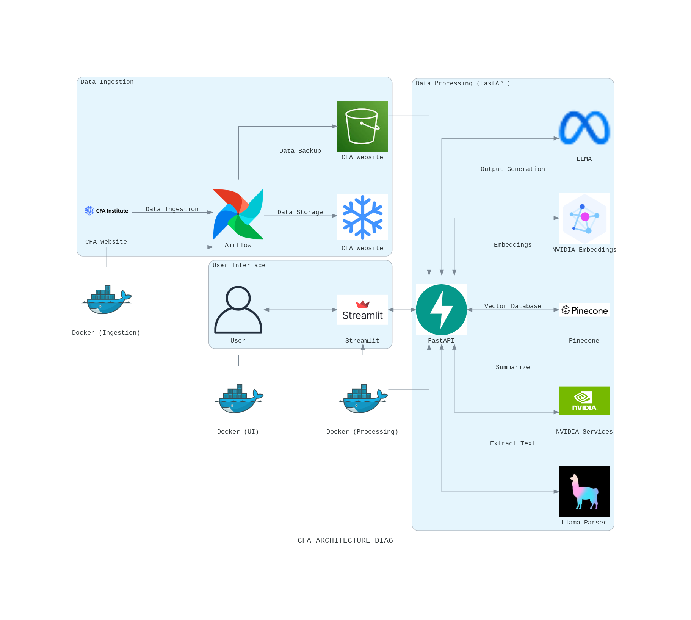

# CFA-Reserach-Publication-RAG-System

## Project Resources

Google codelab: https://codelabs-preview.appspot.com/?file_id=1QdnQ4bhGEMLnumvYofOUmC0TY0ChqccX5FRLZ7DpbKE#0

Streamlit App link (hosted on GCP):http://35.243.197.25:8501/

Demo Video URL: https://youtu.be/8IM0TjIXMRo


### Goal of the Project
This project aims to build an automated system for extracting, processing, and analyzing research publications from the CFA Institute Research Foundation. The system combines web scraping, document processing, and AI-driven search and retrieval to create a user-friendly platform for exploring and analyzing financial research documents.

### Project Overview
The project automates the data ingestion and processing pipeline for CFA publications, transforming raw documents into structured data and summaries. With an interactive interface, users can explore documents, ask questions, and generate research notes. The backend supports complex queries using vector embeddings for semantic search, while the frontend allows seamless navigation of documents.

### Key Technologies Involved

- **Streamlit**: A user-friendly UI framework for browsing documents, generating summaries, and performing Q&A interactions.
- **FastAPI**: Handles backend API services, managing document retrieval, summary generation, and question-answering functionalities.
- **Selenium**: Web scraping framework for extracting data from the CFA Institute Research Foundation website.
- **PyMuPDF**: Processes PDF files, extracting text and images to facilitate further analysis.
- **LlamaParser**: Extracts structured content, organizing text for seamless integration with the backend.
- **Pinecone**: A vector database that stores document embeddings, enabling fast and accurate semantic searches across content.
- **NVIDIA API**: Summarizes documents and generates embeddings, aiding in search functionality and content analysis.
- **Airflow**: Orchestrates the pipeline tasks, automating web scraping, data processing, and loading to ensure the pipeline is consistent and up-to-date.
- **AWS S3**: Stores PDF files, images, and metadata securely, ensuring easy retrieval and backup of ingested data.
- **Snowflake**: A cloud database for structured data storage, handling metadata and document details for easy querying.
- **RAG**:  It enhances the system's ability to generate contextually accurate summaries and responses

### Architecture diagram ###



### System Workflow

1. **Data Ingestion**: Airflow manages the ingestion pipeline, scraping CFA publications, and uploading data (PDFs, images) to AWS S3. Metadata is stored in Snowflake for structured access.
2. **Backend Processing**: FastAPI serves as the API layer, handling queries, generating summaries, and storing research notes.
3. **User Interaction**: Streamlit provides the interactive UI where users can browse publications, generate summaries, and query content.
4. **Search and Retrieval**: Pinecone indexes document embeddings, enabling semantic search across documents and research notes.

### Deployment
The system is deployed on **Google Cloud Platform (GCP)**, using Docker for containerized deployment:
- **Docker**: Containers manage FastAPI and Streamlit, with Docker Compose orchestrating the components for consistent deployment.
- **GCP**: Ensures public access to the application and scalable infrastructure to accommodate user demand.

### How to Use
1. **Register/Login**: Users can sign up and log in to access the platform.
2. **Browse Publications**: Use the grid or dropdown view to select documents for analysis.
3. **Generate Summaries**: Select a document to view a generated summary or key points.
4. **Q&A Interaction**: Ask questions directly from the document, and receive relevant answers powered by AI.
5. **Save Research Notes**: Generate and save insights for future reference or further analysis.
6. **Search Research Notes**: Search across notes for specific content, with search results differentiated by source (document or notes).

### Repository Structure
## Project Structure

```plaintext
ASSIGNMENT-3/
├── Airflow/
│   ├── dags/
│   │   ├── aws_ingestion_pipeline.py
│   │   └── snowflake_ingestion_pipeline.py
│   ├── config/
│   ├── credentials/
│   ├── logs/
│   ├── plugins/
│   ├── .gitignore
│   ├── docker-compose.yaml
│   └── Dockerfile
├── fastapi/
│   ├── credentials/
│   ├── storage/
│   ├── Dockerfile
│   ├── main_fastapi.py
│   ├── pdf_processor.py
│   ├── poetry.lock
│   ├── pyproject.toml
│   ├── text_processor.py
│   ├── utils.py
│   └── docker-compose.yaml
└── streamlit/
    ├── Dockerfile
    ├── index.py
    ├── page1.py
    ├── page2.py
    ├── page3.py
    ├── page4.py
    ├── poetry.lock
    └── pyproject.toml
```

### Prerequisites
- Docker and Docker Compose
- Access to GCP and AWS credentials
- Snowflake and Pinecone setup

### Environment Variables
Each component has its own .env file.

Airflow: Airflow/.env

FastAPI: fastapi/.env

Streamlit: streamlit/.env

### Steps to run the application
**Step 1: Clone the Repository**

If you haven’t done so already, clone the repository to your local machine:

**Step 2: Initialize Airflow**

- cd Airflow

- docker compose up airflow-init

- docker compose up -d

- docker ps

**Step 3: Running Application:**
   
- docker compose up --build -d

- Streamlit application should now be accessible at http://localhost:8501


