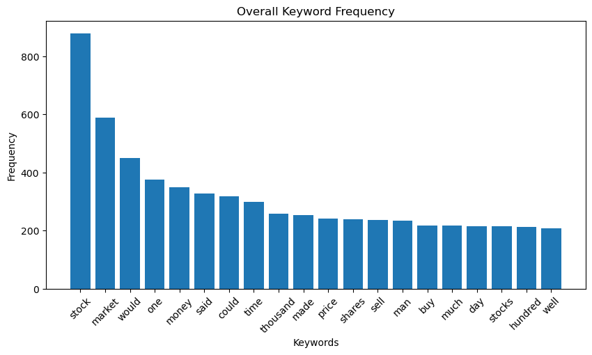
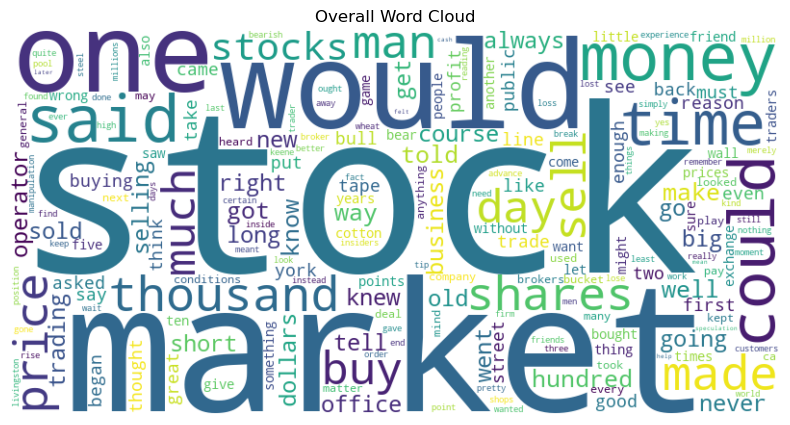
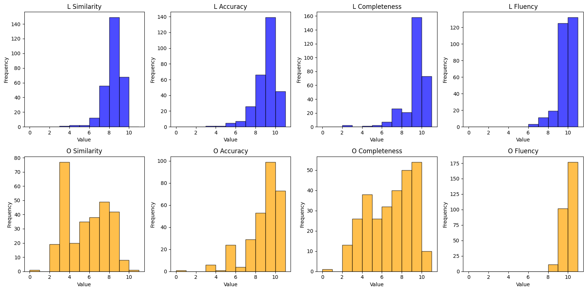

<div style="text-align: center; font-size: 40px; font-weight: bold;">
LivermoreGPT: A Trader Chatbot Inspired by Jesse Livermore's Market Wisdom
</div>

<div style="text-align: center;">    
<br>
Group 4          Hanpeng Yang 002837630          ChengYen Lai  002776864
<br>
</div>

## Introduction

Our final project, LivermoreGPT, is a Trader Chatbot inspired by legendary stock market figure Jesse Livermore. Renowned for his speculative trading strategies and insights into market psychology, Livermore’s principles form the foundation of our chatbot.

Using Transformer-based models with attention mechanisms, we train the bot on curated datasets from Livermore's works, such as Reminiscences of a Stock Operator, to simulate his trading mindset. This project aims to provide both educational and practical financial applications, offering users in-depth market analysis, trading strategies, and psychological insights.

Through AI-driven interactions, LivermoreGPT bridges historical trading wisdom with modern NLP technology. Technical components include Qwen2.5:7B, GPT-4o, Streamlit, Sentence Transformers with OpenAI APIs, Faiss, Ollama, and PyPDF2.

### Transformer

The Transformer architecture relies on two key mechanisms: **Self-Attention** and **Feed-Forward Neural Networks**

1. **Self-Attention Mechanism**: This allows the model to focus on different parts of the input sequence when encoding each word. It calculates attention scores using three learned vectors — **Query (Q)**, **Key (K)**, and **Value (V)** — to weigh the relevance of words to one another, enabling context-aware representations.

2. **Feed-Forward Neural Networks**: After applying self-attention, the resulting context-aware representations pass through fully connected layers. Each layer processes information independently, enabling deep learning of complex patterns. These mechanisms are stacked in layers in both the encoder and decoder of the Transformer

3. **LLM**: Transformer-based architectures to process and generate human-like text by predicting the next word in a sequence. They leverage self-attention and massive datasets to learn contextual word relationships, enabling tasks like translation, summarization, and text generation.

### RAG

The Retrieval-Augmented Generation (RAG) model combines the strengths of retrievers and generators to improve text generation. It leverages a retriever to extract relevant information from a large corpus and a generator to produce coherent responses. The retriever retrieves relevant passages based on the input query, and the generator uses this information to generate responses. By combining retrieval and generation, RAG enhances the quality and relevance of generated text, making it suitable for tasks like question answering, dialogue systems, and content generation.

General steps to implement RAG:

1. **Retriever**: Retrieve relevant passages from a large corpus based on the input query.
2. **Generator**: Generate responses using the retrieved information and the input query.
3. **Ranker**: Rank the retrieved passages to select the most relevant information for generation.

### Sentence Transformers

The Sentence Transformers library provides pre-trained models for generating sentence embeddings. These embeddings capture the semantic meaning of sentences, enabling similarity comparisons and clustering. The library offers various pre-trained models, including BERT, RoBERTa, and DistilBERT, fine-tuned on diverse tasks like semantic textual similarity, natural language inference, and sentiment analysis. By leveraging these models, users can generate sentence embeddings for downstream tasks like clustering, classification, and information retrieval.

`paraphrase-multilingual-mpnet-base-v2` is a multilingual model trained on the Natural Language Inference (NLI) task. It generates sentence embeddings for 50+ languages, enabling cross-lingual similarity comparisons. The model is based on the MobileBERT architecture, which is optimized for mobile and edge devices, offering a balance between efficiency and performance.

### text-embedding-3-small

The text-embedding-3-small model is a pre-trained sentence embedding model that maps sentences to high-dimensional vectors. These vectors capture the semantic meaning of sentences, enabling similarity comparisons and clustering. The model is trained on diverse text corpora, allowing it to generate context-aware embeddings for various tasks like information retrieval, text classification, and clustering. By leveraging pre-trained sentence embeddings, users can perform downstream tasks without extensive training on large datasets.

### Faiss

Faiss is a library for efficient similarity search and clustering of dense vectors. It contains algorithms that search in sets of vectors of any size, up to ones that possibly do not fit in RAM. It also contains supporting code for evaluation and parameter tuning. Faiss is written in C++ with complete wrappers for Python/numpy.

### Qwen2.5:7B

Qwen2.5:7B is a large-scale transformer-based language model trained on diverse text corpora. It leverages the GPT-3 architecture with 175 billion parameters, enabling human-like text generation and understanding. The model is fine-tuned on various tasks like translation, summarization, and text generation, offering state-of-the-art performance on NLP benchmarks. By leveraging Qwen2.5:7B, users can generate human-like text for diverse applications like chatbots, content generation, and conversational agents.

### GPT4-o

GPT4-o is a large-scale transformer-based language model trained on diverse text corpora. It leverages the GPT-3 architecture with 175 billion parameters, enabling human-like text generation and understanding. The model is fine-tuned on various tasks like translation, summarization, and text generation, offering state-of-the-art performance on NLP benchmarks. By leveraging GPT4-o, users can generate human-like text for diverse applications like chatbots, content generation, and conversational agents.

### Streamlit

Streamlit is an open-source app framework for Machine Learning and Data Science projects. It enables users to create interactive web applications with simple Python scripts, allowing for rapid prototyping and deployment. Streamlit offers various components like sliders, buttons, and text inputs to build intuitive interfaces for ML models, data visualizations, and dashboards. By leveraging Streamlit, users can create web applications for diverse tasks like sentiment analysis, image classification, and financial forecasting.

## Data Exploration

We designed the code to perform text extraction and natural language processing (NLP) on a PDF file using PyPDF2 and NLTK. We implemented tokenization, stopword removal, and frequency analysis to extract meaningful keywords, while dividing the text into chapters using the delimiter "Chapter" for summarization. To enhance interpretability, we employed Matplotlib and WordCloud libraries for visualizing keyword distributions and generating a word cloud representation.





We also use LLM to obtain our dataset, by feeding reading materials and generating Q&A datasets.

## Deployment

For backend, this project of LivermoreGPT is deployed with a local Qwen2.5:7B model via Ollama, and also deployed with a online GPT-4o model via OpenAI APIs. For frontend, this project is deployed with Streamlit. To encode texts into vectors, we also used sentence-transformers/paraphrase-multilingual-mpnet-base-v2 model locally and text-embedding-3-small with OpenAI APIs.

This deployment is based on a Windows computer with an Nvidia GPU and Intel CPU. You might need to modify the deployment scripts if you are using a different operating system or hardware, or if you want to deploy the project in a different way.

To set up the project, you can follow the steps below:

1. Clone the repository

   ```bash
   git clone https://github.com/AngeloHYang/LivermoreGPT.git
   ```

2. Create a virtual environment with

   ```bash
   cd LivermoreGPT
   conda create -n LivermoreGPT python=3.10
   ```

3. Activate the virtual environment

   ```bash
   conda activate LivermoreGPT
   ```

4. Install the required packages

   ```bash
   conda install cudatoolkit=11.8 # To install CUDA toolkit
   conda install pytorch torchvision torchaudio pytorch-cuda=11.8 -c pytorch -c nvidia # To install PyTorch with CUDA support accordingly
   pip install -U sentence-transformers # To install sentence-transformers
   conda install -c pytorch faiss-cpu=1.9.0 # To install faiss-cpu
   pip install langchain ollama openai # To install langchain, ollama and openai
   pip install streamlit # To install Streamlit
   ```

   > You'll also need to install Ollama backend seperately on your computer!

   (Optional) For PDF processing and HTML processing, we also need to install the following packages:

   ```bash
   pip3 install PyPDF2 # To install PyPDF2
   pip3 install beautifulsoup4 # To install beautifulsoup4
   ```

   

5. Setup the OpenAI API key

   You need to set up an OpenAI API key to use the GPT-4o model and text-embedding-3-small model.

   You can get an API key from the OpenAI website. After you get the API key, you can set it up by creating a configuration file `./APP/.streamlit/secrets.toml` with the following content:

   ```toml
   OPENAI_API_KEY = "your_openai_api_key"
   ```

6. Run the Streamlit app

   You can run the Streamlit app with the following command:

   ```bash
   streamlit run Hello.py
   ```

   Then you can open the Streamlit app in your browser with the URL `http://localhost:8501`.

## Evaluation

Through an automated self-evaluation process, we assess the performance of our chatbot using metrics like similarity scores, accuracy scores, completness scores, and fluency scores. These metrics help evaluate the quality of the generated responses, ensuring that the chatbot provides relevant and coherent information to users.



## Conclusion

In this project, we developed LivermoreGPT, a Trader Chatbot inspired by Jesse Livermore's market wisdom. By leveraging leveraging a Retrieval Augmented Generation (RAG) system, we trained the chatbot on Livermore's works to simulate his trading mindset. The chatbot offers users in-depth market analysis, trading strategies, and psychological insights, bridging historical trading wisdom with modern NLP technology. Through AI-driven interactions, LivermoreGPT provides educational and practical financial applications, empowering users with Livermore's trading strategies and insights. The project demonstrates the potential of AI in financial applications, offering a novel approach to market analysis and trading education.
