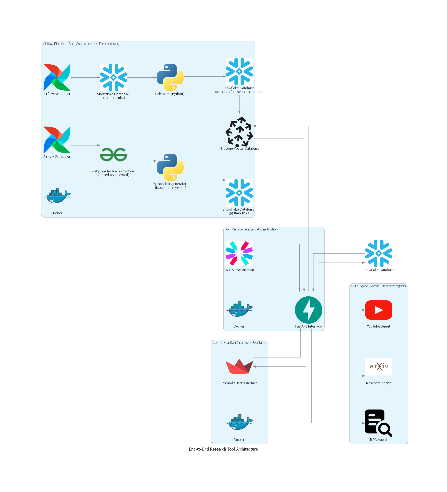

# AIVY - AI Powered Learning Assistant

## **Overview**
Aivy: AI Learning Assistant
Aivy is a next-generation learning assistant that integrates various educational tools into a unified platform. Built with Airflow, FastAPI, and Streamlit, it offers a personalized, engaging, and efficient learning experience by combining text, videos, flashcards, and quizzes.

Why Aivy?

- Unified Learning Tools: Access all your learning content (text, images, videos, quizzes) in one place.
- Personalized Assistance: AI tailors learning content and assessments to user needs.
- Advanced Search: Powered by RAG (Retrieval-Augmented Generation) for context-aware results.
- Engaging UI: Intuitive, interactive, and user-friendly.

Architecture diagram for the same: 



## **Key Features**
1. **Dynamic Lesson Plans**:
   - Lessons organized into modules with titles, descriptions, and detailed explanations.
2. **Quiz and Flashcard Generation**:
   - Auto-generated quizzes and flashcards based on lesson content.
3. **RAG Functionality**:
   - Retrieves relevant YouTube videos, images, and text for user queries.
4. **Logging and Testing**:
   - Comprehensive logging in Streamlit and Airflow for error tracking.
   - APIs tested extensively with **Postman**.
5. **Scalable Design**:
   - Separate environments for Streamlit and FastAPI to ensure modularity.

---

## **Project Structure**
The project is divided into three main components:

### **1. Airflow**
- Handles data extraction pipelines for lesson content, images, and links.
- Key files:
  - `extraction.py`: Extracts lesson content.
  - `image_extraction.py`: Processes images.
  - `links.py`: Manages and fetches additional learning resources.
  - `GFG_Data_Extraction_DAG.py`: Manages and schedules DAG workflows.

### **2. FastAPI**
- Backend API for:
  - Fetching lessons, images, and YouTube video URLs.
  - Generating quizzes and flashcards.
- Lightweight and scalable.

### **3. Streamlit**
- User-friendly frontend for:
  - Navigating and viewing lesson plans.
  - Interacting with quizzes and results.
- Files include:
  - `lesson.py`: Displays detailed lesson content.
  - `quiz.py`: Manages quiz interface and results.
  - `planner.py`: Allows navigation across modules and plans.

---

### **Folder Structure**
```
├── Airflow
│   ├── dags
│   │   ├── extraction_files
│   │   │   ├── extraction.py
│   │   │   ├── image_extraction.py
│   │   │   ├── links.py
│   │   │   ├── testfiles/
│   │   ├── GFG_Data_Extraction_DAG.py
│   ├── Dockerfile
│   ├── docker-compose.yml
│   ├── entrypoint.sh
│   ├── requirements.txt
├── fastapi
│   ├── config.py
│   ├── lessons.py
│   ├── main.py
│   ├── Dockerfile
│   ├── poetry.lock
├── streamlit
│   ├── ui
│   │   ├── lesson.py
│   │   ├── planner.py
│   │   ├── plans.py
│   │   ├── quiz.py
│   ├── app.py
│   ├── Dockerfile
│   ├── docker-compose.yml
│   ├── README.md
├── diagrams
│   ├── images
│   │   ├── folder_structure.png
│   │   ├── architecture_diagram.png

```

---

## **Setup Instructions**

### **1. Clone the Repository**
```bash
git clone <repository-link>
cd <repository-folder>
```

### **2. Setup Environments**

#### **For Streamlit**:
```bash
cd streamlit
python -m venv venv_streamlit  # Create virtual environment
source venv_streamlit/bin/activate  # Activate the environment
poetry install  # Install dependencies
```

#### **For FastAPI**:
```bash
cd fastapi
python -m venv venv_fastapi  # Create virtual environment
source venv_fastapi/bin/activate  # Activate the environment
poetry install  # Install dependencies
```

### **3. Run the Components**

#### **Airflow**:
```bash
cd Airflow
docker-compose up --build
```

#### **FastAPI**:
```bash
cd fastapi
source venv_fastapi/bin/activate
poetry install
uvicorn main:app --reload
```

#### **Streamlit**:
```bash
cd streamlit
source venv_streamlit/bin/activate
poetry install
streamlit run app.py
```

---

You can access the related files to this project here:  

- Documentation: [Codelabs Documentation](https://codelabs-preview.appspot.com/?file_id=1qj_hNrPvLQEQt1r2RgSReLwTkpFyHrK22inGdcHLsY8#0) 
- Deployed FastAPI: [FastAPI Docs](http://3.14.131.176:8000/docs)  
- Deployed Streamlit: [Streamlit App](http://3.14.131.176:8501/)  
- Video Link: [Project Demo](https://drive.google.com/drive/folders/1sBLrejhuyzoQXzyt3lf0hlBzZ16HBY_4?usp=drive_link)  


## **Conclusion**
This project integrates Airflow, FastAPI, and Streamlit to provide a dynamic learning assistant. With separate environments and comprehensive testing, it is scalable, efficient, and user-friendly.

## Contribution 
## Work Distribution

| Name     | Tasks                                                                                               | Contribution (%) |
|----------|-----------------------------------------------------------------------------------------------------|------------------|
| Abhinav  | Logic/implementation (lesson, plan) (Streamlit), FastAPI, Dockerization,                            | 33.33            |
|          | Integration, CI/CD, Deployment, Snowflake                                                           |                  |
| Nishita  | Web scraping, Snowflake, Airflow, lesson logic/integration (image, quiz),                           | 33.33            |
|          | Streamlit, FastAPI, Pinecone, Documentation                                                         |                  |
| Dhir     | Lesson logic/integration (summary, YouTube video, flashcards, quiz), Streamlit, FastAPI, Snowflake  | 33.33            |


