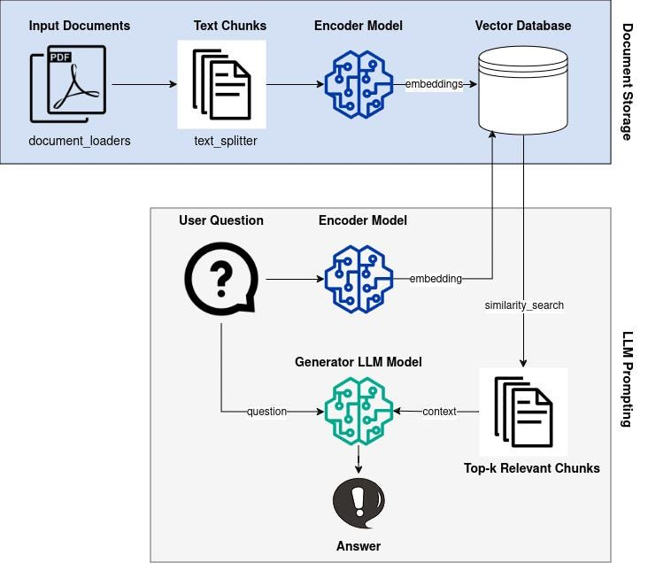
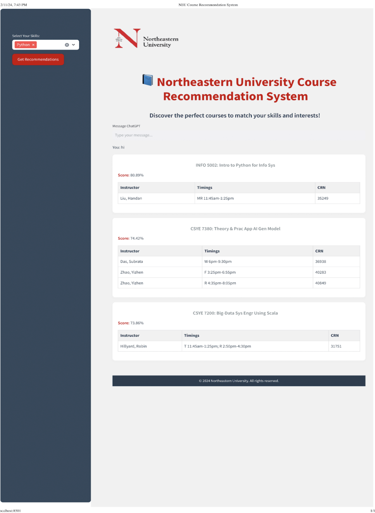

# CourseNavigator: An AI-Powered Chatbot for Personalized Graduate Course Exploration 	

## Live application links

[](https://docs.google.com/document/d/19PfRgivAzZNAu2zFPn8JIHoUOk8DpB5lDd07NlGitpc/edit?tab=t.0)
[](https://coursesuggestionsystem.streamlit.app/)
[](https://youtu.be/kzin0pkmf30)

## Tools & Technologies

[](https://streamlit.io/)
[](https://www.pinecone.io/)
[](https://openai.com/)
[](https://github.com/)
[](https://www.python.org/)
[](https://pandas.pydata.org/)

## **Overview**

Navigating Northeastern University’s graduate course catalog is often a time-intensive process. The **Course Catalog Chatbot** simplifies this by leveraging **Retrieval-Augmented Generation (RAG)** to provide:
- Tailored course recommendations based on user-input skills.
- Semantic search for specific queries.
- Additional conversational features for follow-up questions.

Users can query the chatbot with natural language inputs such as:
- *“Will the recommended courses teach me Data Structures?”*
- *“What topics are covered in Advanced Machine Learning?”*

## Architecture



The Northeastern Course Catalog Chatbot architecture consists of an input document loader that extracts course data, a text chunking component that breaks down the data, an encoder model that generates semantic embeddings of the chunks, a vector database that stores the encoded information, and finally a generator LLM model that uses the vector database to provide relevant and contextualized responses to user questions about course offerings.

## **Key Features**

1. **Data Collection and Embedding:**
   - Web scraping using `BeautifulSoup` to extract data from [newton.neu.edu/spring2025](http://newton.neu.edu/spring2025).
   - Extracting text from course catalog PDFs.
   - Embedding data for semantic search and storing it in **Pinecone**.

2. **Personalized Course Recommendations:**
   - Based on user-input skills, the chatbot performs semantic search to recommend the top 3 courses.
   - Displays recommendations with a relevance percentage for better decision-making.

3. **Interactive Chat Feature:**
   - Users can ask follow-up questions about the recommended courses.
   - Responses are generated using the **OpenAI API**, offering detailed insights.

4. **Streamlit Interface:**
   - A user-friendly interface to input skills, view recommendations, and interact with the chatbot.

## **Relevance and Significance**

### **Why This Project Matters**
Selecting the right courses is vital for students aiming to align their academic and career goals. This project reduces the manual effort involved in searching course catalogs and supplements the process with:
- Accurate, skill-based recommendations.
- Comprehensive course details, improving decision-making.

### **Applications of RAG in Education**
This chatbot demonstrates how **RAG frameworks** can revolutionize education by:
- Combining semantic search with generative AI for context-aware responses.
- Providing a scalable solution for analyzing structured and unstructured data.

## Project Tree

```
📦 
├─ .gitignore
├─ LICENSE
├─ Northeastern-University-Logo.png
├─ README.md
├─ app.py
├─ bot_response.py
├─ connections.py
├─ data_augmentation.py
├─ data_generation
│  ├─ main.py
│  ├─ pdf_parser.py
│  ├─ utils.py
│  └─ webscraper.py
├─ input
│  └─ CourseDescriptions.pdf
├─ output
│  ├─ ExtractedCourseDescriptions.csv
│  └─ output.txt
└─ requirements.txt
```
©generated by [Project Tree Generator](https://woochanleee.github.io/project-tree-generator)

## Installation and Setup

### Prerequisites
- Python 3.8+
- Pinecone account
- OpenAI API key
- Streamlit

### Installation Steps
1. Clone the repository:
   ```bash
   git clone https://github.com/your-username/northeastern-course-catalog-chatbot.git
   cd northeastern-course-catalog-chatbot

2. Create a virtual environment:
    ```bash
    python -m venv venv
    source venv/bin/activate  # On Windows, use `venv\Scripts\activate`

3. Install dependencies:
    ```bash
    pip install -r requirements.txt

4. Set up environment variables:
Create a .env file in the project root and add:
    ```bash
    OPENAI_API_KEY=your_openai_api_key
    PINECONE_API_KEY=your_pinecone_api_key
    INDEX=your_index_name

5. Running the Application
    ```bash
    streamlit run app.py

### Usage

- Enter skills or areas of interest in the input box. 
- View recommended courses with relevance percentages.
- Click on courses to get more details.
Ask follow-up questions about courses.

## Output



After the user selects their skill (in this case, "Python") and clicks "Get Recommendations", the system provides a list of recommended Northeastern University courses related to the user's selected skill.

The recommendations include the following details for each course:

1. **Course Title**: The name of the recommended course.
2. **Instructor**: The instructor teaching the course.
3. **Timings**: The schedule of the course, including the day(s) and time.
4. **CRN**: The course reference number.
5. **Score**: A relevance score (out of 100%) indicating how well the course matches the user's selected skill.

This information is presented in a clear and organized manner, allowing the user to quickly evaluate the recommended courses and make an informed decision about which ones to pursue.

## Team Contribution

WE ATTEST THAT WE HAVEN’T USED ANY OTHER STUDENTS’ WORK IN OUR ASSIGNMENT AND ABIDE BY THE POLICIES LISTED IN THE STUDENT HANDBOOK

| Name                      |
| ------------------------- | 
| Ritesh Choudhary          | 
| Anushka Rajesh Darade     |
| Payal Sanjay Nagaonkar    |
