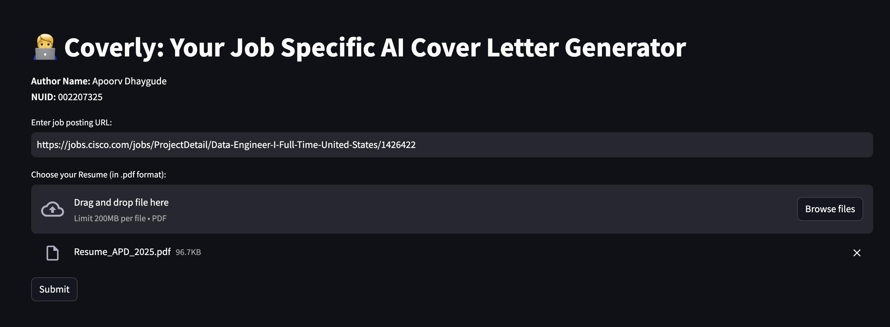
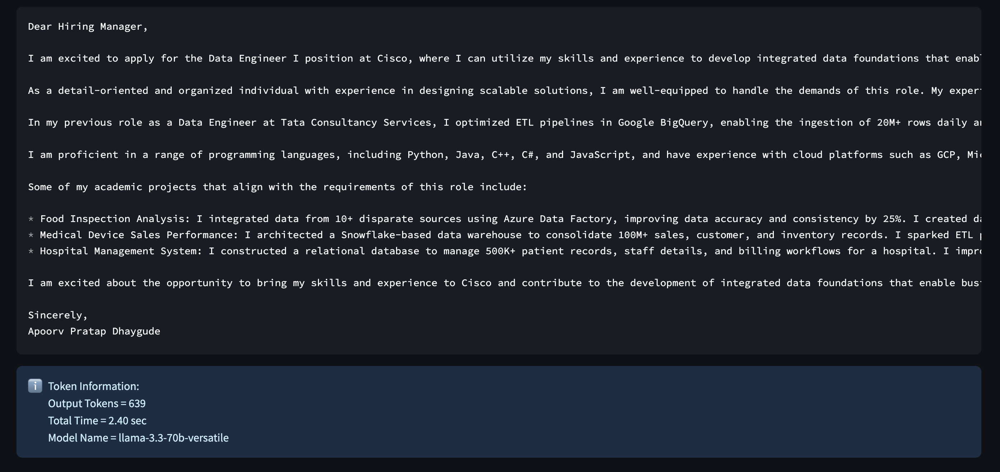
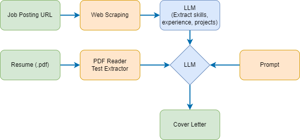

# 📧 Coverly: Job Specific AI Cover Letter Generator

Coverly is an AI-powered application that generates personalized cover letters based on job listings and your resume. The tool streamlines the job application process by:

1. Accepting a job listing URL from the user
2. Taking a resume upload in PDF format
3. Extracting key information from the job listing
4. Analyzing your resume content
5. Generating a tailored cover letter that highlights your relevant skills and experience

## Run App Online
Link: https://coverly-job-specific-ai-cover-letter-generator.streamlit.app/

## Screenshots

## Architecture Diagram

## Key Features

- **Context-Aware Generation**: Creates cover letters that highlight skills and experiences relevant to the specific job
- **Structured Information Extraction**: Parses job listings into structured data (role, experience, skills, description)
- **Fast Processing**: Leverages GROQ's optimized infrastructure for sub-second LLM inference
- **User-Friendly Interface**: Simple Streamlit UI requires minimal input from users
- **Token Usage Metrics**: Provides transparency about computational resources used

## Team Contribution

- **LLM**: LLaMA 3.3 (70B parameter model) via GROQ API - **Apoorv Dhaygude**
- **Framework**: LangChain for LLM interactions - **Apoorv Dhaygude**
- **Frontend**: Streamlit for the user interface - **Chinmay Deshpande**
- **Document Processing**:  WebBaseLoader for job description extraction & PyPDFLoader for resume parsing - **Chinmay Deshpande**
---

Created by **Apoorv Dhaygude** (NUID: 002207325) & **Chinmay Deshpande** (NUID: 002859266)
   
