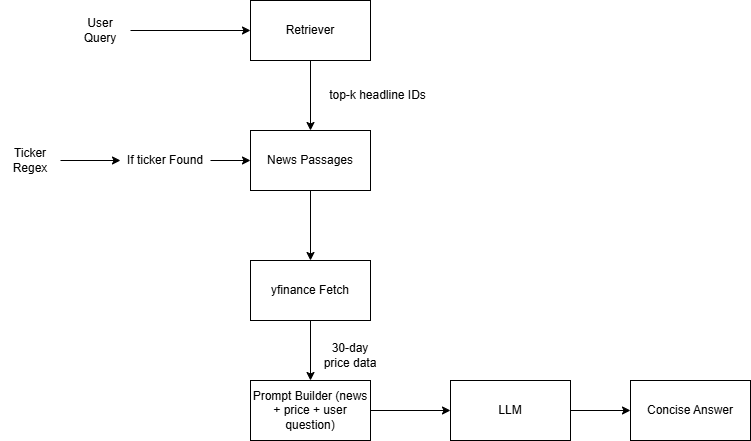

# Financial-News RAG Assistant with Live Stock-Price Context  
Chen Yang | NUID 002837912  

---
This Jupyter Notebook presents a complete **Retrieval-Augmented Generation (RAG) assistant** that helps investors and analysts answer natural-language questions about publicly traded companies by combining two complementary data sources:

1. **Semantic News Retrieval** – Topically relevant headlines are fetched from a cleaned CNBC financial-news corpus (2019 – 2024) via a FAISS vector index.  
2. **Live Market Data** – Up-to-date closing prices are pulled on-the-fly with `yfinance`, summarising recent trends (e.g., 30-day movement) for any recognised ticker symbol.

A lightweight language model (DistilGPT-2) then fuses both contexts into a concise answer, giving the user an “at a glance” narrative that blends qualitative news sentiment with quantitative price performance.
## Website Demo: https://ragchatgoodgoodstuff.vercel.app/
## System Architecture



## Environment Requirements

| Component | Version / Notes |
|-----------|-----------------|
| Python    | **3.10** (tested on Win 10 ×64) |
| pip / conda | Latest; virtual-env recommended |
| PyTorch   | 2.x **CPU wheel** (`--index-url https://download.pytorch.org/whl/cpu`) |
| transformers | ≥ 4.39 |
| faiss-cpu | ≥ 1.8 |
| pandas, numpy, tqdm | latest stable |
| yfinance | ≥ 0.2.37 |
| jupyter / VS Code | Jupyter extension ≥ 2025.3 |

> **Note:** avoid `intel-openmp` conflicts on Windows—use a fresh venv or uninstall `intel-openmp`.

```bash
pip install torch torchvision torchaudio --index-url https://download.pytorch.org/whl/cpu
pip install transformers faiss-cpu pandas numpy tqdm yfinance
```

## Features

### Retrieval-Augmented Generation (RAG)
- **Top-k semantic retrieval** of CNBC headlines powered by **FAISS**.  
- **Live 30-day price summaries** pulled from **yfinance** whenever a ticker is detected in the user query.

### Lightweight Open-Source Stack
- **DistilGPT-2** supplies both embeddings and text generation—no paid API keys required.  
- Optimised to run on **CPU only**; typical end-to-end latency is **≈ 0.8 s** per query.

### Guardrails for Reliable Outputs
- **Repetition penalty** and **no-repeat n-gram filter** prevent looping or spam.  
- Automatic **post-trim** keeps only the first two sentences, ensuring concise answers.

### Extensible by Design
- Swap in stronger embedding models (Sentence-Transformers **all-MiniLM-L6**, **E5**, etc.).  
- Replace FAISS with **Milvus** or **Weaviate** for distributed retrieval.  
- Upgrade the generator to a larger instruction-tuned LLM (e.g., **Mistral-7B**, **Llama-3-8B**).

## Dataset

| Source | Details |
|--------|---------|
| **CNBC Financial News Headlines** | 2 800 cleaned headlines (2019 – 2024). Columns: `Headlines`, `Time`, `Description`. |
| **Yahoo Finance API** (`yfinance`) | Live & historical OHLCV data; the project uses the last **30 trading-day closes** for on-the-fly summaries. |

*The cleaned CSV file — `cnbc_headlines.csv` — is embedded at runtime; no proprietary data is distributed with the repository.*

## References  

1. *ChatGPT* – conversational assistance and content generation for this notebook.  
2. *Prompting Guide — “Retrieval‑Augmented Generation”*  
   <https://www.promptingguide.ai/research/rag>  
3. *TensorFlow Documentation*  
   <https://www.tensorflow.org/>
4. *Dataset*
   <https://www.kaggle.com/datasets/notlucasp/financial-news-headlines>


