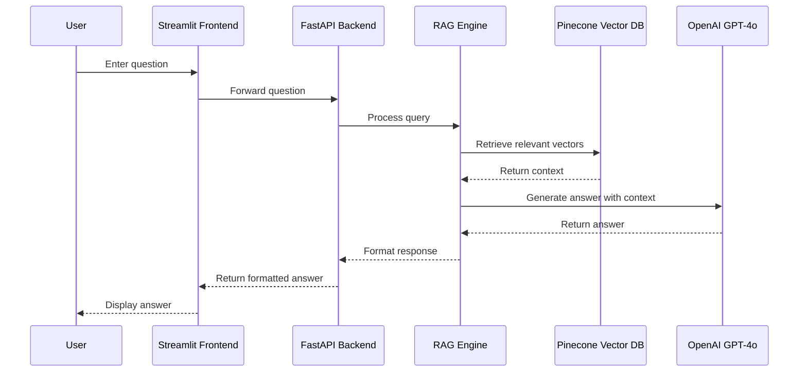

# Multimodal Retrieval-Augmented Generation System
## Your AI-powered Multimodal RAG Assistant

[](https://streamlit.io)
[](https://fastapi.tiangolo.com/)
[](https://gemini.google.com/)
[](https://openai.com)
[](https://github.com/langchain-ai/langchain)
[](https://github.com/langchain-ai/langgraph)
[](https://python.org)
[](https://www.docker.com/)
[](https://www.pinecone.io/)
[](https://www.postgresql.org/)
[](https://cloud.google.com)
[](https://github.com/crawl4ai)
[](https://github.com/pumapdf4llm)
[](https://upstage.ai/)

[](https://jwt.io/)

## Project Overview
This project implements a comprehensive multimodal retrieval-augmented generation system focused on CFA publications. The system scrapes CFA PDFs, processes them to extract text and images, vectorizes the content into searchable embeddings, and provides an intelligent Q&A interface that leverages the multimodal data for accurate and context-aware responses.

## Demo and Access
- **Demo Video Link**: [Demo Video Link](https://youtu.be/5hvMmLP_4Xw)
- **Application URL**: [http://35.188.146.35:8501](http://35.188.146.35:8501)
- **Backend Service**: [http://35.188.146.35:8000/docs](http://35.188.146.35:8000/docs)

    ### Test with Example Query 
    Below is an example query that demonstrates the multimodal capabilities of this system:
    select index peksevim-rf-brief-2025-online
    ```
    Which country offers the highest expected return for stocks, and how does this compare to its associated risk as measured by standard deviation
    ```
    This query references a table image containing capital market assumptions data and asks the system to analyze which country offers the highest expected stock returns relative to risk.
    ```
    Capital Market Assumptions by Country, 2004–2022
    ```
    This retrieves all information contains in  the table

## Key Objectives
- Create an end-to-end pipeline for processing financial documents
- Extract both textual and visual information from PDF publications
- Build a vector-based retrieval system for efficient information access
- Develop a user-friendly Q&A interface powered by advanced AI models
- Deploy the solution as containerized microservices for scalability

## Technical Implementation

### Data Collection and Preparation
- **Web Scraping**: Utilized crawl4ai to scrape CFA publication PDF links
- **Storage**: Uploaded PDFs to Google Cloud Storage for processing and persistence

### PDF Processing
- **Text Extraction**: Used PyMuPDF4LLMs for efficient and accurate text extraction from PDFs
- **Image Extraction**: Leveraged Upstage Document Parse API to identify and extract relevant images
- **Multimodal Data**: Generated additional context data using Gemini 2.5 Pro

### Vector Database
- **Embeddings**: Created text embeddings using OpenAI's embedding models
- **Storage**: Stored vectors in Pinecone for efficient similarity search and retrieval

### Q&A System
- **Backend**: FastAPI service to handle requests and coordinate with the RAG engine
- **LLM Integration**: Used OpenAI GPT-4o for generating accurate, contextual answers
- **Frontend**: Streamlit interface for an intuitive user experience
- **Response Generation**: Implemented techniques to ensure factual and relevant answers

### Deployment
- **Containerization**: Packaged components as Docker containers
- **Orchestration**: Used Docker Compose for service coordination
- **Hosting**: Deployed on Google Cloud Platform for reliability and scalability

## Architecture

### System Architecture


### Images Parsing Architecture


### Application Workflow


## Project Structure
```
multimodal-rag-system/
├── Data
│   ├── Load_pdfs_gcp.py
│   ├── cfa.txt
│   ├── multimodal_vectorize_pinecone.py
│   ├── normalize_existing_urls.py
│   ├── run_scraper.py
│   └── url_scraper.py
├── FastAPIs_Services
│   ├── Dockerfile
│   └── main.py
├── LICENSE
├── POC
│   └── MultimodalRAG_poc.ipynb
├── README.md
├── Streamlit_App
│   ├── Dockerfile
│   └── app.py
├── docker-compose.yml
├── image-1.png
├── image-2.png
├── image.png
├── multimodal-rag-457721-feccdef6281a.json
├── poetry.lock
└── pyproject.toml
```

## Setup Instructions

### Prerequisites
- Python 3.9+
- Poetry
- **Docker** and **Docker Compose** or the **Docker** desktop app for containerization

## Local Development Setup
1. Clone the repository
   ```bash
    git clone [repository-url]
    cd [repository-name]
   ```
2. Required Environment Variables
    Create a `.env` file in the root directory and populate it with the following keys:

    ```plaintext
    GOOGLE_API_KEY=your_google_api_key
    LANGCHAIN_API_KEY=your_langchain_api_key
    LANGCHAIN_TRACING_V2=true
    LANGCHAIN_ENDPOINT=https://api.smith.langchain.com
    LANGCHAIN_PROJECT=Multimodal-rag
    UPSTAGE_API_KEY=your_upstage_api_key
    OPENAI_API_KEY=your_openai_api_key
    PINECONE_ENVIRONMENT=us-east-1-aws
    PINECONE_API_KEY=your_pinecone_api_key

    #Database Configuration

    DB_HOST=your_database_host
    DB_PORT=5432
    DB_NAME=app-login
    DB_USER=your_database_user
    DB_PASSWORD=your_database_password

    #API Configuration

    API_URL=http://fastapi:8000

    #Authentication

    SECRET_KEY=your_secret_key
    ALGORITHM=HS256
    ACCESS_TOKEN_EXPIRE_MINUTES=60

    #Google Cloud

    GOOGLE_APPLICATION_CREDENTIALS=path_to_your_credentials.json
    ```

3. Running Streamlit and FastAPI Services Locally

    Intall dependencies
    ```
    poetry install
    ```
    Run the Streamlit application
    ```
    streamlit run Streamlit_App/Home.py
    ```
    Run the FastAPI backend
    ```
    uvicorn FastAPIs_Services.main:app --reload
    ```

4. Running Streamlit and FastAPI Services Using Docker Containers Locally
    From the root directory, build and start the Docker containers
    ```
    docker compose build --no-cache
    docker compose up
    ```

## GCP Deployment Steps

1. Install Docker and Docker Compose
    ```bash
    # Update package lists
    sudo apt update

    # Install Docker
    sudo apt install -y docker.io

    # Install Docker Compose
    sudo curl -L "https://github.com/docker/compose/releases/download/v2.21.0/docker-compose-$(uname -s)-$(uname -m)" -o /usr/local/bin/docker-compose
    sudo chmod +x /usr/local/bin/docker-compose

    # Verify installation
    docker --version
    docker-compose --version
    ```

2. Create Project Directory
    ```bash
    mkdir ~/project-directory
    cd ~/project-directory
    ```

3. Upload Configuration Files

    Transfer your credentials file and environment variables to the VM:
    ```bash
    # Example using gcloud to transfer files to a Google Cloud VM
    gcloud compute scp --project your-project-id --zone your-zone /local/path/to/credentials.json username@instance-name:/home/username/project-directory/credentials.json

    gcloud compute scp --project your-project-id --zone your-zone /local/path/to/.env username@instance-name:/home/username/project-directory/.env
    ```

4. Create docker-compose.yml

    Create a docker-compose.yml file:
    ```bash
    nano docker-compose.yml
    ```

    Then add the following content:
    ```yaml
    services:
    fastapi:
        image: your-dockerhub-username/your-fastapi-image:latest
        container_name: fastapi_container
        ports:
        - "8000:8000"
        env_file:
        - ./.env
        volumes:
        - ./credentials.json:/app/credentials.json
        networks:
        - app-network

    streamlit:
        image: your-dockerhub-username/your-streamlit-image:latest
        container_name: streamlit_container
        ports:
        - "8501:8501"
        depends_on:
        - fastapi
        env_file:
        - ./.env
        networks:
        - app-network

    networks:
    app-network:
        driver: bridge
    ```

5. Pull and Start Containers
    ```bash
    # Pull Docker images
    sudo docker-compose pull

    # Start containers
    sudo docker-compose up -d
    ```

## Future Improvementss
- Add support for more document types beyond PDFs and upload capabilities
- Implement document versioning and change tracking
- Enhance multimodal understanding with custom vision models
- Add user authentication and document-level access control
- Improve answer generation with fact-checking mechanisms

## References
- [Upstage Document Parse API](https://www.upstage.ai/)
- [Pinecone Documentation](https://docs.pinecone.io/)
- [OpenAI API Documentation](https://platform.openai.com/docs/)
- [Gemini API Documentation](https://ai.google.dev/docs)
- [FastAPI Documentation](https://fastapi.tiangolo.com/)
- [Streamlit Documentation](https://docs.streamlit.io/)
- [Docker Compose Documentation](https://docs.docker.com/compose/)
- [Langchain Documentation](https://langchain-opentutorial.gitbook.io/langchain-opentutorial)

