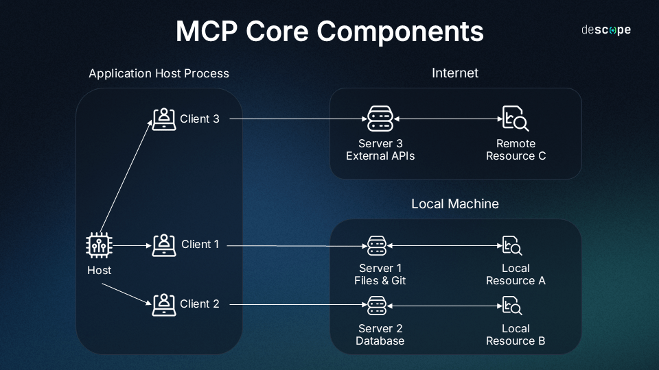

# Data Exploration with Model Control Protocol (MCP)

This project demonstrates the integration of Anthropic's Claude with custom data science tools via the Model Control Protocol (MCP). It provides a powerful interface for interactive data exploration and analysis through natural language.


## 📑 What is MCP?

Model Control Protocol (MCP) is a framework developed by Anthropic that enables AI assistants like Claude to interact with external tools and systems. MCP allows for:

- **Tool Calling**: Claude can request to use specific tools to perform tasks it cannot do directly
- **Resource Access**: Claude can read and write files and access other resources when needed
- **Prompt Templates**: Pre-defined templates for specific use cases can be provided

## 🏗️ Project Structure

This project consists of two main components:

### 1. MCPServer (Data Exploration Server)

The data exploration server provides Claude with tools to:
- Load CSV files
- Execute Python scripts for data analysis
- Generate visualizations and statistics
- Store and retrieve intermediate results

Located in: `mcp-server/mcp-server-data-exploration/`

### 2. MCPClient (Streamlit Interface)

A user-friendly Streamlit web interface that allows you to:
- Connect to the MCP Server
- Set data exploration parameters (CSV file path, analysis topic)
- Chat with Claude to perform data explorations
- View results and visualizations

Located in: `mcp-client/`

## 🚀 Getting Started

### Prerequisites

- Python 3.7 or higher
- Claude API key
- Streamlit
- MCP library
- Mac or Windows computer
- Latest Python version installed
- Latest version of uv installed
### Installation
1. **Install uv**<br>
   windows
   ```bash
   powershell -ExecutionPolicy ByPass -Command "iwr https://astral.sh/uv/install.ps1 -UseBasicParsing | iex"
   ```
   linux curl<br>
   ```bash
   curl -LsSf https://astral.sh/uv/install.sh | sh
   ```

2. **Install dependencies**
   ```bash
   uv pip install -r requirements.txt
   ```

3. **Set up your environment**
   Create a `.env` file in the `mcp-client` directory with your Anthropic API key:
   ```
   ANTHROPIC_API_KEY=your_api_key_here
   ```


### Running the Client

1. **Start the Streamlit interface**
   ```bash
   cd mcp-client
   .venv\Scripts\activate
   streamlit run app.py
   ```

## 📊 Using the Data Explorer

1. **Set Parameters**
   - When the app starts, you'll be prompted to enter:
     - CSV File Path: The full path to the CSV file you want to analyze
     - Analysis Topic: What you want to explore about the data

2. **Connect to the Server**
   - Click "Connect" in the sidebar to establish a connection to the MCP server

3. **Start Exploring**
   - Once connected, you can start chatting with Claude about your data
   - Ask questions like:
     - "Show me the distribution of values in column X"
     - "Find correlations between variables A and B"
     - "Create a visualization showing trends over time"

4. **View Results**
   - Results, including statistics and visualizations, will appear directly in the chat


## 📜 License

This project is licensed under the MIT License - see the LICENSE file for details.
