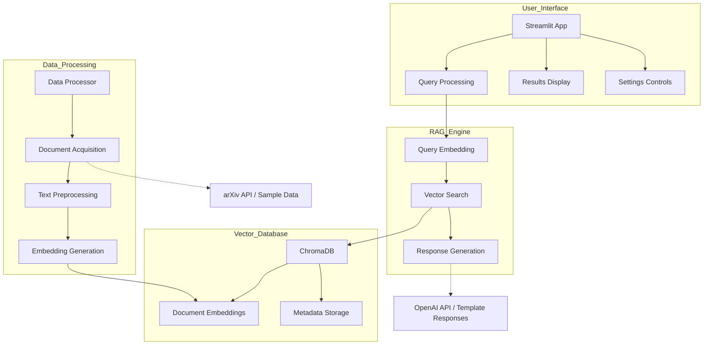

# Literature Review Assistant with ChromaDB


This project implements a Retrieval-Augmented Generation (RAG) system for academic research, using ChromaDB as the external vector database. The system helps researchers search, retrieve, and summarize academic papers based on natural language queries.

## Features

- **Semantic Search**: Find relevant papers based on natural language queries
- **AI-Generated Insights**: Get summaries, comparisons, and research suggestions
- **External Vector Database**: Uses ChromaDB for efficient vector storage and retrieval
- **User-Friendly Interface**: Intuitive Streamlit interface for easy interaction

## Requirements

- Python 3.9+
- OpenAI API key (optional, for enhanced response generation)

## Architecture



### Component Description

1. **User Interface Layer**
   - **Streamlit App**: Main frontend interface for user interaction
   - **Query Processing**: Handles user search requests
   - **Results Display**: Presents search results and AI responses
   - **Settings Controls**: Allows customization of search parameters

2. **RAG Engine Layer**
   - **Query Embedding**: Converts user queries to vector embeddings
   - **Vector Search**: Finds semantically similar documents
   - **Response Generation**: Creates AI-generated insights from retrieved papers

3. **Vector Database Layer**
   - **ChromaDB**: External vector database for efficient similarity search
   - **Document Embeddings**: Vector representations of academic papers
   - **Metadata Storage**: Paper titles, authors, dates, and categories

4. **Data Processing Layer**
   - **Data Processor**: Pipeline for acquiring and processing papers
   - **Document Acquisition**: Downloads papers from external sources
   - **Text Preprocessing**: Cleans and formats paper content
   - **Embedding Generation**: Creates vector embeddings for storage

5. **External Dependencies**
   - **arXiv API / Sample Data**: Source of academic papers
   - **OpenAI API / Template Responses**: Optional AI response generation

## Installation

1. Clone this repository:
   ```
   git clone https://github.com/deepakrajaR/literature-review-rag.git
   cd literature-review-assistant
   ```

2. Install the required packages:
   ```
   pip install -r requirements.txt
   ```

3. (Optional) Create a `.env` file with your OpenAI API key:
   ```
   OPENAI_API_KEY=your_openai_api_key_here
   ```

## Usage

1. First, run the data processor to download and index papers:
   ```
   python data_processor.py
   ```
   This will:
   - Download paper abstracts from arXiv or create sample data if download fails
   - Process the papers and store them in ChromaDB
   - Save the ChromaDB database in the `data/chroma_db` directory

2. Run the Streamlit application:
   ```
   streamlit run app.py
   ```
   The application will be available at http://localhost:8501

3. Use the application:
   - Enter your research question in the text area
   - Adjust settings in the sidebar if needed
   - Click "Search" to get results
   - Explore the AI-generated response and relevant papers

## Technologies Used

- **ChromaDB**: Open-source vector database for storing and retrieving embeddings
- **Streamlit**: For the user interface
- **OpenAI API** (optional): For generating higher quality responses
- **Pandas & NumPy**: For data processing and manipulation
- **Requests**: For downloading papers from arXiv
- **Python-dotenv**: For environment variable management

## Project Structure

- `requirements.txt`: Required Python packages
- `data_processor.py`: Script to download and index papers in ChromaDB
- `rag_engine.py`: Core RAG functionality using ChromaDB
- `app.py`: Streamlit application for the user interface
- `data/chroma_db/`: Directory where ChromaDB stores the vector database
- `data/papers.csv`: CSV file with downloaded paper metadata

## Customization

- **Paper Sources**: You can extend the `download_arxiv_dataset` function to include other sources
- **Response Types**: You can add new response types in
