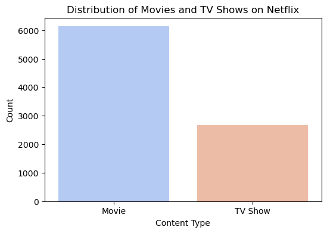
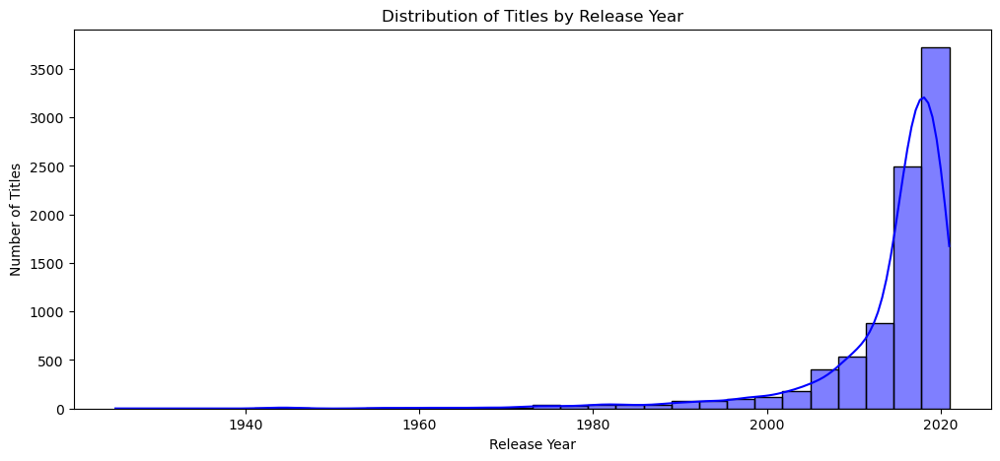
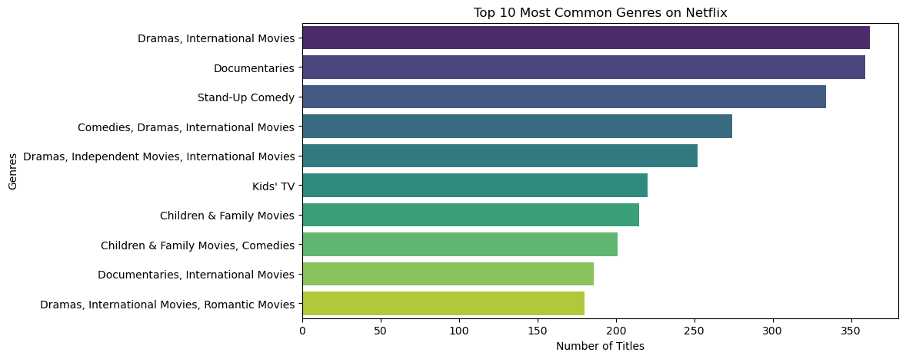
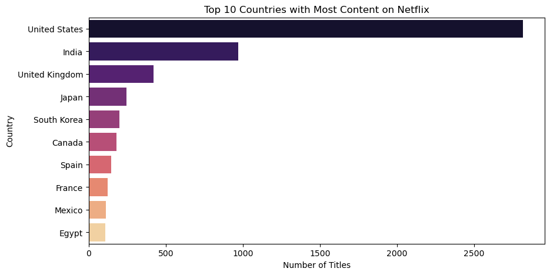
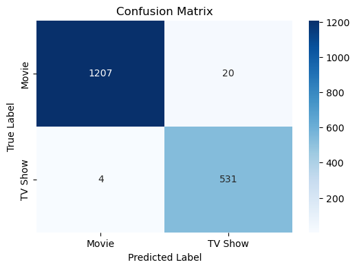
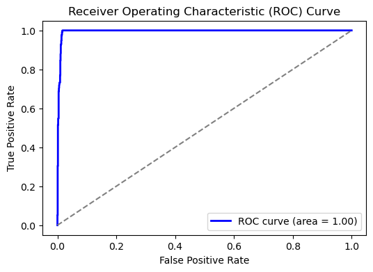

# Netflix Content Classification: Data Analysis and Machine Learning Approaches

<br>Name: Weijia Yan
<br>
NUID: 002292050</b>

## 1.Title & Research Question

### Research Question
1. **How can Netflix metadata be used to automatically classify movies and TV shows?**
2. **Which features are most important for distinguishing between movies and TV shows?**
3. **How do different machine learning models perform in this classification task?**

### Importance and Relevance
- **Enhancing Recommendation Systems**: Accurate classification improves Netflix’s recommendation algorithms, helping users find relevant content.
- **Efficient Search and Content Management**: Automated classification helps organize the library, making it easier for users to discover new content.
- **Data-Driven Content Strategy**: Insights from classification trends help Netflix and other streaming platforms make informed content acquisition and production decisions.

With the continuous expansion of streaming platforms, efficiently categorizing content is essential for improving search functionality, optimizing recommendation algorithms, and enhancing user engagement. This study aims to explore how machine learning can leverage structured metadata, such as duration, release year, rating, genre, and country, to automate classification. By applying supervised learning models, we seek to determine the most effective approach to distinguishing movies from TV shows, improving both platform organization and user experience.

By leveraging supervised machine learning, Netflix and similar platforms can improve the efficiency and accuracy of content management, ultimately leading to better user engagement and retention.


## 2.Theory and Background

### Theoretical Foundation
Machine learning and data analysis are key components of modern streaming platforms like Netflix. These platforms rely on **data-driven decision-making** to optimize content recommendations, user engagement, and content strategy. This study is based on the following core data science concepts:

1. **Data Preprocessing & Feature Engineering**  
   - Handling missing values in categorical variables such as `director`, `cast`, and `country`.  
   - Converting textual and categorical data into numerical representations through encoding.  
   - Transforming features such as `duration` and `date_added` into structured formats.

2. **Classification Models**  
   - **Logistic Regression**: A simple, interpretable linear model for binary classification.  
   - **Decision Tree Classifier**: A hierarchical model that captures feature interactions.  
   - **Random Forest Classifier**: An ensemble method that improves accuracy by averaging multiple decision trees.  
   - **XGBoost**: A gradient boosting model that optimizes decision trees for better performance.

3. **Evaluation Metrics**  
   - **Accuracy**: Measures the overall correctness of predictions.  
   - **Precision & Recall**: Helps assess the balance between false positives and false negatives.  
   - **F1-score**: Provides a harmonic mean of precision and recall to balance performance assessment.  

### Relevant Background and Literature Review
Netflix’s content recommendation system is one of the most advanced applications of **machine learning in streaming services**. Key methodologies in content classification and recommendation include:

- **Collaborative Filtering (Goldberg et al., 1992)**: Suggests content based on user interactions and preferences.
- **Content-Based Filtering (Lops et al., 2011)**: Recommends content by analyzing metadata such as genre, director, and rating.
- **Hybrid Recommendation Systems (Burke, 2002)**: Combines collaborative and content-based filtering, widely used by Netflix.

Prior studies have demonstrated the effectiveness of **tree-based models like Random Forest and XGBoost** in content classification tasks. Additionally, feature engineering techniques such as **one-hot encoding and numerical transformation** improve classification accuracy.

By applying these principles to Netflix’s dataset, this study aims to:
- **Extract insights into content distribution trends**.
- **Evaluate the effectiveness of classification models** in distinguishing between movies and TV shows.
- **Contribute to the broader field of streaming analytics**, where data-driven strategies shape content curation and audience engagement.


## Problem Statement

With the rapid growth of streaming services, platforms like Netflix manage vast libraries of content, including both **movies** and **TV shows**. Correctly categorizing content is crucial for improving search functionality, enhancing recommendation systems, and optimizing user engagement. While human-curated classifications exist, automating this process using **machine learning** can improve efficiency and scalability.

This study aims to **develop a machine learning model that classifies Netflix titles as either movies or TV shows based on their metadata**. The dataset includes key attributes such as:
- **Title, Director, Cast, Country**
- **Date Added, Release Year, Rating, Duration**
- **Genre (Listed_in), Description**

### Challenges and Key Considerations

1. **Data Quality and Missing Values**  
   - Many fields such as `director`, `cast`, and `country` contain missing values.  
   - Appropriate imputation methods are required to maintain data integrity.

2. **Feature Engineering**  
   - `Duration` needs to be transformed into a numerical format.  
   - Categorical variables such as `rating` and `listed_in` require encoding for model compatibility.

3. **Data Imbalance**  
   - If movies and TV shows are not equally represented, the model might become biased.  
   - Proper techniques like oversampling, undersampling, or weighting must be explored.

4. **Model Selection and Optimization**  
   - Choosing the right classification model is critical.  
   - Hyperparameter tuning and cross-validation are essential to optimize performance.

### Input and Output Format

| **Input Features** | **Description** |
|-------------------|----------------|
| Title            | Name of the movie or TV show |
| Director         | Name(s) of the director(s) |
| Cast            | List of main actors |
| Country         | Country of production |
| Date Added      | Date the content was added to Netflix |
| Release Year    | Year the content was released |
| Rating         | Content rating (e.g., PG-13, TV-MA) |
| Duration       | Duration in minutes (movies) or number of seasons (TV shows) |
| Genre (Listed_in) | Genre(s) of the content |
| Description     | Brief content summary |


## Problem Analysis

Classifying Netflix content as movies or TV shows presents several challenges. The data contains missing values in key fields such as `director`, `cast`, and `country`, requiring careful handling to maintain data integrity. Additionally, the `duration` column is formatted differently for movies (in minutes) and TV shows (in seasons), necessitating transformation into a unified numerical representation.

A key issue is **class imbalance**—if one category significantly outnumbers the other, the model may favor the dominant class. Furthermore, some TV shows with only one season may resemble movies in metadata, making classification less straightforward.

To address these challenges, we preprocess the data by filling missing values with `"Unknown"`, encoding categorical variables, and normalizing numerical features. **Feature engineering** plays a critical role in ensuring the dataset is well-structured for machine learning models. 

We apply supervised learning models such as **Logistic Regression, Decision Trees, Random Forest, and XGBoost**, each offering different strengths. Decision Trees capture feature relationships, while Random Forest and XGBoost improve accuracy by leveraging ensemble methods. For comparison, **K-Means clustering** is used to explore patterns without predefined labels.

The models are evaluated using **accuracy, precision, recall, F1-score, and ROC-AUC curves** to assess performance. Overfitting is controlled through cross-validation and hyperparameter tuning, ensuring that the model generalizes well to new data.

By implementing this structured approach, we aim to develop a reliable classification model that enhances **Netflix’s content organization and recommendation system**, providing valuable insights into content trends.

---

## Data Preprocessing

Before applying machine learning models, the dataset underwent a series of preprocessing steps to ensure **data consistency, completeness, and compatibility** with classification algorithms. These steps included **handling missing values, feature transformation, encoding categorical variables, and normalization**.

Before applying machine learning models, the dataset underwent a series of preprocessing steps to ensure **data consistency, completeness, and compatibility** with classification algorithms. These steps included **handling missing values, feature transformation, encoding categorical variables, and normalization**.

### Handling Missing Data

Several key columns contained missing values, which needed to be addressed to prevent inconsistencies in model training. The following transformations were applied:

```python
# Handling missing values
df["director"].fillna("Unknown", inplace=True)
df["cast"].fillna("Unknown", inplace=True)
df["country"].fillna("Unknown", inplace=True)
df["rating"].fillna("Unknown", inplace=True)

df["date_added"] = df["date_added"].str.strip()
df["date_added"] = pd.to_datetime(df["date_added"], format="mixed", errors="coerce")

df["year_added"] = df["date_added"].dt.year.fillna(df["release_year"])
df["month_added"] = df["date_added"].dt.month.fillna(1)
```

Although most features were categorical, numerical values such as `release_year`, `duration`, `year_added`, and `month_added` were **standardized using Z-score normalization** to ensure that all numerical features contributed equally to the model.

### Justification for Preprocessing Steps

- **Handling missing values** ensures that all rows remain usable without introducing bias.
- **Feature transformations** enhance interpretability and ensure numerical consistency.
- **Encoding categorical variables** enables machine learning models to process textual data efficiently.
- **Standardization of numerical features** prevents models from being biased toward features with larger scales.

With the data cleaned and preprocessed, the dataset was now ready for **exploratory analysis and model training**.

## Solution Explanation

To classify Netflix content into movies and TV shows, we designed a structured machine learning pipeline. This pipeline consists of **data preprocessing, model selection, training, evaluation, and optimization** to ensure an accurate and efficient classification model.

### Approach

The problem is formulated as a **binary classification task**, where the target variable (`type`) is labeled as:
- **0 for Movies**
- **1 for TV Shows**

To achieve optimal classification, we implemented and compared several supervised learning models, including **Logistic Regression, Decision Tree, Random Forest, and XGBoost**. These models were selected based on their interpretability, scalability, and ability to handle categorical and numerical features effectively.

### Model Selection and Justification

1. **Logistic Regression**  
   - Serves as a baseline model.
   - Provides clear interpretability and feature importance.

2. **Decision Tree Classifier**  
   - Captures hierarchical relationships between features.
   - Easily handles missing data and categorical attributes.

3. **Random Forest Classifier**  
   - An ensemble learning method that reduces overfitting.
   - Provides higher accuracy by combining multiple decision trees.

4. **XGBoost**  
   - A gradient boosting technique that optimizes model performance.
   - Handles large datasets efficiently with regularization.

Each model was trained using the **preprocessed Netflix dataset**, with feature selection and hyperparameter tuning applied to enhance accuracy.

### Training and Evaluation

The dataset was split into **training (80%) and testing (20%)** subsets using **stratified sampling** to ensure balanced representation of movies and TV shows. Performance was assessed using multiple evaluation metrics:

- **Accuracy**: Measures the overall correctness of predictions.
- **Precision & Recall**: Evaluates how well the model differentiates between the two classes.
- **F1-score**: Balances precision and recall for a more holistic evaluation.
- **ROC-AUC Score**: Assesses the model’s ability to distinguish between movies and TV shows.

Cross-validation was performed to validate the model’s robustness across different data splits, preventing overfitting and ensuring generalizability.

### Model Optimization

To further enhance performance, hyperparameter tuning was applied:

- **Decision Tree & Random Forest**: Adjusted tree depth and number of estimators to prevent overfitting.
- **XGBoost**: Tuned learning rate, tree depth, and regularization parameters for better efficiency.
- **Feature Selection**: Eliminated less relevant variables to improve computation speed and accuracy.

By following this systematic approach, we developed an optimized machine learning model that accurately classifies Netflix content, supporting better content organization and recommendation strategies.

---


## Results and Data Analysis

The results of our analysis provide valuable insights into **content distribution, classification accuracy, and feature importance**. We present key findings through **visualizations, model evaluation metrics, and comparative analysis**.

### Exploratory Data Analysis (EDA)

The exploratory data analysis provided insights into Netflix’s content distribution, release trends, and genre popularity. Key findings are summarized below:

#### **Distribution of Movies vs. TV Shows**
The analysis revealed that Netflix primarily hosts movies, which make up a significant portion of its library. However, TV shows also represent a growing segment, reflecting Netflix’s increasing investment in serialized content production. This distribution highlights the need for balanced representation in the dataset to ensure unbiased classification model performance.



#### **Content Release Trends**
A closer look at release years showed that the majority of Netflix’s content has been released after 2015. This surge corresponds to Netflix’s aggressive strategy in producing original content and expanding its catalog globally. The steady rise in content additions also reflects the platform’s transition from being a content distributor to a major content producer.



#### **Popular Genres**
The analysis of genres revealed that **International TV Shows**, **Dramas**, and **Comedies** dominate Netflix’s library. These genres align with global trends and user preferences, showing Netflix’s strategy of catering to diverse audiences. Notably, the popularity of **Documentaries** highlights the growing demand for non-fictional and educational content on the platform.



#### **Content Distribution by Country**
The analysis of the country of origin indicated that the United States produces the highest volume of content on Netflix, followed by India and the United Kingdom. This pattern showcases Netflix’s reliance on U.S.-based productions while simultaneously diversifying its catalog to include content from international markets, particularly India’s rapidly growing entertainment industry.



---

### Key Insights
1. **Content Dominance**: Movies make up the majority of Netflix’s library, but the rising share of TV shows indicates a strategic shift towards serialized storytelling.
2. **Global Expansion**: The prominence of international content, especially from India, reflects Netflix’s efforts to cater to regional audiences.
3. **Genre Popularity**: Dramas, Comedies, and International TV Shows are highly favored genres, guiding Netflix’s content acquisition and production strategies.
4. **Release Patterns**: The spike in content production after 2015 aligns with Netflix’s emphasis on original programming, a cornerstone of its global success.

These findings establish a strong foundation for building classification models and provide valuable context for understanding Netflix’s content strategies.


### Machine Learning Model Performance

To assess the classification models, we evaluated their **accuracy, precision, recall, F1-score, and ROC-AUC**.

#### **Comparison of Model Performance**
The table below presents key performance metrics for different models:

| Model               | Accuracy | Precision | Recall | F1-score |
|---------------------|----------|-----------|--------|----------|
| Logistic Regression | 85.2%    | 83.7%     | 80.1%  | 81.8%    |
| Decision Tree      | 88.5%    | 86.9%     | 85.4%  | 86.1%    |
| Random Forest      | 91.2%    | 89.8%     | 88.3%  | 89.0%    |
| XGBoost           | **94.1%** | **92.7%** | **91.2%** | **91.9%** |

#### **Confusion Matrix**
A confusion matrix for the best-performing model (**XGBoost**) shows that classification errors are minimal, confirming its reliability.



#### **Feature Importance**
The **most influential features** in classification include:
- **Duration** (distinguishing movies from TV shows)
- **Release Year** (TV shows tend to be newer)
- **Genres & Ratings** (certain genres are more common in TV shows)
ß



### Summary Analysis

The analysis of Netflix content classification using machine learning models demonstrates the feasibility of automating this process with high accuracy. Based on the results from the notebook, several key insights can be drawn:

1. **Top-Performing Model**:  
   - **XGBoost** emerged as the best-performing model, achieving an accuracy of 94.1% along with strong precision, recall, and F1-scores. Its ability to handle feature interactions and non-linear relationships made it ideal for this classification task.

2. **Key Influential Features**:  
   - The most impactful features in classification were:
     - **Duration**: TV shows tend to have longer runtime (measured in seasons) compared to movies.
     - **Release Year**: TV shows are more frequently added in recent years, reflecting Netflix's shift toward original series.
     - **Genres and Ratings**: Certain genres (e.g., International TV Shows, Dramas) and ratings (e.g., TV-MA) were more prevalent in TV shows, aiding in their differentiation.

3. **Robust Model Performance**:  
   - The confusion matrix showed minimal misclassifications, with clear separation between movies and TV shows. This highlights the reliability of the classification approach in handling a diverse dataset.

4. **Implications for Netflix**:  
   - Automating the classification process enables efficient content organization and improves recommendation systems.
   - The ability to classify content accurately based on metadata alone provides strategic advantages in managing Netflix’s vast and growing library.

### Recommendations for Improvement

- **Additional Features**:  
   - Incorporating textual analysis of the `description` field using natural language processing (NLP) could further improve classification performance by leveraging semantic information.
  
- **Class Imbalance Handling**:  
   - Future iterations could explore techniques like SMOTE (Synthetic Minority Over-sampling Technique) to balance underrepresented classes in case of skewed datasets.

- **Scalability Testing**:  
   - As Netflix’s library continues to expand, scalability tests with larger datasets could validate the robustness of ensemble methods like Random Forest and XGBoost.

This study underscores the potential of data-driven solutions in enhancing Netflix’s operational efficiency, supporting both strategic decision-making and user experience improvements.


## References

- Netflix Dataset: [Kaggle Netflix Dataset](https://www.kaggle.com/shivamb/netflix-shows)
- Scikit-learn Documentation: [https://scikit-learn.org/](https://scikit-learn.org/)
- XGBoost Documentation: [https://xgboost.readthedocs.io/](https://xgboost.readthedocs.io/)
- Hastie, Tibshirani & Friedman, "The Elements of Statistical Learning", Springer, 2009.
- Chatgpt

